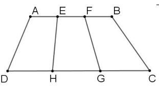
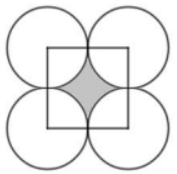

# Lô thử — đề thi vào lớp 6 CLC (2 đề, 24 câu) · 10/10

> Bước 1 của quy trình 3 bước (`kho-rules/README.md` §0): giải thử → CEO duyệt → chạy toàn bộ 58 đề (805 câu).
> Luật giải dùng lại 5T v1 (`k5T.md`) + phần riêng của đề thi (`lo/clc6-brief-soan.md`). CHƯA ghi DB.
> Tệp này do script dựng từ bản soạn — sửa thì sửa ở bản soạn, không sửa tay ở đây.

## Cách làm lô này

- Đề lấy từ bản Word "TUYỂN TẬP ĐỀ THI CLC 2025-2026" (công thức MathType → LaTeX, 883/883 đổi được).
- **Người soạn** (Sonnet) viết lời giải, không được xem lời giải có sẵn.
- **Người kiểm** (Sonnet khác, không xem bản soạn) làm 3 việc: đối chiếu đề Word với PDF đề lẻ từng câu · chép đáp số in trong sách · tự tính lại bằng code.
- Máy so ba nguồn đáp số; Opus đọc từng lời giải.

**Kết quả: 24/24 câu khớp cả ba nguồn.** Người kiểm bắt được 1 lỗi tách đề (CG 2022 câu 8 dính chữ "Phần 3: Tự luận" — đã sửa bộ tách)
và 1 chỗ lời giải sách sai dù đáp số đúng (LTV 2018 câu 13: sách ghi "diện tích hình tròn $3,14\times 4\times 4=13,76$").

## Khuôn đề nghị cho 3 kiểu câu của đề thi

| Kiểu câu trong đề | Lưu vào kho | Đáp án | Phần 2. Trình bày |
|---|---|---|---|
| Điền đáp số (568 câu) | trả lời ngắn | số + đơn vị như HS ghi vào ô | trình bày ĐẦY ĐỦ như bài tự luận lớp 5 |
| Trắc nghiệm A–D (139 câu) | trắc nghiệm, giữ 4 phương án | một chữ cái | giải ra kết quả rồi mới "Chọn B." — không thử từng phương án |
| Tự luận (98 câu) | tự luận | a) …; b) … | từng ý, ý sau dùng lại kết quả ý trước |

Mỗi câu của đề = một câu kho (không tách ý) để sau này còn in lại nguyên đề. Phần 1 mọi câu = card 3–6 bước.

## Chỗ cần CEO chốt

1. **LTV 2018 câu 4 (giá vé – doanh thu) — bài có hai cách.** Bản soạn dùng "giả sử lúc đầu có 100 khán giả" rồi tính doanh thu cũ, doanh thu mới,
   số khán giả mới, giá vé mới. Sách dùng tỉ số: giá vé mới $=108\%:120\%=90\%$ giá vé cũ. Chốt cách nào làm chuẩn cho dạng
   "hai đại lượng nhân với nhau, cho % thay đổi"?
2. **CG 2022 bài 2 tự luận — sơ đồ quá nhiều phần** (Toán 83 phần, Tiếng Anh 60 phần). Giữ sơ đồ (máy vẫn vẽ được, vạch dày) hay khi số phần lớn thì bỏ sơ đồ, chỉ viết "83 phần / 60 phần"?
3. **Đề Word thiếu hình nhưng đề chữ đủ dữ kiện** (CG 2022 câu 8 — PDF có hình hình thang; LTV 2018 câu 2). Đang giải theo chữ, không thêm hình.
   Có cần lấy hình từ PDF bù vào cho những câu như vậy không?
4. **LTV 2018 câu 12** — đề hỏi "đến năm nào" nhưng không cho năm hiện tại ⇒ đáp án ghi "Sau 23 năm nữa" (sách cũng ghi vậy). Giữ nguyên đề.
5. **Khối:** các câu này vào chung khối 5T (dạng chờ `T15T000000`, tên đề gốc dạng `CLC6 · LTV 2018 · 7`) — hay khối riêng?

---

# ĐỀ LƯƠNG THẾ VINH 2018 – 2019 — 14 câu

## LTV 2018 · 1 — điền đáp số

**Đề.** Viết liên tiếp 10 số lẻ đầu tiên ta được 1 số tự nhiên, sau đó lại xóa đi 10 chữ số bất kì của số vừa nhận được mà không thay đổi thứ tự các chữ số thì ta được số lớn nhất là bao nhiêu?

**Đáp án:** $95719$  ·  *đối chiếu:* người kiểm tự tính `95719` · sách `95719` ⇒ **khớp cả ba**

**Phần 1. Hướng dẫn**

**Mấu chốt:** Số nào có chữ số đứng đầu lớn hơn thì lớn hơn; nếu chữ số đầu bằng nhau thì xét chữ số thứ hai, rồi chữ số thứ ba… Vì vậy phải chọn các chữ số GIỮ LẠI lần lượt từ trái sang phải, mỗi lần chọn chữ số lớn nhất có thể, miễn là phía sau còn đủ chữ số để giữ cho đủ số lượng.

**Bước 1.** Viết liên tiếp $10$ số lẻ đầu tiên rồi đếm xem có bao nhiêu chữ số; xoá đi $10$ chữ số thì biết số mới còn lại bao nhiêu chữ số.

**Bước 2.** Chọn chữ số đầu tiên: nó phải chừa lại đủ chữ số phía sau, nên chỉ được chọn trong những chữ số đầu của số; trong khoảng đó lấy chữ số lớn nhất, các chữ số đứng trước nó bị xoá.

**Bước 3.** Chọn chữ số thứ hai cũng theo cách đó, nhưng chỉ xét các chữ số nằm bên phải chữ số vừa chọn và vẫn phải chừa đủ chỗ cho các chữ số còn lại.

**Bước 4.** Làm tương tự cho các chữ số tiếp theo cho đến khi giữ đủ số chữ số cần giữ; đếm lại tổng số chữ số đã xoá phải đúng $10$.

**Chú ý:** Chỉ được xoá chữ số chứ không được đổi chỗ các chữ số còn lại.

**Phần 2. Trình bày**

Viết liên tiếp $10$ số lẻ đầu tiên $1;\ 3;\ 5;\ 7;\ 9;\ 11;\ 13;\ 15;\ 17;\ 19$ ta được số $135791113151719$.

Số này có số chữ số là: $5+5\times 2=15$ (chữ số)

Số chữ số còn lại sau khi xoá là: $15-10=5$ (chữ số)

Chữ số đầu tiên phải còn chừa $4$ chữ số phía sau, nên chọn trong $11$ chữ số đầu $13579111315$; chữ số lớn nhất là $9$. Xoá $4$ chữ số đứng trước là $1;\ 3;\ 5;\ 7$.

Chữ số thứ hai phải chừa $3$ chữ số phía sau, nên chọn trong $7$ chữ số $1113151$ đứng ngay sau số $9$; chữ số lớn nhất là $5$. Xoá $5$ chữ số đứng trước nó là $1;\ 1;\ 1;\ 3;\ 1$.

Chữ số thứ ba phải chừa $2$ chữ số phía sau, nên chọn trong $2$ chữ số $17$ đứng ngay sau số $5$; chữ số lớn nhất là $7$. Xoá chữ số $1$ đứng trước nó.

Hai chữ số cuối giữ nguyên là $1$ và $9$. Số chữ số đã xoá là: $4+5+1=10$ (chữ số)

Vậy số lớn nhất nhận được là $95719$.

## LTV 2018 · 2 — điền đáp số

**Đề.** Trên một khối gỗ hình lập phương cạnh 20cm, người ta đục một lỗ hình vuông cạnh 3cm ở chính giữa, xuyên qua khối gỗ. Tính thể tích phần còn lại của khối gỗ?

**Đáp án:** $7820\ \text{cm}^3$  ·  *đối chiếu:* người kiểm tự tính `7820 cm³` · sách `7820 cm³` ⇒ **khớp cả ba**

> Người soạn ghi: Đề không có hình. Hiểu: lỗ đục xuyên suốt, vuông góc với một mặt của khối, là hình hộp chữ nhật đáy vuông cạnh 3 cm, cao bằng cạnh khối (20 cm). "Ở chính giữa" chỉ vị trí, không ảnh hưởng thể tích.

**Phần 1. Hướng dẫn**

**Mấu chốt:** Thể tích phần còn lại bằng thể tích cả khối gỗ trừ thể tích phần gỗ đã bị đục đi. Vì lỗ xuyên suốt khối gỗ nên phần bị đục chính là một hình hộp chữ nhật có đáy là hình vuông cạnh $3$ cm và chiều cao bằng cạnh khối gỗ.

**Bước 1.** Tính thể tích khối gỗ hình lập phương lúc chưa đục: lấy cạnh nhân cạnh nhân cạnh.

**Bước 2.** Tính thể tích phần gỗ bị đục: hình hộp chữ nhật có hai cạnh đáy là $3$ cm và chiều cao bằng cạnh khối gỗ, vì lỗ đục xuyên qua hết khối.

**Bước 3.** Lấy thể tích khối gỗ lúc đầu trừ thể tích phần bị đục để được thể tích phần gỗ còn lại.

**Chú ý:** Lỗ nằm "ở chính giữa" chỉ cho biết vị trí lỗ, không làm thay đổi thể tích phần bị đục.

**Phần 2. Trình bày**

Bài giải

Thể tích khối gỗ lúc đầu là: $20\times 20\times 20=8000$ ($\text{cm}^3$)

Thể tích phần gỗ bị đục đi là: $3\times 3\times 20=180$ ($\text{cm}^3$)

Thể tích phần còn lại của khối gỗ là: $8000-180=7820$ ($\text{cm}^3$)

Đáp số: $7820\ \text{cm}^3$

## LTV 2018 · 3 — điền đáp số

**Đề.** Trong một tháng có 3 ngày chủ nhật trùng vào ngày chẵn. Hỏi ngày 25 tháng đó là ngày thứ mấy trong tuần?

**Đáp án:** Thứ Ba  ·  *đối chiếu:* người kiểm tự tính `Thứ Ba` · sách `Thứ Ba` ⇒ **khớp cả ba**

**Phần 1. Hướng dẫn**

**Mấu chốt:** Hai ngày chủ nhật liên tiếp cách nhau đúng $7$ ngày, mà $7$ là số lẻ, nên ngày chủ nhật này chẵn thì ngày chủ nhật kế tiếp lẻ, rồi lại chẵn, cứ xen kẽ nhau. Dựa vào đó tìm xem tháng phải có mấy ngày chủ nhật mới có $3$ ngày chủ nhật chẵn.

**Bước 1.** Nhận xét: cộng thêm $7$ (số lẻ) vào một ngày chẵn thì được ngày lẻ, cộng thêm $7$ vào ngày lẻ thì được ngày chẵn, nên các chủ nhật chẵn lẻ xen kẽ nhau.

**Bước 2.** Một tháng có $4$ hoặc $5$ ngày chủ nhật. Với $4$ chủ nhật xen kẽ chẵn lẻ thì nhiều nhất chỉ có $2$ ngày chẵn, nên muốn có $3$ ngày chẵn phải có $5$ chủ nhật và ngày chủ nhật đầu tiên là ngày chẵn.

**Bước 3.** Tháng có $5$ chủ nhật thì chủ nhật đầu tiên chỉ có thể là ngày $1$, $2$ hoặc $3$ (vì chủ nhật thứ năm không quá ngày $31$); chọn ngày chẵn rồi liệt kê các chủ nhật của tháng.

**Bước 4.** Từ ngày chủ nhật gần ngày $25$ nhất, đếm tiếp từng ngày để biết ngày $25$ là thứ mấy.

**Phần 2. Trình bày**

Hai chủ nhật liên tiếp cách nhau $7$ ngày (số lẻ) nên các ngày chủ nhật là chẵn, lẻ xen kẽ nhau.

Tháng có $4$ chủ nhật thì có nhiều nhất $2$ chủ nhật là ngày chẵn, nên tháng đó có $5$ chủ nhật và chủ nhật đầu tiên là ngày chẵn.

Chủ nhật đầu tiên không thể quá ngày $3$ vì $3+7\times 4=31$; mà đó là ngày chẵn nên chủ nhật đầu tiên là ngày $2$.

Các ngày chủ nhật của tháng là: $2;\ 9;\ 16;\ 23;\ 30$.

Ngày $25$ sau chủ nhật ngày $23$ là: $25-23=2$ (ngày)

Sau chủ nhật hai ngày là thứ ba.

Vậy ngày $25$ của tháng đó là thứ Ba.

## LTV 2018 · 4 — điền đáp số

**Đề.** Giá vé xem phim là 40 nghìn đồng một vé. Sau khi giảm giá vé, số khán giả tăng thêm $20\%$ nên doanh thu tăng $8\%$. Hỏi giá vé sau khi giảm là bao nhiêu?

**Đáp án:** $36000$ đồng  ·  *đối chiếu:* người kiểm tự tính `36 000 đồng (36 nghìn đồng)` · sách `36 000 đồng` ⇒ **khớp cả ba**

**Phần 1. Hướng dẫn**

**Mấu chốt:** Doanh thu bằng giá vé nhân với số khán giả. Đề chỉ cho tỉ lệ phần trăm tăng của số khán giả và của doanh thu, không cho số cụ thể, nên ta chọn số khán giả ban đầu là một số đẹp ($100$ người) rồi tính lần lượt doanh thu cũ, doanh thu mới, số khán giả mới và giá vé mới. Chọn số khác thì kết quả giá vé vẫn như vậy vì mọi đại lượng đều tăng theo cùng tỉ lệ.

**Bước 1.** Đổi giá vé ra đồng, giả sử trước khi giảm giá có $100$ khán giả rồi tính doanh thu lúc đầu bằng giá vé nhân với số khán giả.

**Bước 2.** Tính doanh thu sau khi giảm giá: doanh thu tăng $8\%$ nghĩa là bằng $108\%$ doanh thu lúc đầu.

**Bước 3.** Tính số khán giả sau khi giảm giá: tăng thêm $20\%$ nghĩa là bằng $120\%$ số khán giả lúc đầu.

**Bước 4.** Giá vé sau khi giảm bằng doanh thu mới chia cho số khán giả mới.

**Phần 2. Trình bày**

Bài giải

Đổi: $40$ nghìn đồng $=40000$ đồng

Giả sử trước khi giảm giá có $100$ khán giả.

Doanh thu trước khi giảm giá là: $40000\times 100=4000000$ (đồng)

Doanh thu sau khi giảm giá là: $4000000\times 108\%=4320000$ (đồng)

Số khán giả sau khi giảm giá là: $100\times 120\%=120$ (người)

Giá vé sau khi giảm là: $4320000:120=36000$ (đồng)

Đáp số: $36000$ đồng

## LTV 2018 · 5 — điền đáp số

**Đề.** Tìm $x$ biết: $x+3,5=6,72+3,28$

**Đáp án:** $x=6,5$  ·  *đối chiếu:* người kiểm tự tính `6,5` · sách `6,5` ⇒ **khớp cả ba**

**Phần 1. Hướng dẫn**

**Mấu chốt:** Vế phải là tổng của hai số thập phân $6,72$ và $3,28$ có phần thập phân cộng lại ra đúng một số tròn, nên tính vế phải trước để đưa bài về dạng tìm số hạng chưa biết.

**Bước 1.** Tính vế phải $6,72+3,28$ thành một số duy nhất; hai số này có hai chữ số phần thập phân cộng lại vừa đủ tròn.

**Bước 2.** Sau khi vế phải là một số, $x$ cộng với $3,5$ bằng số đó, nên $x$ là số hạng chưa biết của một phép cộng.

**Bước 3.** Muốn tìm số hạng chưa biết, ta lấy tổng trừ đi số hạng đã biết.

**Phần 2. Trình bày**

$\begin{array}{l} x+3,5=6,72+3,28 \\ x+3,5=10 \\ x=10-3,5 \\ x=6,5 \end{array}$

## LTV 2018 · 6 — điền đáp số

**Đề.** Hàng ngày, Chi đạp xe đi học với vận tốc 12 km/h. Nhà Chi cách trường 3km mà bạn phải đến trường lúc 7 giờ 20 phút. Hỏi muộn nhất là mấy giờ Chi phải ra khỏi nhà?

**Đáp án:** $7$ giờ $5$ phút  ·  *đối chiếu:* người kiểm tự tính `7 giờ 5 phút` · sách `7 giờ 5 phút` ⇒ **khớp cả ba**

**Phần 1. Hướng dẫn**

**Mấu chốt:** Muốn biết muộn nhất mấy giờ phải ra khỏi nhà thì tính xem đi từ nhà đến trường mất bao lâu, rồi lấy giờ phải đến trường trừ đi thời gian đó. Thời gian bằng quãng đường chia cho vận tốc.

**Bước 1.** Tính thời gian Chi đạp xe từ nhà đến trường bằng cách lấy quãng đường chia cho vận tốc.

**Bước 2.** Đổi thời gian vừa tìm được từ giờ sang phút để dễ trừ với số giờ phút của đồng hồ.

**Bước 3.** Lấy giờ phải đến trường trừ đi thời gian đi để tìm giờ ra khỏi nhà muộn nhất.

**Chú ý:** "Muộn nhất" nghĩa là Chi đạp xe liền một mạch và vừa kịp đến trường lúc $7$ giờ $20$ phút.

**Phần 2. Trình bày**

Bài giải

Ta có sơ đồ:

(Nhà cách trường $3$ km; Chi đi với vận tốc $12$ km/giờ)

Thời gian Chi đạp xe từ nhà đến trường là: $3:12=\dfrac{1}{4}$ (giờ)

Đổi: $\dfrac{1}{4}$ giờ $=15$ phút

Muộn nhất Chi phải ra khỏi nhà lúc: $7$ giờ $20$ phút $-\ 15$ phút $=7$ giờ $5$ phút

Đáp số: $7$ giờ $5$ phút

## LTV 2018 · 7 — điền đáp số

**Đề.** Tìm số tự nhiên $x$ biết: $\frac{2}{5}<\frac{x}{8}<\frac{3}{5}$

**Đáp án:** $x=4$  ·  *đối chiếu:* người kiểm tự tính `x = 4` · sách `x = 4` ⇒ **khớp cả ba**

**Phần 1. Hướng dẫn**

**Mấu chốt:** Để so sánh ba phân số $\dfrac{2}{5}$, $\dfrac{x}{8}$ và $\dfrac{3}{5}$ phải quy đồng chúng về cùng mẫu số; khi đó phân số nào có tử số lớn hơn thì lớn hơn, nên bài toán trở thành tìm $x$ sao cho tử số của $\dfrac{x}{8}$ nằm giữa hai tử số kia.

**Bước 1.** Tìm mẫu số chung của $5$ và $8$ rồi quy đồng cả ba phân số về mẫu số chung đó.

**Bước 2.** Sau khi cùng mẫu số, so sánh các tử số: tử số của $\dfrac{x}{8}$ phải lớn hơn tử số của phân số bé và bé hơn tử số của phân số lớn.

**Bước 3.** Tử số của $\dfrac{x}{8}$ sau khi quy đồng là $x$ nhân $5$ nên phải chia hết cho $5$; tìm số chia hết cho $5$ nằm giữa hai tử số đó, rồi chia cho $5$ để tìm $x$.

**Chú ý:** $x$ là số tự nhiên nên chỉ nhận những giá trị làm cho $x\times 5$ chia hết cho $5$ và nằm đúng khoảng đã tìm.

**Phần 2. Trình bày**

$\dfrac{2}{5}<\dfrac{x}{8}<\dfrac{3}{5}$

$\dfrac{16}{40}<\dfrac{x\times 5}{40}<\dfrac{24}{40}$

Vì $16<x\times 5<24$ và $x\times 5$ chia hết cho $5$ nên $x\times 5=20$.

Vậy $x=20:5=4$.

## LTV 2018 · 8 — điền đáp số

**Đề.** Một mảnh vườn hình chữ nhật có chiều dài gấp đôi chiều rộng và diện tích là $200m^{2}$. Tính chu vi mảnh vườn đó?

**Đáp án:** $60$ m  ·  *đối chiếu:* người kiểm tự tính `60 m` · sách `60 m` ⇒ **khớp cả ba**

**Phần 1. Hướng dẫn**

**Mấu chốt:** Chiều dài gấp đôi chiều rộng nên chia mảnh vườn thành $2$ hình vuông bằng nhau, mỗi hình vuông có cạnh bằng chiều rộng. Biết diện tích mỗi hình vuông thì tìm được cạnh, từ đó tìm chiều dài và chu vi.

**Bước 1.** Chia hình chữ nhật thành $2$ hình vuông bằng nhau, cạnh mỗi hình vuông bằng chiều rộng mảnh vườn.

**Bước 2.** Tính diện tích một hình vuông rồi tìm cạnh của nó: cạnh là số nhân với chính nó ra diện tích đó.

**Bước 3.** Cạnh hình vuông là chiều rộng; chiều dài gấp đôi chiều rộng; sau đó tính chu vi bằng nửa chu vi nhân $2$.

**Phần 2. Trình bày**

Bài giải

Chia mảnh vườn thành $2$ hình vuông bằng nhau, cạnh mỗi hình vuông bằng chiều rộng.

Diện tích mỗi hình vuông là: $200:2=100$ ($\text{m}^2$)

Vì $10\times 10=100$ nên chiều rộng mảnh vườn là $10$ m.

Chiều dài mảnh vườn là: $10\times 2=20$ (m)

Chu vi mảnh vườn là: $(20+10)\times 2=60$ (m)

Đáp số: $60$ m

## LTV 2018 · 9 — điền đáp số

**Đề.** Người ta may 25 bộ quần áo giống nhau hết 70m vải. Hỏi để may được 8 bộ quần áo như thế hết bao nhiêu mét vải?

**Đáp án:** $22,4$ m  ·  *đối chiếu:* người kiểm tự tính `22,4 m` · sách `22,4 m` ⇒ **khớp cả ba**

**Phần 1. Hướng dẫn**

**Mấu chốt:** Các bộ quần áo giống nhau nên số mét vải cần dùng tỉ lệ thuận với số bộ: may nhiều bộ gấp bao nhiêu lần thì cần vải gấp bấy nhiêu lần. Cách làm gọn là rút về đơn vị: tìm số mét vải may một bộ rồi nhân với số bộ cần may.

**Bước 1.** Nhận ra số vải và số bộ quần áo là hai đại lượng tỉ lệ thuận, nên ta rút về đơn vị là một bộ quần áo.

**Bước 2.** Tìm số mét vải may một bộ quần áo bằng cách lấy tổng số vải chia cho số bộ đã may.

**Bước 3.** Lấy số mét vải may một bộ nhân với số bộ cần may để tìm số vải cần dùng.

**Phần 2. Trình bày**

Bài giải

Số mét vải để may $1$ bộ quần áo là: $70:25=2,8$ (m)

Số mét vải để may $8$ bộ quần áo là: $2,8\times 8=22,4$ (m)

Đáp số: $22,4$ m

## LTV 2018 · 10 — điền đáp số

**Đề.** Cho hình vẽ bên, biết $AE=EF=FB$; $DH=HG=GC$ và diện tích tứ giác $ABCD$ bằng $15cm^{2}$. Tính diện tích tứ giác $GHEF$?

**Đáp án:** $5\ \text{cm}^2$  ·  *đối chiếu:* người kiểm tự tính `5 cm²` · sách `5cm²` ⇒ **khớp cả ba**

> Người soạn ghi: Dựa vào hình: AB song song DC; E, F nằm trên AB, H, G nằm trên DC; tứ giác GHEF là hình thang giữa có hai đáy EF và HG, cùng chiều cao với hình thang ABCD. Đề chữ không nói rõ AB // DC, lấy từ hình vẽ.

**Phần 1. Hướng dẫn**

**Mấu chốt:** Hai hình thang $ABCD$ và $GHEF$ có cùng chiều cao; đáy bé và đáy lớn của $GHEF$ đều bằng $\dfrac{1}{3}$ đáy tương ứng của $ABCD$, nên tổng hai đáy của $GHEF$ bằng $\dfrac{1}{3}$ tổng hai đáy của $ABCD$. Diện tích hình thang bằng tổng hai đáy nhân chiều cao rồi chia $2$ nên diện tích $GHEF$ cũng bằng $\dfrac{1}{3}$ diện tích $ABCD$.

**Bước 1.** Nhìn hình vẽ: $AB$ và $DC$ song song nên $ABCD$ là hình thang; $E$, $F$ nằm trên $AB$ còn $H$, $G$ nằm trên $DC$ nên $GHEF$ cũng là hình thang có cùng chiều cao với $ABCD$.

**Bước 2.** So sánh các đáy: $AE=EF=FB$ nên $AB$ gồm $3$ đoạn bằng nhau, suy ra $EF$ bằng $\dfrac{1}{3}$ của $AB$; tương tự $HG$ bằng $\dfrac{1}{3}$ của $DC$.

**Bước 3.** Vì tổng hai đáy giảm còn $\dfrac{1}{3}$ còn chiều cao không đổi nên diện tích hình thang $GHEF$ bằng $\dfrac{1}{3}$ diện tích hình thang $ABCD$.

**Bước 4.** Lấy diện tích $ABCD$ chia cho $3$ để tìm diện tích $GHEF$.

**Phần 2. Trình bày**

Bài giải

Theo hình vẽ, $ABCD$ và $GHEF$ là hai hình thang có cùng chiều cao.

Vì $AE=EF=FB$ nên $EF=\dfrac{1}{3}\times AB$.

Vì $DH=HG=GC$ nên $HG=\dfrac{1}{3}\times DC$.

Tổng hai đáy hình thang $GHEF$ bằng $\dfrac{1}{3}$ tổng hai đáy hình thang $ABCD$, chiều cao bằng nhau nên $S_{GHEF}=\dfrac{1}{3}\times S_{ABCD}$.

Diện tích tứ giác $GHEF$ là: $15:3=5$ ($\text{cm}^2$)

Đáp số: $5\ \text{cm}^2$

## LTV 2018 · 11 — điền đáp số

**Đề.** Kết quả của phép tính: $\frac{3}{7}\times\frac{5}{13}+\frac{3}{7}\times\frac{8}{13}+5\frac{4}{7}$

**Đáp án:** $6$  ·  *đối chiếu:* người kiểm tự tính `6` · sách `6` ⇒ **khớp cả ba**

**Phần 1. Hướng dẫn**

**Mấu chốt:** Hai tích đầu có chung thừa số $\dfrac{3}{7}$, nên dùng tính chất nhân một số với một tổng để đưa $\dfrac{3}{7}$ ra ngoài; trong ngoặc là hai phân số cùng mẫu $13$ có tổng bằng $1$. Sau đó $\dfrac{3}{7}$ và phần phân số của $5\dfrac{4}{7}$ cùng mẫu $7$ nên cộng gọn được.

**Bước 1.** Đặt thừa số chung $\dfrac{3}{7}$ ra ngoài, trong ngoặc là tổng hai phân số $\dfrac{5}{13}$ và $\dfrac{8}{13}$.

**Bước 2.** Cộng hai phân số cùng mẫu số $13$: tử số cộng lại bằng mẫu số nên tổng bằng $1$, rồi lấy $\dfrac{3}{7}$ nhân với $1$ thì giữ nguyên.

**Bước 3.** Cộng hỗn số bằng cách tách phần nguyên và phần phân số: cộng hai phân số cùng mẫu $7$ trước rồi cộng với phần nguyên.

**Chú ý:** Không đổi $5\dfrac{4}{7}$ ra phân số vì tử số sẽ lớn, khó tính.

**Phần 2. Trình bày**

$\dfrac{3}{7}\times\dfrac{5}{13}+\dfrac{3}{7}\times\dfrac{8}{13}+5\dfrac{4}{7}$

$=\dfrac{3}{7}\times\left(\dfrac{5}{13}+\dfrac{8}{13}\right)+5\dfrac{4}{7}$

$=\dfrac{3}{7}\times 1+5\dfrac{4}{7}$

$=\dfrac{3}{7}+5\dfrac{4}{7}$

$=5+\left(\dfrac{3}{7}+\dfrac{4}{7}\right)$

$=5+1$

$=6$

## LTV 2018 · 12 — điền đáp số

**Đề.** Năm nay bố 42 tuổi, chị 12 tuổi, em 7 tuổi. Đến năm nào thì tuổi bố bằng tổng số tuổi hai chị em?

**Đáp án:** Sau $23$ năm nữa  ·  *đối chiếu:* người kiểm tự tính `23 năm nữa (tức sau 23 năm; đề không cho năm hiện tại nên không ra mốc năm cụ thể)` · sách `23 năm nữa` ⇒ **khớp cả ba**

> Người soạn ghi: Đề hỏi "đến năm nào" nhưng không cho năm hiện tại, nên đáp số là "sau 23 năm nữa" (nếu năm nay là N thì năm đó là N+23). Thử lại: sau 23 năm bố 65 tuổi, chị 35, em 30 (35+30=65).

**Phần 1. Hướng dẫn**

**Mấu chốt:** Mỗi năm qua đi, tuổi bố tăng $1$ tuổi nhưng tổng số tuổi hai chị em tăng $2$ tuổi (mỗi em tăng $1$ tuổi). Vì vậy tuổi bố hiện đang hơn tổng tuổi hai chị em bao nhiêu thì mỗi năm khoảng cách đó giảm đi $1$ tuổi, đến khi hết khoảng cách thì hai bên bằng nhau.

**Bước 1.** Tính tổng số tuổi của chị và em hiện nay rồi so với tuổi bố để biết bố đang hơn bao nhiêu tuổi.

**Bước 2.** Tính mỗi năm khoảng cách giữa tuổi bố và tổng tuổi hai chị em giảm đi bao nhiêu tuổi.

**Bước 3.** Lấy khoảng cách hiện nay chia cho số tuổi giảm đi mỗi năm để biết sau bao nhiêu năm thì tuổi bố bằng tổng tuổi hai chị em.

**Chú ý:** Đề không cho biết năm nay là năm nào, nên câu trả lời là sau bao nhiêu năm nữa.

**Phần 2. Trình bày**

Bài giải

Tổng số tuổi của chị và em hiện nay là: $12+7=19$ (tuổi)

Hiện nay tuổi bố hơn tổng số tuổi hai chị em là: $42-19=23$ (tuổi)

Mỗi năm tổng số tuổi hai chị em tăng $1+1=2$ (tuổi), tuổi bố tăng $1$ tuổi nên mỗi năm khoảng cách giảm đi: $2-1=1$ (tuổi)

Số năm để tuổi bố bằng tổng số tuổi hai chị em là: $23:1=23$ (năm)

Đáp số: sau $23$ năm nữa

## LTV 2018 · 13 — điền đáp số

**Đề.** Tính diện tích phần đánh dấu chấm trên hình vẽ bên biết bán kính mỗi đường tròn là 4cm?

**Đáp án:** $13,76\ \text{cm}^2$  ·  *đối chiếu:* người kiểm tự tính `13,76 cm² (64 - 16 x 3,14)` · sách `13,76 cm²` ⇒ **khớp cả ba**

> Người soạn ghi: Đề chữ không nói các đường tròn tiếp xúc nhau; lấy từ hình: 4 đường tròn bằng nhau, tiếp xúc nhau, tâm của chúng là 4 đỉnh của hình vuông. Phần đánh dấu chấm = hình vuông trừ 4 hình quạt 1/4 hình tròn.

**Phần 1. Hướng dẫn**

**Mấu chốt:** Theo hình vẽ, bốn đường tròn bằng nhau tiếp xúc nhau và tâm của chúng là bốn đỉnh của một hình vuông. Phần đánh dấu chấm là hình vuông bỏ đi bốn phần tư hình tròn ở bốn góc; bốn phần tư ghép lại đúng bằng một hình tròn.

**Bước 1.** Tìm cạnh hình vuông: hai đường tròn kề nhau tiếp xúc nhau nên khoảng cách giữa hai tâm bằng tổng hai bán kính, cũng là cạnh hình vuông.

**Bước 2.** Tính diện tích hình vuông bằng cạnh nhân cạnh.

**Bước 3.** Ở mỗi đỉnh hình vuông có một phần tư hình tròn bán kính $4$ cm; bốn phần tư ghép lại thành một hình tròn, tính diện tích hình tròn đó.

**Bước 4.** Lấy diện tích hình vuông trừ diện tích hình tròn vừa tính để được diện tích phần đánh dấu chấm.

**Phần 2. Trình bày**

Bài giải

Theo hình vẽ, bốn đường tròn tiếp xúc nhau và tâm của chúng là bốn đỉnh của một hình vuông.

Cạnh hình vuông là: $4+4=8$ (cm)

Diện tích hình vuông là: $8\times 8=64$ ($\text{cm}^2$)

Bốn phần tư hình tròn ghép lại thành một hình tròn có diện tích là: $4\times 4\times 3,14=50,24$ ($\text{cm}^2$)

Diện tích phần đánh dấu chấm là: $64-50,24=13,76$ ($\text{cm}^2$)

Đáp số: $13,76\ \text{cm}^2$

## LTV 2018 · 14 — điền đáp số

**Đề.** Cho dãy số sau: 1; 1; 2; 3; 5; 8... Hỏi số thứ 12 của dãy đó là số nào?

**Đáp án:** $144$  ·  *đối chiếu:* người kiểm tự tính `144` · sách `144` ⇒ **khớp cả ba**

**Phần 1. Hướng dẫn**

**Mấu chốt:** Với dãy số cho trước, hãy thử xem mỗi số có liên hệ gì với các số đứng trước nó. Ở dãy này, từ số thứ ba trở đi, mỗi số bằng tổng của hai số đứng liền trước nó.

**Bước 1.** Thử tìm quy luật từ những số đầu: cộng hai số đứng liền trước xem có bằng số kế tiếp hay không.

**Bước 2.** Kiểm tra quy luật vừa tìm bằng tất cả các số đã cho trong dãy để chắc chắn quy luật đúng.

**Bước 3.** Viết tiếp từng số theo quy luật, vừa viết vừa đếm số thứ tự cho tới số thứ $12$.

**Phần 2. Trình bày**

Quy luật: từ số thứ ba, mỗi số bằng tổng hai số đứng liền trước nó.

Số thứ bảy là: $5+8=13$

Số thứ tám là: $8+13=21$

Số thứ chín là: $13+21=34$

Số thứ mười là: $21+34=55$

Số thứ mười một là: $34+55=89$

Số thứ mười hai là: $55+89=144$

Vậy số thứ $12$ của dãy là $144$.

---

# ĐỀ CẦU GIẤY 2022 – 2023 — 10 câu

### Phần 1: Trắc nghiệm (Mỗi câu hỏi 0,75 điểm)

## CG 2022 · P1.1 — trắc nghiệm

**Đề.** Tính: $3,5\times\frac{1}{4}-1,5\times\frac{1}{4}$

A. 0 · B. $\frac{1}{2}$ · C. $\frac{5}{4}$ · D. $\frac{1}{8}$

**Đáp án:** B  ·  *đối chiếu:* người kiểm tự tính `1/2 (B)` · sách `Chọn B (= 1/2)` ⇒ **khớp cả ba**

**Phần 1. Hướng dẫn**

**Mấu chốt:** Hai tích có chung thừa số $\dfrac{1}{4}$ nên đưa $\dfrac{1}{4}$ ra ngoài, biến biểu thức thành "một hiệu nhân với $\dfrac{1}{4}$" cho dễ tính.

**Bước 1.** Nhìn kĩ hai tích $3,5\times\dfrac{1}{4}$ và $1,5\times\dfrac{1}{4}$ thì thấy cùng có thừa số $\dfrac{1}{4}$, đó là dấu hiệu để dùng tính chất nhân một số với một hiệu.

**Bước 2.** Viết lại biểu thức thành hiệu của hai số thập phân đặt trong ngoặc rồi nhân với $\dfrac{1}{4}$, và tính hiệu trong ngoặc trước vì hai số này tính nhẩm rất gọn.

**Bước 3.** Nhân kết quả trong ngoặc với $\dfrac{1}{4}$ theo quy tắc nhân số tự nhiên với phân số, rút gọn phân số rồi đối chiếu với bốn phương án.

**Chú ý:** Không cần đổi $3,5$ và $1,5$ ra phân số; đặt thừa số chung ra ngoài thì mọi phép tính đều đơn giản.

**Phần 2. Trình bày**

$3,5\times\dfrac{1}{4}-1,5\times\dfrac{1}{4}$

$=(3,5-1,5)\times\dfrac{1}{4}$

$=2\times\dfrac{1}{4}$

$=\dfrac{2}{4}=\dfrac{1}{2}$

Chọn B.

## CG 2022 · P1.2 — trắc nghiệm

**Đề.** $0,2m^{3}$ gấp $25dm^{3}$ số lần là:

A. 0,008 · B. 0,8 · C. 8 · D. 80

**Đáp án:** C  ·  *đối chiếu:* người kiểm tự tính `8 (C)` · sách `Chọn C (200 : 25 = 8 lần)` ⇒ **khớp cả ba**

**Phần 1. Hướng dẫn**

**Mấu chốt:** Muốn biết số này gấp số kia bao nhiêu lần thì hai số phải cùng một đơn vị đo, rồi lấy số lớn chia cho số bé.

**Bước 1.** Nhận ra hai thể tích đang dùng hai đơn vị khác nhau là mét khối và đề-xi-mét khối, nên chưa thể chia ngay.

**Bước 2.** Đổi $0,2\ \text{m}^3$ sang đề-xi-mét khối, nhớ rằng $1\ \text{m}^3$ bằng $1000\ \text{dm}^3$ nên phải nhân với $1000$.

**Bước 3.** Lấy thể tích lớn chia cho thể tích bé để biết gấp mấy lần, rồi chọn phương án trùng với kết quả.

**Chú ý:** Nếu chia thẳng $0,2$ cho $25$ mà không đổi đơn vị thì sẽ ra con số $0,008$ rất dễ chọn nhầm.

**Phần 2. Trình bày**

Đổi: $0,2\ \text{m}^3=200\ \text{dm}^3$

$200\ \text{dm}^3$ gấp $25\ \text{dm}^3$ số lần là: $200:25=8$ (lần)

Chọn C.

## CG 2022 · P1.3 — trắc nghiệm

**Đề.** Một ô tô đi với vận tốc 60 km/giờ, tính quãng đường ô tô đi được trong 12 phút.

A. 0,2 km · B. 5 km · C. 720 km · D. 12 km

**Đáp án:** D  ·  *đối chiếu:* người kiểm tự tính `12 km (D)` · sách `Chọn D (12 km)` ⇒ **khớp cả ba**

**Phần 1. Hướng dẫn**

**Mấu chốt:** Vận tốc cho theo km/giờ thì thời gian phải tính bằng giờ, nên đổi $12$ phút ra giờ trước rồi mới nhân.

**Bước 1.** Thấy vận tốc tính theo kilômét trên giờ mà thời gian lại cho bằng phút, nghĩa là đơn vị chưa khớp nhau.

**Bước 2.** Đổi $12$ phút ra giờ bằng cách lấy $12$ chia cho $60$, vì một giờ có $60$ phút.

**Bước 3.** Dùng công thức quãng đường bằng vận tốc nhân với thời gian, rồi đối chiếu với bốn phương án.

**Chú ý:** Nhân thẳng $60$ với $12$ sẽ ra số rất lớn, đó là bẫy của phương án có $720$ km.

**Phần 2. Trình bày**

Đổi: $12$ phút $=12:60=0,2$ giờ

Quãng đường ô tô đi được trong $12$ phút là: $60\times 0,2=12$ (km)

Chọn D.

## CG 2022 · P1.4 — trắc nghiệm

**Đề.** Một hình hộp hình chữ nhật có chiều dài là 12 cm, chiều rộng là 8 cm. Một hình lập phương có cạnh bằng trung bình cộng ba kích thước của hình hộp chữ nhật và có diện tích toàn phần là $486cm^{2}$. Tìm chiều cao của hình hộp chữ nhật.

A. 7 cm · B. 8 cm · C. 9 cm · D. 81 cm

**Đáp án:** A  ·  *đối chiếu:* người kiểm tự tính `7 cm (A)` · sách `Chọn A (7 cm)` ⇒ **khớp cả ba**

**Phần 1. Hướng dẫn**

**Mấu chốt:** Từ diện tích toàn phần tìm ra cạnh hình lập phương, rồi nhớ rằng "cạnh bằng trung bình cộng ba kích thước" nên tổng ba kích thước bằng $3$ lần cạnh.

**Bước 1.** Hình lập phương có $6$ mặt là $6$ hình vuông bằng nhau, nên lấy diện tích toàn phần chia cho $6$ để biết diện tích một mặt.

**Bước 2.** Tìm cạnh hình lập phương là số nhân với chính nó thì bằng diện tích một mặt vừa tìm.

**Bước 3.** Cạnh bằng trung bình cộng của ba kích thước nên tổng ba kích thước của hình hộp chữ nhật bằng cạnh nhân với $3$.

**Bước 4.** Lấy tổng ba kích thước trừ đi chiều dài và chiều rộng đã biết để được chiều cao, rồi chọn phương án.

**Chú ý:** Đừng lấy diện tích một mặt làm độ dài cạnh, vì diện tích tính bằng xăng-ti-mét vuông còn cạnh tính bằng xăng-ti-mét.

**Phần 2. Trình bày**

Diện tích một mặt của hình lập phương là: $486:6=81$ ($\text{cm}^2$)

Vì $9\times 9=81$ nên cạnh của hình lập phương là $9$ cm.

Tổng ba kích thước của hình hộp chữ nhật là: $9\times 3=27$ (cm)

Chiều cao của hình hộp chữ nhật là: $27-12-8=7$ (cm)

Chọn A.

### Phần 2: Điền đáp số (Mỗi câu 1 điểm)

## CG 2022 · P2.5 — điền đáp số

**Đề.** Tìm $x$, biết: $15,25-5\times x=0,75$

**Đáp án:** $x=2,9$  ·  *đối chiếu:* người kiểm tự tính `2,9` · sách `x = 2,9` ⇒ **khớp cả ba**

**Phần 1. Hướng dẫn**

**Mấu chốt:** Coi tích $5\times x$ là một số trừ chưa biết trong phép trừ, tìm số trừ trước rồi mới tìm thừa số $x$.

**Bước 1.** Nhận ra phần chưa biết nằm trong tích $5\times x$, và tích này đứng ở vị trí số trừ của phép trừ $15,25-\ldots=0,75$.

**Bước 2.** Tìm số trừ bằng cách lấy số bị trừ trừ đi hiệu, tức là tính $15,25-0,75$ để biết tích $5\times x$.

**Bước 3.** Tìm thừa số chưa biết bằng cách lấy tích vừa tìm chia cho thừa số đã biết là $5$.

Thử lại: thay giá trị $x$ vừa tìm vào biểu thức ban đầu, tính ra phải bằng $0,75$.

**Phần 2. Trình bày**

$\begin{array}{l}15,25-5\times x=0,75\\ 5\times x=15,25-0,75\\ 5\times x=14,5\\ x=14,5:5\\ x=2,9\end{array}$

## CG 2022 · P2.6 — điền đáp số

**Đề.** Tổng số học sinh khối 5 của một trường tiểu học là một số có ba chữ số và chữ số hàng trăm là 2. Biết khi xếp học sinh thành 10 hàng thì dư 5 học sinh và xếp thành 9 hàng thì không dư. Hỏi số học sinh khối 5 là bao nhiêu?

**Đáp án:** $225$ học sinh  ·  *đối chiếu:* người kiểm tự tính `225 học sinh` · sách `225 học sinh` ⇒ **khớp cả ba**

**Phần 1. Hướng dẫn**

**Mấu chốt:** "Xếp thành $10$ hàng dư $5$" cho biết chữ số hàng đơn vị, còn "xếp thành $9$ hàng không dư" là dấu hiệu chia hết cho $9$ (tổng các chữ số chia hết cho $9$).

**Bước 1.** Số học sinh chia cho $10$ dư $5$ nên chữ số tận cùng, tức chữ số hàng đơn vị, chính là $5$.

**Bước 2.** Số học sinh chia hết cho $9$ nên tổng ba chữ số của nó phải chia hết cho $9$.

**Bước 3.** Chữ số hàng trăm và hàng đơn vị đã biết, còn chữ số hàng chục chỉ có thể từ $0$ đến $9$, từ đó tìm được khoảng giá trị của tổng ba chữ số và chọn số chia hết cho $9$.

**Bước 4.** Lấy tổng đó trừ đi tổng hai chữ số đã biết để tìm chữ số hàng chục, rồi viết ra số học sinh.

**Chú ý:** Chữ số hàng chục có thể bằng $0$, nên phải tính khoảng giá trị của tổng bắt đầu từ trường hợp đó.

**Phần 2. Trình bày**

Xếp thành $10$ hàng thì dư $5$ học sinh nên chữ số hàng đơn vị của số học sinh là $5$.

Tổng chữ số hàng trăm và hàng đơn vị là: $2+5=7$

Xếp thành $9$ hàng không dư nên số học sinh chia hết cho $9$, do đó tổng ba chữ số chia hết cho $9$.

Chữ số hàng chục từ $0$ đến $9$ nên tổng ba chữ số từ $7$ đến $16$, trong khoảng này chỉ có $9$ chia hết cho $9$.

Chữ số hàng chục là: $9-7=2$

Vậy số học sinh khối 5 là $225$ học sinh.

## CG 2022 · P2.7 — điền đáp số

**Đề.** Tuổi anh bằng $\frac{5}{4}$ tuổi em. Biết hai lần tuổi anh cộng với tuổi em là 28 tuổi. Tính số tuổi của anh.

**Đáp án:** $10$ tuổi  ·  *đối chiếu:* người kiểm tự tính `10 tuổi` · sách `10 tuổi` ⇒ **khớp cả ba**

**Phần 1. Hướng dẫn**

**Mấu chốt:** Đổi "tuổi anh bằng $\dfrac{5}{4}$ tuổi em" thành số phần bằng nhau (anh $5$ phần, em $4$ phần), rồi đếm "hai lần tuổi anh cộng tuổi em" gồm bao nhiêu phần; đề cho tổng này là $28$ nên đây là bài tổng – tỉ.

**Bước 1.** Chia tuổi em thành $4$ phần bằng nhau thì tuổi anh bằng $\dfrac{5}{4}$ tuổi em nên là $5$ phần như thế.

**Bước 2.** Hai lần tuổi anh là hai lần $5$ phần, cộng thêm tuổi em là $4$ phần, từ đó đếm được tổng số phần bằng nhau.

**Bước 3.** Con số $28$ tuổi ứng với tổng số phần vừa đếm, nên chia $28$ cho tổng số phần để tìm giá trị của một phần.

**Bước 4.** Tuổi anh gồm $5$ phần nên lấy giá trị một phần nhân với $5$.

**Chú ý:** Đề hỏi tuổi anh chứ không hỏi tổng, đừng dừng lại ở bước tìm giá trị một phần.

**Phần 2. Trình bày**

Bài giải

Vì tuổi anh bằng $\dfrac{5}{4}$ tuổi em nên tuổi anh là $5$ phần, tuổi em là $4$ phần như thế.

Ta có sơ đồ:

(Tuổi anh 5 phần; tuổi anh lần thứ hai 5 phần; tuổi em 4 phần; tổng 28 tuổi)

Hai lần tuổi anh cộng tuổi em gồm số phần bằng nhau là: $5\times 2+4=14$ (phần)

Giá trị của một phần là: $28:14=2$ (tuổi)

Tuổi của anh là: $2\times 5=10$ (tuổi)

Đáp số: $10$ tuổi

## CG 2022 · P2.8 — điền đáp số

**Đề.** Cho hình thang ABCD có hai đáy AB, CD. Hai đường chéo AC và BD cắt nhau tại O. Biết diện tích tam giác OAD là $11cm^{2}$, diện tích tam giác OAB là $5cm^{2}$. Tính diện tích hình thang ABCD.

**Đáp án:** $51,2\ \text{cm}^2$  ·  *đối chiếu:* người kiểm tự tính `51,2 cm²` · sách `51,2 cm²` ⇒ **khớp cả ba**

> Người soạn ghi: Đề thiếu hình (chỉ mô tả bằng chữ) nhưng đủ dữ kiện: hình thang ABCD đáy AB, CD; giải theo cách hiểu chuẩn (O giao hai đường chéo). Cuối nội dung đề dính nhầm chuỗi "Phần 3: Tự luận" (lỗi tách đề, không phải đề) — bỏ qua khi in. Đáp số 51,2 là số thập phân không tròn nhưng nhất quán với dữ kiện.

> Người kiểm ghi (đề Word ↔ PDF): Word: không có hình, và cuối nội dung dính thừa chuỗi "Phần 3: Tự luận" (tiêu đề phần kế bị chép lẫn vào câu) / PDF: câu 8 có hình hình thang ABCD với hai đường chéo cắt nhau tại O (hình có ở cả đề và lời giải); số liệu 11 cm², 5 cm² khớp.

**Phần 1. Hướng dẫn**

**Mấu chốt:** Hai tam giác có chung đường cao thì tỉ số diện tích bằng tỉ số hai đáy; từ cặp tam giác đã biết diện tích tìm được tỉ số $OB:OD$, rồi dùng tỉ số đó cho cặp tam giác còn lại.

**Bước 1.** Hai đường chéo chia hình thang thành bốn tam giác; hai tam giác ABD và ABC có chung đáy AB và cùng chiều cao, nên bớt đi phần chung OAB thì hai tam giác ở hai bên (OAD và OBC) có diện tích bằng nhau.

**Bước 2.** Tam giác OAB và tam giác OAD cùng có đỉnh A, đáy nằm trên BD, nên tỉ số diện tích của chúng cho biết tỉ số hai đoạn $OB$ và $OD$.

**Bước 3.** Tam giác OBC và tam giác OCD cũng cùng có đỉnh C và đáy nằm trên BD, nên có cùng tỉ số $OB:OD$; biết diện tích tam giác OBC thì tìm được diện tích tam giác OCD.

**Bước 4.** Cộng diện tích bốn tam giác nhỏ ghép lại thành hình thang để được kết quả cuối cùng.

**Chú ý:** Hình thang có đúng bốn tam giác nhỏ, nhớ cộng đủ cả bốn chứ không bỏ sót tam giác OBC.

**Phần 2. Trình bày**

Bài giải

Hai tam giác ABD và ABC có chung đáy AB và có chiều cao bằng nhau (bằng chiều cao hình thang) nên $S_{ABD}=S_{ABC}$.

Cùng bớt đi $S_{OAB}$ thì được: $S_{OBC}=S_{OAD}=11$ ($\text{cm}^2$)

Tam giác OAB và tam giác OAD có chung đường cao hạ từ A xuống BD, suy ra $\dfrac{S_{OAB}}{S_{OAD}}=\dfrac{OB}{OD}=\dfrac{5}{11}$

Tam giác OBC và tam giác OCD có chung đường cao hạ từ C xuống BD, suy ra $\dfrac{S_{OBC}}{S_{OCD}}=\dfrac{OB}{OD}=\dfrac{5}{11}$

Diện tích tam giác OCD là: $11:5\times 11=24,2$ ($\text{cm}^2$)

Diện tích hình thang ABCD là: $5+11+11+24,2=51,2$ ($\text{cm}^2$)

Đáp số: $51,2\ \text{cm}^2$

### Phần 3: Tự luận

## CG 2022 · P3.1 — tự luận

**Đề.** Một cuộc thi vẽ có 120 học sinh đạt giải. Số học sinh đạt giải nhất bằng $10\%$ tổng số học sinh đạt giải, số học sinh đạt giải nhì bằng $\frac{1}{5}$ tổng số học sinh đạt ba giải còn lại, số học sinh đạt giải ba bằng $\frac{3}{5}$ số học sinh đạt giải khuyến khích.  
a) Tính số học sinh đạt giải nhất.  
b) Tính số học sinh đạt giải khuyến khích.

**Đáp án:** a) $12$ học sinh; b) $55$ học sinh  ·  *đối chiếu:* người kiểm tự tính `a) 12 học sinh; b) 55 học sinh` · sách `a) 12 học sinh; b) 55 học sinh` ⇒ **khớp cả ba**

**Phần 1. Hướng dẫn**

**Mấu chốt:** Chia bài làm hai chặng tổng – tỉ: chặng thứ nhất tách giải nhì ($1$ phần) khỏi ba giải còn lại ($5$ phần), chặng thứ hai tách giải ba ($3$ phần) khỏi giải khuyến khích ($5$ phần); ý b) dùng lại kết quả ý a).

**Bước 1.** Ý a): giải nhất bằng $10\%$ tổng số học sinh đạt giải, nên lấy $10\%$ của $120$ học sinh.

**Bước 2.** Giải nhì bằng $\dfrac{1}{5}$ tổng ba giải còn lại nên giải nhì là $1$ phần, ba giải còn lại là $5$ phần; $120$ học sinh ứng với tổng số phần này, từ đó tìm được số học sinh giải nhì.

**Bước 3.** Lấy $120$ trừ đi số học sinh giải nhất và giải nhì (dùng lại kết quả ý a) để biết hai giải còn lại là giải ba và giải khuyến khích có tất cả bao nhiêu học sinh.

**Bước 4.** Giải ba bằng $\dfrac{3}{5}$ giải khuyến khích nên giải ba là $3$ phần, giải khuyến khích là $5$ phần; chia số học sinh vừa tìm theo tổng số phần để tìm giải khuyến khích.

**Chú ý:** "Ba giải còn lại" của giải nhì gồm giải nhất, giải ba và giải khuyến khích, không phải chỉ ba giải xếp sau giải nhì.

**Phần 2. Trình bày**

Bài giải

a) Số học sinh đạt giải nhất là: $120\times 10\%=12$ (học sinh)

b) Giải nhì bằng $\dfrac{1}{5}$ tổng số học sinh ba giải còn lại nên giải nhì là $1$ phần, ba giải còn lại là $5$ phần.

Ta có sơ đồ:

(Giải nhì 1 phần; ba giải còn lại 5 phần; tổng 120 học sinh)

Tổng số phần bằng nhau là: $1+5=6$ (phần)

Số học sinh đạt giải nhì là: $120:6\times 1=20$ (học sinh)

Số học sinh đạt giải ba và giải khuyến khích là: $120-12-20=88$ (học sinh)

Giải ba bằng $\dfrac{3}{5}$ giải khuyến khích nên giải ba là $3$ phần, giải khuyến khích là $5$ phần.

Ta có sơ đồ:

(Giải ba 3 phần; giải khuyến khích 5 phần; tổng 88 học sinh)

Tổng số phần bằng nhau là: $3+5=8$ (phần)

Số học sinh đạt giải khuyến khích là: $88:8\times 5=55$ (học sinh)

Đáp số: a) $12$ học sinh; b) $55$ học sinh

## CG 2022 · P3.2 — tự luận

**Đề.** Trong kì thi chọn HSG có 2 môn thi là Toán và Tiếng Anh. Biết $\frac{1}{10}$ số học sinh giỏi Tiếng Anh bằng $\frac{6}{83}$ số học sinh giỏi Toán. Số học sinh giỏi Toán hơn số học sinh giỏi Tiếng Anh là một số có hai chữ số, chia cho 5 và 9 đều dư 2. Tính số học sinh giỏi Toán, số học sinh giỏi Tiếng Anh.

**Đáp án:** Toán: $332$ học sinh; Tiếng Anh: $240$ học sinh  ·  *đối chiếu:* người kiểm tự tính `Toán 332 học sinh; Tiếng Anh 240 học sinh` · sách `Toán 332 học sinh; Tiếng Anh 240 học sinh` ⇒ **khớp cả ba**

**Phần 1. Hướng dẫn**

**Mấu chốt:** Từ "$\dfrac{1}{10}$ số HS giỏi Tiếng Anh bằng $\dfrac{6}{83}$ số HS giỏi Toán" suy ra tỉ số hai môn (Toán $83$ phần, Tiếng Anh $60$ phần), nên hiệu là một số phần cố định; điều kiện chia $5$ và chia $9$ đều dư $2$ dùng để chọn ra hiệu thật.

**Bước 1.** Một phần mười số học sinh giỏi Tiếng Anh cho trước, nên gấp lên $10$ lần để biết cả số học sinh giỏi Tiếng Anh bằng bao nhiêu phần số học sinh giỏi Toán.

**Bước 2.** Đổi tỉ số vừa tìm thành số phần bằng nhau, và vì phân số đó đã tối giản nên mỗi phần là một số học sinh nguyên; từ đó tìm được hiệu gồm bao nhiêu phần.

**Bước 3.** Hiệu có hai chữ số và bằng một số nguyên lần số phần ở bước trước, nên liệt kê các số có hai chữ số như vậy rồi lọc bằng điều kiện chia $5$ dư $2$ và chia $9$ dư $2$.

**Bước 4.** Biết hiệu thật, chia cho số phần của hiệu để tìm một phần, rồi nhân với số phần của từng môn.

**Chú ý:** Phải thử cả hai điều kiện chia $5$ dư $2$ và chia $9$ dư $2$ cho số còn lại, chỉ dùng một điều kiện thì chưa đủ chắc.

**Phần 2. Trình bày**

Bài giải

$\dfrac{1}{10}$ số học sinh giỏi Tiếng Anh bằng $\dfrac{6}{83}$ số học sinh giỏi Toán nên số học sinh giỏi Tiếng Anh bằng: $\dfrac{6}{83}\times 10=\dfrac{60}{83}$ (số học sinh giỏi Toán)

Do đó số học sinh giỏi Toán là $83$ phần, số học sinh giỏi Tiếng Anh là $60$ phần như thế.

Hiệu số phần bằng nhau là: $83-60=23$ (phần)

Hiệu là số có hai chữ số chia hết cho $23$ nên hiệu là một trong các số: $23$; $46$; $69$; $92$.

Hiệu chia cho $5$ dư $2$ nên chữ số tận cùng là $2$ hoặc $7$, trong bốn số trên chỉ có $92$.

Thử lại: $92:9=10$ (dư $2$), thoả mãn chia $9$ dư $2$.

Vậy số học sinh giỏi Toán hơn số học sinh giỏi Tiếng Anh là $92$ học sinh.

Ta có sơ đồ:

(Giỏi Toán 83 phần; giỏi Tiếng Anh 60 phần; hiệu 92 học sinh)

Giá trị của một phần là: $92:23=4$ (học sinh)

Số học sinh giỏi Toán là: $4\times 83=332$ (học sinh)

Số học sinh giỏi Tiếng Anh là: $4\times 60=240$ (học sinh)

Đáp số: Toán: $332$ học sinh; Tiếng Anh: $240$ học sinh
