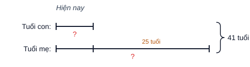
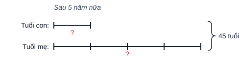

# 4T · LÔ GIẢI THỬ 1 — 13 câu từ sách "Toán arc 4 quyển 1" theo luật `k4T.md` (v0, 07/10, CHƯA ghi DB)

> Mỗi câu: **gán dạng** (mã + lý do) → **Phần 1. Hướng dẫn** → **Phần 2. Trình bày**. Chọn câu để phủ nhiều khuôn (lập luận · đếm ·
> tính thuận tiện · thay đổi thành phần · dãy số · tổng–hiệu · cấu tạo số · phân số · tổng–tỉ · tính ngược) và ưu tiên dạng đang
> **0 câu** trong kho (`010107`, `080101`, `120101`, `210101`, `220102`, `230101`). Đáp số đã thử ngược vào đề (§4 luật).
> Ký hiệu nguồn: `LT 1.5b` = Luyện tập chuyên đề 1 bài 5 ý b · `PCT 3.7` = Phiếu cuối tuần 3 bài 7.

---

## Câu 1 — LT 1.5b · Viết số tự nhiên lớn nhất, có hai chữ số, tích các chữ số là 24.

**Dạng:** `T14T010102` — lớn nhất, biết **tích** các chữ số và số chữ số. *(chủ đề cùng số với chuyên đề; khớp phương pháp "tách tích thành hai chữ số")*

**Phần 1. Hướng dẫn**

Mấu chốt: tích hai chữ số bằng $24$ nên phải tìm **các cặp chữ số** (mỗi chữ số từ $1$ đến $9$) có tích $24$. Chỉ có hai cặp: $3$ và $8$; $4$ và $6$ (không lấy $2$ và $12$ vì $12$ không phải chữ số). Muốn số lớn nhất thì đặt chữ số lớn hơn ở hàng chục, rồi so các số lập được.

**Phần 2. Trình bày**

Hai chữ số có tích bằng $24$ là: $3$ và $8$; $4$ và $6$.

Các số có hai chữ số lập được là: $38$; $83$; $46$; $64$.

Số lớn nhất là $83$.

Vậy số cần tìm là $83$.

---

## Câu 2 — LT 1.9c · Viết số tự nhiên nhỏ nhất, có các chữ số khác nhau, tổng các chữ số bằng 40.

**Dạng:** `T14T010106` — nhỏ nhất, biết tổng các chữ số (không cho số chữ số).

**Phần 1. Hướng dẫn**

Mấu chốt: số nhỏ nhất khi **ít chữ số nhất** và chữ số nhỏ đứng ở hàng cao. Để ít chữ số nhất thì chọn các chữ số lớn: $9+8+7+6+5=35$, chưa đủ $40$; thêm $4$ được $39$, vẫn chưa đủ; vậy phải có **$7$ chữ số**. Bảy chữ số khác nhau lớn nhất có tổng $9+8+7+6+5+4+3=42$, thừa $2$ so với $40$, nên hạ bớt: thay $3$ bằng $1$ được tổng đúng $40$. Sắp xếp từ bé đến lớn.

Chú ý: không chọn chữ số $0$, vì có $0$ thì sáu chữ số còn lại khác nhau có tổng nhiều nhất là $39$, không đủ $40$.

**Phần 2. Trình bày**

Số tự nhiên nhỏ nhất khi nó ít chữ số nhất và chữ số nhỏ nhất đứng ở hàng cao nhất.

Viết số $40$ thành tổng ít chữ số khác nhau nhất nên các chữ số cần chọn càng lớn càng tốt. Ta có: $9+8+7+6+5+4=39<40$ nên số cần tìm phải có $7$ chữ số.

Ta có: $40=1+4+5+6+7+8+9$

Sắp xếp các chữ số theo thứ tự từ nhỏ đến lớn để được số cần tìm là $1456789$.

---

## Câu 3 — LT 1.4a · Từ các chữ số 0 ; 2 ; 5 ; 9 ; 6 ; 8, viết số tự nhiên chẵn, lớn nhất, có ba chữ số khác nhau.

**Dạng:** `T14T010107` — viết số lớn nhất / nhỏ nhất từ các chữ số cho trước. *(dạng đang 0 câu)*

**Phần 1. Hướng dẫn**

Mấu chốt: số chẵn thì **chữ số hàng đơn vị phải chẵn**; số lớn nhất thì các hàng cao lấy chữ số lớn nhất còn lại. Lấy hàng trăm là $9$, hàng chục là $8$; hàng đơn vị chọn chữ số chẵn lớn nhất trong các chữ số còn lại ($0$; $2$; $5$; $6$) là $6$.

**Phần 2. Trình bày**

Số lớn nhất khi chữ số lớn nhất đứng ở hàng cao nhất, nên chữ số hàng trăm là $9$, chữ số hàng chục là $8$.

Số cần tìm là số chẵn nên chữ số hàng đơn vị là chữ số chẵn lớn nhất trong các chữ số còn lại: $6$.

Vậy số cần tìm là $986$.

---

## Câu 4 — PCT 3.7 · Từ các chữ số 0 ; 4 ; 7 ; 9, lập được bao nhiêu số lẻ có bốn chữ số khác nhau?

**Dạng:** `T14T020103` — đếm các số lập từ các chữ số **có điều kiện** (số lẻ). *(có cả chữ số 0, nhưng điều kiện "lẻ" là yếu tố quyết định cách đếm nên xếp vào 020103, không phải 020102)*

**Phần 1. Hướng dẫn**

Mấu chốt: đếm theo từng hàng, nhưng phải chọn **hàng đơn vị trước** vì có điều kiện số lẻ, rồi đến hàng nghìn vì hàng nghìn không được là $0$. Hàng đơn vị: $2$ cách ($7$ hoặc $9$). Hàng nghìn: còn $3$ chữ số nhưng bỏ $0$, được $2$ cách. Hai hàng còn lại lấy $2$ chữ số còn lại: $2\times 1$ cách.

**Phần 2. Trình bày**

Gọi số cần tìm có dạng $\overline{abcd}$ ($a$ khác $0$; $a,b,c,d$ khác nhau).

Số cần tìm là số lẻ nên chữ số hàng đơn vị $d$ có $2$ cách chọn ($7$ hoặc $9$).

Chữ số hàng nghìn $a$ khác $0$ và khác $d$ nên có $2$ cách chọn.

Chữ số hàng trăm $b$ có $2$ cách chọn, chữ số hàng chục $c$ có $1$ cách chọn.

Số các số lẻ có bốn chữ số khác nhau lập được là: $2\times 2\times 2\times 1=8$ (số)

Đáp số: $8$ số

---

## Câu 5 — LT 4.7d · Tính bằng cách thuận tiện: $3565-\left(2388-435\right)$

**Dạng:** `T14T000000` — **dạng chờ.** Chủ đề `T14T04` chỉ có dạng về phép nhân/chia; "tính thuận tiện cộng trừ (trừ một hiệu)" chưa có dạng — xem `k4T.md` §5 bảng thiếu.

**Phần 1. Hướng dẫn**

Mấu chốt: một số trừ đi một hiệu thì bằng số đó trừ số bị trừ rồi **cộng** số trừ: $a-(b-c)=a-b+c$. Dấu hiệu: $3565$ và $435$ cộng lại tròn nghìn ($4000$), nên bỏ ngoặc rồi ghép $3565$ với $435$.

**Phần 2. Trình bày**

$3565-\left(2388-435\right)$

$=3565-2388+435$

$=\left(3565+435\right)-2388$

$=4000-2388$

$=1612$

---

## Câu 6 — LT 4.16 · Tổng của hai số là 20. Nếu gấp số hạng thứ hai lên 5 lần và giữ nguyên số hạng thứ nhất thì được tổng mới là 36. Tìm hai số ban đầu.

**Dạng:** `T14T090101` — thay đổi đại lượng trong phép cộng (gấp một số hạng).

**Phần 1. Hướng dẫn**

Mấu chốt: gấp số hạng thứ hai lên $5$ lần nghĩa là tổng được **thêm $4$ lần** số hạng thứ hai (vì vẫn giữ $1$ lần cũ). Tổng tăng $36-20=16$, đó chính là $4$ lần số hạng thứ hai. Tìm được số hạng thứ hai thì lấy tổng trừ đi là ra số hạng thứ nhất.

**Phần 2. Trình bày**

Bài giải

Khi gấp số hạng thứ hai lên $5$ lần và giữ nguyên số hạng thứ nhất thì tổng tăng thêm $4$ lần số hạng thứ hai.

Bốn lần số hạng thứ hai là: $36-20=16$

Số hạng thứ hai là: $16:4=4$

Số hạng thứ nhất là: $20-4=16$

Đáp số: Số hạng thứ nhất: $16$; Số hạng thứ hai: $4$

---

## Câu 7 — LT 6.6 · Cho dãy số: 11 ; 16 ; 21 ; 26 ; 31 ; … (tách 3 câu vì 3 ý độc lập, 3 dạng khác nhau)

### Câu 7a — Tìm số hạng thứ 85 của dãy số trên.

**Dạng:** `T14T060101` — tìm số hạng thứ $n$.

**Phần 1. Hướng dẫn**

Mấu chốt: dãy cách đều, hai số liền nhau hơn kém nhau $5$. Từ số hạng thứ nhất đến số hạng thứ $85$ có $85-1=84$ khoảng cách, nên số hạng thứ $85$ bằng số đầu cộng $84$ lần khoảng cách.

**Phần 2. Trình bày** *(sửa theo CEO 07/10: bỏ dòng khoảng cách / số khoảng cách)*

Bài giải

Số hạng thứ $85$ của dãy là: $11+\left(85-1\right)\times 5=431$

Đáp số: $431$

### Câu 7b — Tính tổng 100 số hạng đầu tiên của dãy số.

**Dạng:** `T14T060103` — tổng của dãy số cách đều.

**Phần 1. Hướng dẫn**

Mấu chốt: tổng dãy cách đều bằng (số đầu + số cuối) nhân với số số hạng rồi chia $2$. Chưa biết số cuối nên phải tìm số hạng thứ $100$ trước (như câu 7a).

**Phần 2. Trình bày** *(sửa theo CEO 07/10)*

Bài giải

Số hạng thứ $100$ của dãy là: $11+\left(100-1\right)\times 5=506$

Tổng $100$ số hạng đầu tiên của dãy là: $\left(11+506\right)\times 100:2=25850$

Đáp số: $25850$

### Câu 7c — Số 951 là số hạng thứ bao nhiêu của dãy số trên?

**Dạng:** `T14T060104` — tìm vị trí của một số trong dãy.

**Phần 1. Hướng dẫn**

Mấu chốt: từ $11$ đến $951$ có $(951-11):5$ khoảng cách; số thứ tự bằng số khoảng cách **cộng $1$**. Trước khi tính phải kiểm tra $951$ có thuộc dãy không: $951-11=940$ chia hết cho $5$ nên thuộc dãy.

**Phần 2. Trình bày** *(sửa theo CEO 07/10)*

Bài giải

Số $951$ là số hạng thứ: $\left(951-11\right):5+1=189$

Đáp số: thứ $189$

---

## Câu 8 — LT 8.6 · Cách đây ba năm tổng số tuổi của hai mẹ con là 35 tuổi. Biết mẹ hơn con 25 tuổi. Tính tuổi mỗi người hiện nay.

**Dạng:** `T14T080101` — tổng hiệu cơ bản (tổng ẩn qua thời gian; bản đồ chưa tách "ẩn tổng" nên về dạng cơ bản). *(dạng đang 0 câu)*

**Phần 1. Hướng dẫn**

Mấu chốt: tổng số tuổi cho ở **ba năm trước**, còn câu hỏi là hiện nay. Sau ba năm mỗi người thêm $3$ tuổi, hai người thêm $6$ tuổi, nên tổng hiện nay là $35+6=41$. Hiệu số tuổi thì **không đổi** theo thời gian, vẫn là $25$. Có tổng và hiệu hiện nay thì tìm số bé (tuổi con) trước.

**Phần 2. Trình bày**

Bài giải

Tổng số tuổi của hai mẹ con hiện nay là: $35+3\times 2=41$ (tuổi)

Ta có sơ đồ:

*(hình do máy vẽ từ `so-do/k4T-cau8.json` bằng `scripts/kho/so-do-doan-thang.mjs` — CEO 07/10 yêu cầu có hình; khi ghi kho SVG lên `anh_dap_an`)*

Tuổi con hiện nay là: $\left(41-25\right):2=8$ (tuổi)

Tuổi mẹ hiện nay là: $8+25=33$ (tuổi)

Đáp số: Con: $8$ tuổi; Mẹ: $33$ tuổi

---

## Câu 9 — LT 9.7 · Khi nhân một số tự nhiên với 45, một bạn đã viết nhầm số 45 thành 54 nên kết quả của phép tính tăng thêm 207 đơn vị. Hãy tìm tích đúng của phép nhân đó.

**Dạng:** `T14T000000` — **dạng chờ.** Chuyên đề 9 (lời văn nhân chia: tích riêng thẳng cột, viết nhầm thừa số, số dư lớn nhất) chưa có dạng nào trong bản đồ; chủ đề `T14T09` chỉ có "phép cộng".

**Phần 1. Hướng dẫn**

Mấu chốt: viết nhầm $45$ thành $54$ tức là thừa số thứ hai **tăng thêm $54-45=9$**, nên tích tăng thêm $9$ lần số tự nhiên đó. Tích tăng $207$ nên số đó bằng $207:9$. Tìm được số thì nhân lại với $45$.

**Phần 2. Trình bày**

Bài giải

Khi viết nhầm $45$ thành $54$ thì thừa số thứ hai tăng thêm: $54-45=9$ (đơn vị)

Khi đó tích tăng thêm $9$ lần số tự nhiên cần nhân.

Số tự nhiên đó là: $207:9=23$

Tích đúng của phép nhân là: $23\times 45=1035$

Đáp số: $1035$

---

## Câu 10 — LT 12.3 · Tìm số tự nhiên có hai chữ số, biết nếu viết thêm chữ số 3 vào bên trái số đó thì được số mới gấp 5 lần số đã cho.

**Dạng:** `T14T120101` — viết thêm chữ số vào bên trái số cho trước. *(dạng đang 0 câu)*

**Phần 1. Hướng dẫn**

Mấu chốt: viết thêm chữ số $3$ vào bên trái số có hai chữ số $\overline{ab}$ thì được $\overline{3ab}$, tức là số đó **cộng thêm $300$**. Số mới gấp $5$ lần số cũ, nghĩa là $5$ lần số cũ bằng số cũ cộng $300$; bớt đi $1$ lần số cũ ở cả hai bên thì $4$ lần số cũ bằng $300$.

**Phần 2. Trình bày**

Gọi số cần tìm là $\overline{ab}$ ($a$ khác $0$; $a,b<10$). Số mới là $\overline{3ab}$.

Ta có: $\overline{ab}\times 5=\overline{3ab}$

$\overline{ab}\times 5=300+\overline{ab}$

$\overline{ab}\times 4=300$ (Bớt cả hai vế đi $\overline{ab}$)

$\begin{array}{l} \overline{ab}=300:4 \\ \overline{ab}=75 \end{array}$

Đáp số: $75$

---

## Câu 11 — LT 21.5 · Nam có một số bi, Nam cho bạn $\dfrac{7}{12}$ số bi của mình thì Nam còn lại 25 viên bi. Hỏi ban đầu, Nam có bao nhiêu viên bi?

**Dạng:** `T14T210101` — tìm đại lượng khi biết giá trị phân số của nó, hai đại lượng (số bi đã cho và số bi còn lại). *(dạng đang 0 câu; tên dạng "hai đại lượng" hiểu là bài chỉ có 2 phần: phần đã dùng và phần còn lại)*

**Phần 1. Hướng dẫn**

Mấu chốt: $25$ viên bi còn lại **ứng với phần nào** của số bi ban đầu? Nam cho đi $\dfrac{7}{12}$ nên còn lại $1-\dfrac{7}{12}=\dfrac{5}{12}$ số bi. Biết $\dfrac{5}{12}$ của số bi là $25$ viên thì số bi là $25:\dfrac{5}{12}$.

**Phần 2. Trình bày**

Bài giải

$25$ viên bi còn lại chiếm số phần tổng số bi là: $1-\dfrac{7}{12}=\dfrac{5}{12}$ (số bi)

Số bi ban đầu của Nam là: $25:\dfrac{5}{12}=60$ (viên bi)

Đáp số: $60$ viên bi

---

## Câu 12 — LT 22.10 · Hiện nay, tổng số tuổi của hai mẹ con là 35 tuổi. Sau 5 năm nữa, tuổi con bằng $\dfrac{1}{4}$ tuổi mẹ. Tính tuổi hiện nay của mỗi người.

**Dạng:** `T14T220102` — tổng tỉ **ẩn tổng** (tổng tại thời điểm có tỉ số phải tính). *(dạng đang 0 câu)*

**Phần 1. Hướng dẫn**

Mấu chốt: tỉ số $\dfrac{1}{4}$ là của **5 năm sau**, nên phải vẽ sơ đồ ở thời điểm đó; tổng số tuổi khi ấy là $35+5\times 2=45$. Giải tổng–tỉ ra tuổi con sau 5 năm, rồi **trừ 5** để về hiện nay.

Chú ý: lỗi hay gặp là lấy tổng $35$ chia $5$ phần.

**Phần 2. Trình bày**

Bài giải

Sau $5$ năm nữa, tổng số tuổi của hai mẹ con là: $35+5\times 2=45$ (tuổi)

Ta có sơ đồ sau $5$ năm nữa:

Tổng số phần bằng nhau là: $1+4=5$ (phần)

Tuổi con sau $5$ năm nữa là: $45:5\times 1=9$ (tuổi)

Tuổi con hiện nay là: $9-5=4$ (tuổi)

Tuổi mẹ hiện nay là: $35-4=31$ (tuổi)

Đáp số: Con: $4$ tuổi; Mẹ: $31$ tuổi

---

## Câu 13 — LT 24.12 · Hưng có một số cái kẹo. Hưng cho em $\dfrac{2}{3}$ số kẹo đó và 4 cái kẹo nữa thì còn lại 6 cái kẹo. Hỏi lúc đầu, Hưng có bao nhiêu cái kẹo?

**Dạng:** `T14T230101` — tính ngược từ cuối (tìm số ban đầu trong chuỗi phép tính). *(dạng đang 0 câu)*

**Phần 1. Hướng dẫn**

Mấu chốt: đi **ngược từ cuối**. Trước khi cho thêm $4$ cái, Hưng còn $6+4=10$ cái; $10$ cái này là phần còn lại sau khi cho $\dfrac{2}{3}$, tức là $\dfrac{1}{3}$ số kẹo. Vậy số kẹo lúc đầu gấp $3$ lần $10$.

**Phần 2. Trình bày**

Bài giải

Số kẹo còn lại sau khi Hưng cho em $\dfrac{2}{3}$ số kẹo là: $6+4=10$ (cái)

$10$ cái kẹo chiếm số phần số kẹo lúc đầu là: $1-\dfrac{2}{3}=\dfrac{1}{3}$ (số kẹo)

Số kẹo lúc đầu của Hưng là: $10:\dfrac{1}{3}=30$ (cái)

Đáp số: $30$ cái kẹo

---

## Bảng tóm tắt lô 1

| # | Nguồn | Dạng | Đáp số | Ghi chú |
|---|---|---|---|---|
| 1 | LT 1.5b | `010102` | 83 | |
| 2 | LT 1.9c | `010106` | 1456789 | bẫy: phải 7 chữ số, không có 0 |
| 3 | LT 1.4a | `010107` | 986 | dạng 0 câu |
| 4 | PCT 3.7 | `020103` | 8 | chọn 020103 thay 020102 vì điều kiện "lẻ" quyết định cách đếm |
| 5 | LT 4.7d | `000000` chờ | 1612 | thiếu dạng "thuận tiện cộng trừ" |
| 6 | LT 4.16 | `090101` | 16 và 4 | |
| 7a/b/c | LT 6.6 | `060101` / `060103` / `060104` | 431 / 25850 / thứ 189 | tách 3 câu |
| 8 | LT 8.6 | `080101` | 8 và 33 | dạng 0 câu; tổng ẩn |
| 9 | LT 9.7 | `000000` chờ | 1035 | thiếu toàn bộ dạng chuyên đề 9 |
| 10 | LT 12.3 | `120101` | 75 | dạng 0 câu |
| 11 | LT 21.5 | `210101` | 60 | dạng 0 câu |
| 12 | LT 22.10 | `220102` | 4 và 31 | dạng 0 câu |
| 13 | LT 24.12 | `230101` | 30 | dạng 0 câu |
