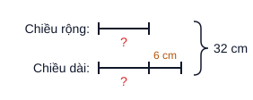
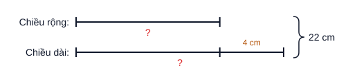
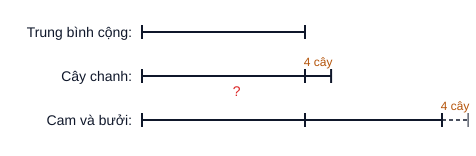
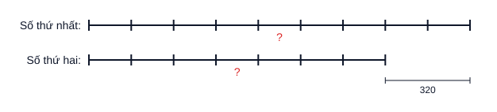

# 4T · LÔ GIẢI THỬ — lô 1 (13 câu, CEO duyệt 07/10) + lô 2 (20 câu, CEO duyệt 07/10) + lô 3 (20 câu, chờ duyệt) · sách "Toán arc 4 quyển 1" theo luật `k4T.md` (CHƯA ghi DB)

> Mỗi câu: **gán dạng** (mã + lý do) → **Phần 1. Hướng dẫn** → **Phần 2. Trình bày**. Chọn câu để phủ nhiều khuôn (lập luận · đếm ·
> tính thuận tiện · thay đổi thành phần · dãy số · tổng–hiệu · cấu tạo số · phân số · tổng–tỉ · tính ngược) và ưu tiên dạng đang
> **0 câu** trong kho (`010107`, `080101`, `120101`, `210101`, `220102`, `230101`). Đáp số đã thử ngược vào đề (§4 luật).
> Ký hiệu nguồn: `LT 1.5b` = Luyện tập chuyên đề 1 bài 5 ý b · `PCT 3.7` = Phiếu cuối tuần 3 bài 7.

---

## Câu 1 — LT 1.5b · Viết số tự nhiên lớn nhất, có hai chữ số, tích các chữ số là 24.

**Dạng:** `T14T010102` — lớn nhất, biết **tích** các chữ số và số chữ số. *(chủ đề cùng số với chuyên đề; khớp phương pháp "tách tích thành hai chữ số")*

**Phần 1. Hướng dẫn**

Mấu chốt: tích hai chữ số bằng $24$ nên phải tìm **các cặp chữ số** (mỗi chữ số từ $1$ đến $9$) có tích $24$. Chỉ có hai cặp: $3$ và $8$; $4$ và $6$ (không lấy $2$ và $12$ vì $12$ không phải chữ số). Muốn số lớn nhất thì đặt chữ số lớn hơn ở hàng chục, rồi so các số lập được.

**Phần 2. Trình bày**

Hai chữ số có tích bằng $24$ là: $3$ và $8$; $4$ và $6$.

Các số có hai chữ số lập được là: $38$; $83$; $46$; $64$.

Số lớn nhất là $83$.

Vậy số cần tìm là $83$.

---

## Câu 2 — LT 1.9c · Viết số tự nhiên nhỏ nhất, có các chữ số khác nhau, tổng các chữ số bằng 40.

**Dạng:** `T14T010106` — nhỏ nhất, biết tổng các chữ số (không cho số chữ số).

**Phần 1. Hướng dẫn**

Mấu chốt: số nhỏ nhất khi **ít chữ số nhất** và chữ số nhỏ đứng ở hàng cao. Để ít chữ số nhất thì chọn các chữ số lớn: $9+8+7+6+5=35$, chưa đủ $40$; thêm $4$ được $39$, vẫn chưa đủ; vậy phải có **$7$ chữ số**. Bảy chữ số khác nhau lớn nhất có tổng $9+8+7+6+5+4+3=42$, thừa $2$ so với $40$, nên hạ bớt: thay $3$ bằng $1$ được tổng đúng $40$. Sắp xếp từ bé đến lớn.

Chú ý: không chọn chữ số $0$, vì có $0$ thì sáu chữ số còn lại khác nhau có tổng nhiều nhất là $39$, không đủ $40$.

**Phần 2. Trình bày**

Số tự nhiên nhỏ nhất khi nó ít chữ số nhất và chữ số nhỏ nhất đứng ở hàng cao nhất.

Viết số $40$ thành tổng ít chữ số khác nhau nhất nên các chữ số cần chọn càng lớn càng tốt. Ta có: $9+8+7+6+5+4=39<40$ nên số cần tìm phải có $7$ chữ số.

Ta có: $40=1+4+5+6+7+8+9$

Sắp xếp các chữ số theo thứ tự từ nhỏ đến lớn để được số cần tìm là $1456789$.

---

## Câu 3 — LT 1.4a · Từ các chữ số 0 ; 2 ; 5 ; 9 ; 6 ; 8, viết số tự nhiên chẵn, lớn nhất, có ba chữ số khác nhau.

**Dạng:** `T14T010107` — viết số lớn nhất / nhỏ nhất từ các chữ số cho trước. *(dạng đang 0 câu)*

**Phần 1. Hướng dẫn**

Mấu chốt: số chẵn thì **chữ số hàng đơn vị phải chẵn**; số lớn nhất thì các hàng cao lấy chữ số lớn nhất còn lại. Lấy hàng trăm là $9$, hàng chục là $8$; hàng đơn vị chọn chữ số chẵn lớn nhất trong các chữ số còn lại ($0$; $2$; $5$; $6$) là $6$.

**Phần 2. Trình bày**

Số lớn nhất khi chữ số lớn nhất đứng ở hàng cao nhất, nên chữ số hàng trăm là $9$, chữ số hàng chục là $8$.

Số cần tìm là số chẵn nên chữ số hàng đơn vị là chữ số chẵn lớn nhất trong các chữ số còn lại: $6$.

Vậy số cần tìm là $986$.

---

## Câu 4 — PCT 3.7 · Từ các chữ số 0 ; 4 ; 7 ; 9, lập được bao nhiêu số lẻ có bốn chữ số khác nhau?

**Dạng:** `T14T020103` — đếm các số lập từ các chữ số **có điều kiện** (số lẻ). *(có cả chữ số 0, nhưng điều kiện "lẻ" là yếu tố quyết định cách đếm nên xếp vào 020103, không phải 020102)*

**Phần 1. Hướng dẫn**

Mấu chốt: đếm theo từng hàng, nhưng phải chọn **hàng đơn vị trước** vì có điều kiện số lẻ, rồi đến hàng nghìn vì hàng nghìn không được là $0$. Hàng đơn vị: $2$ cách ($7$ hoặc $9$). Hàng nghìn: còn $3$ chữ số nhưng bỏ $0$, được $2$ cách. Hai hàng còn lại lấy $2$ chữ số còn lại: $2\times 1$ cách.

**Phần 2. Trình bày**

Gọi số cần tìm có dạng $\overline{abcd}$ ($a$ khác $0$; $a,b,c,d$ khác nhau).

Số cần tìm là số lẻ nên chữ số hàng đơn vị $d$ có $2$ cách chọn ($7$ hoặc $9$).

Chữ số hàng nghìn $a$ khác $0$ và khác $d$ nên có $2$ cách chọn.

Chữ số hàng trăm $b$ có $2$ cách chọn, chữ số hàng chục $c$ có $1$ cách chọn.

Số các số lẻ có bốn chữ số khác nhau lập được là: $2\times 2\times 2\times 1=8$ (số)

Đáp số: $8$ số

---

## Câu 5 — LT 4.7d · Tính bằng cách thuận tiện: $3565-\left(2388-435\right)$

**Dạng:** `T14T000000` — **dạng chờ.** Chủ đề `T14T04` chỉ có dạng về phép nhân/chia; "tính thuận tiện cộng trừ (trừ một hiệu)" chưa có dạng — xem `k4T.md` §5 bảng thiếu.

**Phần 1. Hướng dẫn**

Mấu chốt: một số trừ đi một hiệu thì bằng số đó trừ số bị trừ rồi **cộng** số trừ: $a-(b-c)=a-b+c$. Dấu hiệu: $3565$ và $435$ cộng lại tròn nghìn ($4000$), nên bỏ ngoặc rồi ghép $3565$ với $435$.

**Phần 2. Trình bày**

$3565-\left(2388-435\right)$

$=3565-2388+435$

$=\left(3565+435\right)-2388$

$=4000-2388$

$=1612$

---

## Câu 6 — LT 4.16 · Tổng của hai số là 20. Nếu gấp số hạng thứ hai lên 5 lần và giữ nguyên số hạng thứ nhất thì được tổng mới là 36. Tìm hai số ban đầu.

**Dạng:** `T14T090101` — thay đổi đại lượng trong phép cộng (gấp một số hạng).

**Phần 1. Hướng dẫn**

Mấu chốt: gấp số hạng thứ hai lên $5$ lần nghĩa là tổng được **thêm $4$ lần** số hạng thứ hai (vì vẫn giữ $1$ lần cũ). Tổng tăng $36-20=16$, đó chính là $4$ lần số hạng thứ hai. Tìm được số hạng thứ hai thì lấy tổng trừ đi là ra số hạng thứ nhất.

**Phần 2. Trình bày**

Bài giải

Khi gấp số hạng thứ hai lên $5$ lần và giữ nguyên số hạng thứ nhất thì tổng tăng thêm $4$ lần số hạng thứ hai.

Bốn lần số hạng thứ hai là: $36-20=16$

Số hạng thứ hai là: $16:4=4$

Số hạng thứ nhất là: $20-4=16$

Đáp số: Số hạng thứ nhất: $16$; Số hạng thứ hai: $4$

---

## Câu 7 — LT 6.6 · Cho dãy số: 11 ; 16 ; 21 ; 26 ; 31 ; … (tách 3 câu vì 3 ý độc lập, 3 dạng khác nhau)

### Câu 7a — Tìm số hạng thứ 85 của dãy số trên.

**Dạng:** `T14T060101` — tìm số hạng thứ $n$.

**Phần 1. Hướng dẫn**

Mấu chốt: dãy cách đều, hai số liền nhau hơn kém nhau $5$. Từ số hạng thứ nhất đến số hạng thứ $85$ có $85-1=84$ khoảng cách, nên số hạng thứ $85$ bằng số đầu cộng $84$ lần khoảng cách.

**Phần 2. Trình bày** *(sửa theo CEO 07/10: bỏ dòng khoảng cách / số khoảng cách)*

Bài giải

Số hạng thứ $85$ của dãy là: $11+\left(85-1\right)\times 5=431$

Đáp số: $431$

### Câu 7b — Tính tổng 100 số hạng đầu tiên của dãy số.

**Dạng:** `T14T060103` — tổng của dãy số cách đều.

**Phần 1. Hướng dẫn**

Mấu chốt: tổng dãy cách đều bằng (số đầu + số cuối) nhân với số số hạng rồi chia $2$. Chưa biết số cuối nên phải tìm số hạng thứ $100$ trước (như câu 7a).

**Phần 2. Trình bày** *(sửa theo CEO 07/10)*

Bài giải

Số hạng thứ $100$ của dãy là: $11+\left(100-1\right)\times 5=506$

Tổng $100$ số hạng đầu tiên của dãy là: $\left(11+506\right)\times 100:2=25850$

Đáp số: $25850$

### Câu 7c — Số 951 là số hạng thứ bao nhiêu của dãy số trên?

**Dạng:** `T14T060104` — tìm vị trí của một số trong dãy.

**Phần 1. Hướng dẫn**

Mấu chốt: từ $11$ đến $951$ có $(951-11):5$ khoảng cách; số thứ tự bằng số khoảng cách **cộng $1$**. Trước khi tính phải kiểm tra $951$ có thuộc dãy không: $951-11=940$ chia hết cho $5$ nên thuộc dãy.

**Phần 2. Trình bày** *(sửa theo CEO 07/10)*

Bài giải

Số $951$ là số hạng thứ: $\left(951-11\right):5+1=189$

Đáp số: thứ $189$

---

## Câu 8 — LT 8.6 · Cách đây ba năm tổng số tuổi của hai mẹ con là 35 tuổi. Biết mẹ hơn con 25 tuổi. Tính tuổi mỗi người hiện nay.

**Dạng:** `T14T080101` — tổng hiệu cơ bản (tổng ẩn qua thời gian; bản đồ chưa tách "ẩn tổng" nên về dạng cơ bản). *(dạng đang 0 câu)*

**Phần 1. Hướng dẫn**

Mấu chốt: tổng số tuổi cho ở **ba năm trước**, còn câu hỏi là hiện nay. Sau ba năm mỗi người thêm $3$ tuổi, hai người thêm $6$ tuổi, nên tổng hiện nay là $35+6=41$. Hiệu số tuổi thì **không đổi** theo thời gian, vẫn là $25$. Có tổng và hiệu hiện nay thì tìm số bé (tuổi con) trước.

**Phần 2. Trình bày**

Bài giải

Tổng số tuổi của hai mẹ con hiện nay là: $35+3\times 2=41$ (tuổi)

Ta có sơ đồ:

*(hình do máy vẽ từ `so-do/k4T-cau8.json` bằng `scripts/kho/so-do-doan-thang.mjs` — CEO 07/10 yêu cầu có hình; khi ghi kho SVG lên `anh_dap_an`)*

Tuổi con hiện nay là: $\left(41-25\right):2=8$ (tuổi)

Tuổi mẹ hiện nay là: $8+25=33$ (tuổi)

Đáp số: Con: $8$ tuổi; Mẹ: $33$ tuổi

---

## Câu 9 — LT 9.7 · Khi nhân một số tự nhiên với 45, một bạn đã viết nhầm số 45 thành 54 nên kết quả của phép tính tăng thêm 207 đơn vị. Hãy tìm tích đúng của phép nhân đó.

**Dạng:** `T14T000000` — **dạng chờ.** Chuyên đề 9 (lời văn nhân chia: tích riêng thẳng cột, viết nhầm thừa số, số dư lớn nhất) chưa có dạng nào trong bản đồ; chủ đề `T14T09` chỉ có "phép cộng".

**Phần 1. Hướng dẫn**

Mấu chốt: viết nhầm $45$ thành $54$ tức là thừa số thứ hai **tăng thêm $54-45=9$**, nên tích tăng thêm $9$ lần số tự nhiên đó. Tích tăng $207$ nên số đó bằng $207:9$. Tìm được số thì nhân lại với $45$.

**Phần 2. Trình bày**

Bài giải

Khi viết nhầm $45$ thành $54$ thì thừa số thứ hai tăng thêm: $54-45=9$ (đơn vị)

Khi đó tích tăng thêm $9$ lần số tự nhiên cần nhân.

Số tự nhiên đó là: $207:9=23$

Tích đúng của phép nhân là: $23\times 45=1035$

Đáp số: $1035$

---

## Câu 10 — LT 12.3 · Tìm số tự nhiên có hai chữ số, biết nếu viết thêm chữ số 3 vào bên trái số đó thì được số mới gấp 5 lần số đã cho.

**Dạng:** `T14T120101` — viết thêm chữ số vào bên trái số cho trước. *(dạng đang 0 câu)*

**Phần 1. Hướng dẫn**

Mấu chốt: viết thêm chữ số $3$ vào bên trái số có hai chữ số $\overline{ab}$ thì được $\overline{3ab}$, tức là số đó **cộng thêm $300$**. Số mới gấp $5$ lần số cũ, nghĩa là $5$ lần số cũ bằng số cũ cộng $300$; bớt đi $1$ lần số cũ ở cả hai bên thì $4$ lần số cũ bằng $300$.

**Phần 2. Trình bày**

Gọi số cần tìm là $\overline{ab}$ ($a$ khác $0$; $a,b<10$). Số mới là $\overline{3ab}$.

Ta có: $\overline{ab}\times 5=\overline{3ab}$

$\overline{ab}\times 5=300+\overline{ab}$

$\overline{ab}\times 4=300$ (Bớt cả hai vế đi $\overline{ab}$)

$\begin{array}{l} \overline{ab}=300:4 \\ \overline{ab}=75 \end{array}$

Đáp số: $75$

---

## Câu 11 — LT 21.5 · Nam có một số bi, Nam cho bạn $\dfrac{7}{12}$ số bi của mình thì Nam còn lại 25 viên bi. Hỏi ban đầu, Nam có bao nhiêu viên bi?

**Dạng:** `T14T210101` — tìm đại lượng khi biết giá trị phân số của nó, hai đại lượng (số bi đã cho và số bi còn lại). *(dạng đang 0 câu; tên dạng "hai đại lượng" hiểu là bài chỉ có 2 phần: phần đã dùng và phần còn lại)*

**Phần 1. Hướng dẫn**

Mấu chốt: $25$ viên bi còn lại **ứng với phần nào** của số bi ban đầu? Nam cho đi $\dfrac{7}{12}$ nên còn lại $1-\dfrac{7}{12}=\dfrac{5}{12}$ số bi. Biết $\dfrac{5}{12}$ của số bi là $25$ viên thì số bi là $25:\dfrac{5}{12}$.

**Phần 2. Trình bày**

Bài giải

$25$ viên bi còn lại chiếm số phần tổng số bi là: $1-\dfrac{7}{12}=\dfrac{5}{12}$ (số bi)

Số bi ban đầu của Nam là: $25:\dfrac{5}{12}=60$ (viên bi)

Đáp số: $60$ viên bi

---

## Câu 12 — LT 22.10 · Hiện nay, tổng số tuổi của hai mẹ con là 35 tuổi. Sau 5 năm nữa, tuổi con bằng $\dfrac{1}{4}$ tuổi mẹ. Tính tuổi hiện nay của mỗi người.

**Dạng:** `T14T220102` — tổng tỉ **ẩn tổng** (tổng tại thời điểm có tỉ số phải tính). *(dạng đang 0 câu)*

**Phần 1. Hướng dẫn**

Mấu chốt: tỉ số $\dfrac{1}{4}$ là của **5 năm sau**, nên phải vẽ sơ đồ ở thời điểm đó; tổng số tuổi khi ấy là $35+5\times 2=45$. Giải tổng–tỉ ra tuổi con sau 5 năm, rồi **trừ 5** để về hiện nay.

Chú ý: lỗi hay gặp là lấy tổng $35$ chia $5$ phần.

**Phần 2. Trình bày**

Bài giải

Sau $5$ năm nữa, tổng số tuổi của hai mẹ con là: $35+5\times 2=45$ (tuổi)

Ta có sơ đồ sau $5$ năm nữa:

Tổng số phần bằng nhau là: $1+4=5$ (phần)

Tuổi con sau $5$ năm nữa là: $45:5\times 1=9$ (tuổi)

Tuổi con hiện nay là: $9-5=4$ (tuổi)

Tuổi mẹ hiện nay là: $35-4=31$ (tuổi)

Đáp số: Con: $4$ tuổi; Mẹ: $31$ tuổi

---

## Câu 13 — LT 24.12 · Hưng có một số cái kẹo. Hưng cho em $\dfrac{2}{3}$ số kẹo đó và 4 cái kẹo nữa thì còn lại 6 cái kẹo. Hỏi lúc đầu, Hưng có bao nhiêu cái kẹo?

**Dạng:** `T14T230101` — tính ngược từ cuối (tìm số ban đầu trong chuỗi phép tính). *(dạng đang 0 câu)*

**Phần 1. Hướng dẫn**

Mấu chốt: đi **ngược từ cuối**. Trước khi cho thêm $4$ cái, Hưng còn $6+4=10$ cái; $10$ cái này là phần còn lại sau khi cho $\dfrac{2}{3}$, tức là $\dfrac{1}{3}$ số kẹo. Vậy số kẹo lúc đầu gấp $3$ lần $10$.

**Phần 2. Trình bày**

Bài giải

Số kẹo còn lại sau khi Hưng cho em $\dfrac{2}{3}$ số kẹo là: $6+4=10$ (cái)

$10$ cái kẹo chiếm số phần số kẹo lúc đầu là: $1-\dfrac{2}{3}=\dfrac{1}{3}$ (số kẹo)

Số kẹo lúc đầu của Hưng là: $10:\dfrac{1}{3}=30$ (cái)

Đáp số: $30$ cái kẹo

---

## Bảng tóm tắt lô 1

| # | Nguồn | Dạng | Đáp số | Ghi chú |
|---|---|---|---|---|
| 1 | LT 1.5b | `010102` | 83 | |
| 2 | LT 1.9c | `010106` | 1456789 | bẫy: phải 7 chữ số, không có 0 |
| 3 | LT 1.4a | `010107` | 986 | dạng 0 câu |
| 4 | PCT 3.7 | `020103` | 8 | chọn 020103 thay 020102 vì điều kiện "lẻ" quyết định cách đếm |
| 5 | LT 4.7d | `000000` chờ | 1612 | thiếu dạng "thuận tiện cộng trừ" |
| 6 | LT 4.16 | `090101` | 16 và 4 | |
| 7a/b/c | LT 6.6 | `060101` / `060103` / `060104` | 431 / 25850 / thứ 189 | tách 3 câu |
| 8 | LT 8.6 | `080101` | 8 và 33 | dạng 0 câu; tổng ẩn |
| 9 | LT 9.7 | `000000` chờ | 1035 | thiếu toàn bộ dạng chuyên đề 9 |
| 10 | LT 12.3 | `120101` | 75 | dạng 0 câu |
| 11 | LT 21.5 | `210101` | 60 | dạng 0 câu |
| 12 | LT 22.10 | `220102` | 4 và 31 | dạng 0 câu |
| 13 | LT 24.12 | `230101` | 30 | dạng 0 câu |

---
---

# 4T · LÔ GIẢI THỬ 2 — 20 câu, 8 chuyên đề chưa có trong lô 1 (07/10, theo `k4T.md` sau vòng sửa lô 1, CHƯA ghi DB)

> Chuyên đề: 3 Đo lường · 5 Chu vi diện tích · 10 Chia hết · 11 Chia có dư · 14 Rút về đơn vị · 15 Thống kê · 16 Phân số · 17 So sánh phân số.
> Đề chép từ sách đọc lại bằng `doc-docx.mjs` 07/10. Đáp số đã thử ngược + máy tính lại (liệt kê vét cạn cho bài tìm chữ số / lịch / chia dư).
> Bản đồ tra trên DB live 07/10 (chỉ đọc). Áp luật lô 1: Phần 2 bài dãy/trồng cây không ghi bước trung gian của Phần 1 · mỗi câu một dòng · bài tổng–hiệu có hình sơ đồ.

---

## Câu 1 — LT 3.1 · Sắp xếp 1 kg 512 g ; 1 kg 5 hg ; 1 kg 51 dag ; 10 hg 50 g theo thứ tự từ lớn đến bé.

**Dạng:** `T14T030101` — đổi đơn vị đo khối lượng. *(muốn so sánh phải đổi về cùng một đơn vị; dạng duy nhất của chủ đề Đo lường)*

**Phần 1. Hướng dẫn**

Mấu chốt: bốn số đo viết bằng **các đơn vị khác nhau** nên chưa so được, phải đổi tất cả về **cùng một đơn vị nhỏ nhất** là gam. Nhớ: $1$ kg $=1000$ g; $1$ hg $=100$ g; $1$ dag $=10$ g.

Chú ý: $10$ hg $50$ g nhìn có số $10$ to nhưng chỉ là $1050$ g, nhỏ nhất trong bốn số đo.

**Phần 2. Trình bày**

$1$ kg $512$ g $=1512$ g

$1$ kg $5$ hg $=1500$ g

$1$ kg $51$ dag $=1510$ g

$10$ hg $50$ g $=1050$ g

Vì $1512$ g $>1510$ g $>1500$ g $>1050$ g nên thứ tự từ lớn đến bé là: $1$ kg $512$ g ; $1$ kg $51$ dag ; $1$ kg $5$ hg ; $10$ hg $50$ g.

---

## Câu 2 — LT 3.6 · Trong một tháng nào đó có ba ngày thứ Năm đều là ngày chẵn. Hỏi ngày 26 của tháng đó là thứ mấy?

**Dạng:** `T14T000000` — **dạng chờ.** Bài lịch (ngày trong tuần lặp 7 ngày) chưa có dạng; chủ đề `T14T03` chỉ có "đổi đơn vị khối lượng".

**Phần 1. Hướng dẫn**

Mấu chốt: hai ngày thứ Năm liền nhau cách nhau $7$ ngày (số lẻ) nên các ngày thứ Năm **chẵn, lẻ xen kẽ**. Một tháng có nhiều nhất $5$ ngày thứ Năm. Muốn có $3$ ngày chẵn thì phải đủ $5$ ngày thứ Năm theo kiểu chẵn – lẻ – chẵn – lẻ – chẵn, tức là **ngày thứ Năm đầu tiên là ngày chẵn**. Có $5$ ngày thứ Năm thì ngày thứ Năm đầu tiên không quá ngày $3$ (vì $3+7\times 4=31$). Ngày chẵn không quá $3$ chỉ có ngày $2$.

**Phần 2. Trình bày**

Hai ngày thứ Năm liền nhau cách nhau $7$ ngày nên các ngày thứ Năm trong tháng lần lượt là ngày chẵn, ngày lẻ xen kẽ nhau.

Một tháng có nhiều nhất $5$ ngày thứ Năm. Tháng đó có $3$ ngày thứ Năm là ngày chẵn nên tháng đó có $5$ ngày thứ Năm và ngày thứ Năm đầu tiên là ngày chẵn.

Ngày thứ Năm đầu tiên không quá ngày $3$ (vì $3+7\times 4=31$) nên ngày thứ Năm đầu tiên là ngày $2$.

Các ngày thứ Năm của tháng đó là: $2$ ; $9$ ; $16$ ; $23$ ; $30$.

Ngày $26$ sau ngày thứ Năm $23$ là: $26-23=3$ (ngày)

Vậy ngày $26$ của tháng đó là Chủ nhật.

---

## Câu 3 — LT 3.13 · Một chai đựng dung dịch nặng 1300 g. Nếu chai đó đựng một nửa lượng dung dịch thì nặng 750 g. Hỏi khi chai rỗng thì nặng bao nhiêu gam?

**Dạng:** `T14T000000` — **dạng chờ.** Bài lời văn với số đo khối lượng (bì + hàng), không phải đổi đơn vị.

**Phần 1. Hướng dẫn**

Mấu chốt: hai lần cân **cùng một cái chai**, chỉ khác lượng dung dịch. Vậy phần nặng hơn $1300-750$ chính là **một nửa** lượng dung dịch. Lấy $750$ g (chai + nửa dung dịch) bớt đi nửa dung dịch là ra chai rỗng.

Chú ý: không lấy $1300:2$ — chai không bị chia đôi.

**Phần 2. Trình bày**

Bài giải

Khối lượng của một nửa lượng dung dịch là: $1300-750=550$ (g)

Khối lượng của chai rỗng là: $750-550=200$ (g)

Đáp số: $200$ g

---

## Câu 4 — LT 5.4 · Một hình chữ nhật có chu vi bằng chu vi của một hình vuông có cạnh 16 cm. Biết chiều dài hơn chiều rộng 6 cm. Tìm chiều dài, chiều rộng của hình chữ nhật.

**Dạng:** `T14T080101` — tổng hiệu cơ bản (tổng ẩn = nửa chu vi). *(giải bằng tổng–hiệu ⇒ dạng tổng–hiệu — CEO chốt 07/10)*

**Phần 1. Hướng dẫn**

Mấu chốt: chiều dài và chiều rộng là **hai số biết hiệu** ($6$ cm); còn thiếu **tổng**. Tổng của chiều dài và chiều rộng chính là **nửa chu vi**. Chu vi hình chữ nhật bằng chu vi hình vuông cạnh $16$ cm, nên tìm chu vi hình vuông → nửa chu vi → giải tổng–hiệu, tìm số bé (chiều rộng) trước.

**Phần 2. Trình bày**

Bài giải

Chu vi hình vuông là: $16\times 4=64$ (cm)

Nửa chu vi hình chữ nhật là: $64:2=32$ (cm)

Ta có sơ đồ:

Chiều rộng hình chữ nhật là: $\left(32-6\right):2=13$ (cm)

Chiều dài hình chữ nhật là: $13+6=19$ (cm)

Đáp số: Chiều dài: $19$ cm; Chiều rộng: $13$ cm

---

## Câu 5 — LT 5.9 · Một hình chữ nhật có chu vi là 44 cm. Nếu tăng chiều rộng thêm 4 cm thì hình chữ nhật đó trở thành hình vuông. Tính diện tích của hình chữ nhật ban đầu.

**Dạng:** `T14T080101` — tổng hiệu cơ bản. *(sửa 07/10 theo luật CEO chốt ở câu 4: lõi là tổng–hiệu — "tăng rộng thành hình vuông" ⇒ hiệu 4 cm, nửa chu vi là tổng; diện tích chỉ là bước cuối. Bản gửi duyệt ghi dạng chờ)*

**Phần 1. Hướng dẫn**

Mấu chốt: "tăng chiều rộng thêm $4$ cm thì thành hình vuông" nghĩa là chiều rộng mới bằng chiều dài, tức là **chiều dài hơn chiều rộng $4$ cm**. Có hiệu $4$ cm, tổng là nửa chu vi $44:2$ ⇒ bài tổng–hiệu. Tìm xong hai cạnh mới tính diện tích.

**Phần 2. Trình bày**

Bài giải

Nửa chu vi hình chữ nhật là: $44:2=22$ (cm)

Tăng chiều rộng thêm $4$ cm thì được hình vuông nên chiều dài hơn chiều rộng $4$ cm.

Ta có sơ đồ:

Chiều rộng hình chữ nhật là: $\left(22-4\right):2=9$ (cm)

Chiều dài hình chữ nhật là: $9+4=13$ (cm)

Diện tích hình chữ nhật ban đầu là: $13\times 9=117$ ($cm^2$)

Đáp số: $117$ $cm^2$

---

## Câu 6 — LT 5.19 · (*) Một miếng bìa hình vuông có độ dài cạnh 10 cm. Người ta cắt đi bốn góc theo các hình vuông nhỏ cạnh 2 cm (như hình vẽ). Tính chu vi và diện tích của phần bìa còn lại.

**Dạng:** `T14T000000` — **dạng chờ** (hình ghép / cắt bớt). *Câu có hình đề (`image111.emf` trong docx) ⇒ khi ghi kho cắt vào `anh_de`. Một câu, không tách: chu vi và diện tích cùng một hình.*

**Phần 1. Hướng dẫn**

Mấu chốt về **chu vi**: ở mỗi góc, cắt đi hình vuông nhỏ thì đường viền **mất** hai đoạn $2$ cm của cạnh cũ nhưng **thêm** hai cạnh $2$ cm của hình vuông nhỏ lộ ra. Mất bao nhiêu thêm bấy nhiêu nên **chu vi không đổi**. Về **diện tích**: lấy diện tích miếng bìa trừ bốn hình vuông nhỏ.

Chú ý: lỗi hay gặp là nghĩ "cắt bớt thì chu vi giảm".

**Phần 2. Trình bày**

Bài giải

Ở mỗi góc, khi cắt đi một hình vuông nhỏ thì chu vi bớt đi hai đoạn $2$ cm nhưng lại thêm hai cạnh của hình vuông nhỏ, mỗi cạnh $2$ cm. Vậy chu vi phần bìa còn lại bằng chu vi miếng bìa ban đầu.

Chu vi phần bìa còn lại là: $10\times 4=40$ (cm)

Diện tích miếng bìa ban đầu là: $10\times 10=100$ ($cm^2$)

Diện tích một hình vuông nhỏ là: $2\times 2=4$ ($cm^2$)

Diện tích phần bìa còn lại là: $100-4\times 4=84$ ($cm^2$)

Đáp số: Chu vi: $40$ cm; Diện tích: $84$ $cm^2$

---

## Câu 7 — LT 10.5b · Cho bốn chữ số 0 ; 3 ; 6 ; 9. Hãy viết tất cả các số có ba chữ số khác nhau chia hết cho 5 và 9.

**Dạng:** `T14T100103` — lập số từ các chữ số cho trước để chia hết. *(LT 10.5 có 3 ý a/b/c độc lập ⇒ tách; đây là ý b)*

**Phần 1. Hướng dẫn**

Mấu chốt: xét **chia hết cho 5 trước** vì nó chốt luôn hàng đơn vị: tận cùng $0$ hoặc $5$, mà không có chữ số $5$ ⇒ hàng đơn vị là $0$. Còn lại chọn **hai chữ số** trong $3$ ; $6$ ; $9$ sao cho tổng chia hết cho $9$: thử ba cặp $3+6=9$ ; $3+9=12$ ; $6+9=15$ ⇒ chỉ cặp $3$ và $6$. Đổi chỗ hai chữ số đó được hai số.

**Phần 2. Trình bày**

Số cần tìm chia hết cho $5$ nên chữ số hàng đơn vị là $0$ (trong các chữ số đã cho không có chữ số $5$).

Số cần tìm chia hết cho $9$ nên tổng hai chữ số còn lại chia hết cho $9$.

Ta có: $3+6=9$ ; $3+9=12$ ; $6+9=15$. Chỉ có $3+6=9$ chia hết cho $9$.

Vậy các số cần tìm là: $360$ ; $630$.

---

## Câu 8 — LT 10.12 · Thay các chữ $a;b$ bằng các chữ số thích hợp để số $\overline{65a3b}$ chia hết cho 36.

**Dạng:** `T14T100102` — tìm chữ số để số chia hết. *(chia hết cho 36 quy về chia hết cho 4 và 9)*

**Phần 1. Hướng dẫn**

Mấu chốt: chưa có dấu hiệu chia hết cho $36$, nên viết $36=4\times 9$ — số chia hết cho cả $4$ và $9$ thì chia hết cho $36$. Xét **4 trước** vì nó chốt hàng đơn vị: $\overline{3b}$ chia hết cho $4$ ⇒ $b=2$ ($32$) hoặc $b=6$ ($36$). Với **mỗi** giá trị của $b$, dùng dấu hiệu chia hết cho $9$ tìm $a$.

Chú ý: có **hai** đáp số, đừng dừng ở trường hợp đầu.

**Phần 2. Trình bày**

Ta có $36=4\times 9$ nên $\overline{65a3b}$ chia hết cho $36$ khi $\overline{65a3b}$ chia hết cho cả $4$ và $9$.

$\overline{65a3b}$ chia hết cho $4$ khi $\overline{3b}$ chia hết cho $4$ nên $b=2$ hoặc $b=6$.

Với $b=2$ thì $\overline{65a32}$ chia hết cho $9$ khi $6+5+a+3+2=\left(16+a\right)$ chia hết cho $9$. Suy ra $a=2$. Ta được số $65232$.

Với $b=6$ thì $\overline{65a36}$ chia hết cho $9$ khi $6+5+a+3+6=\left(20+a\right)$ chia hết cho $9$. Suy ra $a=7$. Ta được số $65736$.

Vậy $a=2$, $b=2$ hoặc $a=7$, $b=6$.

---

## Câu 9 — LT 10.14 · (*) Cho biết $18\times 19\times 20\times 21\times 22=\overline{31*0080}$. Không thực hiện phép tính hãy tìm và giải thích cách tìm giá trị của chữ số *.

**Dạng:** `T14T100102` — tìm chữ số để số chia hết. *(chữ số thiếu tìm bằng dấu hiệu chia hết cho 9; khác ở chỗ phải TỰ nhận ra tích chia hết cho 9)*

**Phần 1. Hướng dẫn**

Mấu chốt: không được nhân, nên phải tìm một **số chia hết** mà tích chắc chắn chia hết. Trong tích có thừa số $18$ chia hết cho $9$ ⇒ cả tích chia hết cho $9$ ⇒ tổng các chữ số của $\overline{31*0080}$ chia hết cho $9$. Tổng các chữ số đã biết là $12$, nên $*$ là chữ số làm $12+*$ chia hết cho $9$.

**Phần 2. Trình bày**

Tích $18\times 19\times 20\times 21\times 22$ có thừa số $18$ chia hết cho $9$ nên tích chia hết cho $9$.

Do đó $\overline{31*0080}$ chia hết cho $9$, tức là $3+1+*+0+0+8+0=\left(12+*\right)$ chia hết cho $9$.

Suy ra $*=6$.

---

## Câu 10 — LT 11.9 · Người ta viết liên tiếp cụm từ THẦN ĐỒNG ĐẤT VIỆT thành một dãy chữ liên tiếp THANDONGDATVIETTHANDONGDATVIET... Hỏi chữ cái thứ 352 của dãy là chữ cái nào? Của từ nào?

**Dạng:** `T14T110104` — bài toán về dãy đối tượng lặp lại.

**Phần 1. Hướng dẫn**

Mấu chốt: dãy lặp lại theo **cụm** THANDONGDATVIET. Đếm số chữ cái của một cụm (không tính dấu cách, không dấu): $15$ chữ. Chia $352$ cho $15$: thương là số cụm đầy đủ, **số dư** cho biết chữ cái thứ 352 là chữ thứ mấy trong cụm tiếp theo. Dư $7$ ⇒ đếm T-H-A-N-D-O-**N**.

Chú ý: nếu dư $0$ thì là chữ **cuối** của cụm.

**Phần 2. Trình bày**

Bài giải

Cụm từ THANDONGDATVIET có $15$ chữ cái.

Ta có: $352:15=23$ (dư $7$)

Vậy chữ cái thứ $352$ là chữ cái thứ $7$ của cụm từ, đó là chữ N của từ ĐỒNG.

Đáp số: chữ N, của từ ĐỒNG

---

## Câu 11 — LT 11.12 · Tìm số tự nhiên nhỏ nhất khác 1 mà khi chia cho 3 ; 4 ; 5 và 7 có cùng số dư là 1.

**Dạng:** `T14T110105` — tìm số khi biết điều kiện chia cho nhiều số. *(dạng đang 0 câu)*

**Phần 1. Hướng dẫn**

Mấu chốt: chia cho cả bốn số **đều dư 1** ⇒ **bớt 1** thì chia hết cho cả $3$ ; $4$ ; $5$ và $7$. Vậy đi tìm số nhỏ nhất khác $0$ chia hết cho cả bốn số rồi cộng $1$. Tìm bằng cách lọc dần: chia hết cho $4$ và $5$ ⇒ cứ thêm $20$ ($20$ ; $40$ ; $60$ ; …); trong đó chia hết cho $3$ ⇒ cứ thêm $60$; thử lần lượt với $7$.

Chú ý: đề nói "khác $1$" vì số $1$ chia cho mọi số đều dư $1$ — loại trường hợp số bớt $1$ bằng $0$.

**Phần 2. Trình bày**

Số cần tìm chia cho $3$ ; $4$ ; $5$ và $7$ đều dư $1$ nên số đó bớt đi $1$ thì chia hết cho cả $3$ ; $4$ ; $5$ và $7$.

Các số khác $0$ chia hết cho cả $4$ và $5$ là: $20$ ; $40$ ; $60$ ; $80$ ; $100$ ; $120$ ; …

Trong các số đó, các số chia hết cho $3$ là: $60$ ; $120$ ; $180$ ; $240$ ; $300$ ; $360$ ; $420$ ; …

Trong các số đó, số nhỏ nhất chia hết cho $7$ là $420$.

Số cần tìm là: $420+1=421$

Đáp số: $421$

---

## Câu 12 — LT 14.4 · Mua 4 đôi dép hết 240000 đồng, mua 3 đôi giày vải hết 375000 đồng. Hỏi mua 3 đôi dép và 1 đôi giày vải cùng loại hết bao nhiêu tiền?

**Dạng:** `T14T000000` — **dạng chờ.** Rút về đơn vị **hai đại lượng** (dép và giày) — `k4T.md` §5 đã ghi thiếu.

**Phần 1. Hướng dẫn**

Mấu chốt: có **hai thứ hàng**, mỗi thứ phải rút về đơn vị **riêng**: giá $1$ đôi dép, giá $1$ đôi giày. Sau đó tính tiền $3$ đôi dép rồi cộng tiền $1$ đôi giày.

Chú ý: không cộng $240000+375000$ rồi chia — hai thứ giá khác nhau.

**Phần 2. Trình bày**

Tóm tắt:

$4$ đôi dép: $240000$ đồng

$3$ đôi giày vải: $375000$ đồng

$3$ đôi dép và $1$ đôi giày vải: … đồng?

Bài giải

Giá tiền một đôi dép là: $240000:4=60000$ (đồng)

Giá tiền một đôi giày vải là: $375000:3=125000$ (đồng)

Mua $3$ đôi dép hết số tiền là: $60000\times 3=180000$ (đồng)

Mua $3$ đôi dép và $1$ đôi giày vải hết số tiền là: $180000+125000=305000$ (đồng)

Đáp số: $305000$ đồng

---

## Câu 13 — LT 14.13 · Để chuẩn bị cho một hội nghị người ta kê 15 hàng ghế đủ chỗ cho 180 người ngồi. Trên thực tế có 204 người đến dự. Hỏi phải kê thêm bao nhiêu hàng ghế nữa? Biết rằng mỗi hàng ghế có số chỗ ngồi như nhau.

**Dạng:** `T14T140101` — rút về đơn vị một đại lượng. *(bước 2 là phép CHIA = "dạng 2" của sách; dạng 1 và dạng 2 chung một dạng — CEO chốt 07/10)*

**Phần 1. Hướng dẫn**

Mấu chốt: rút về đơn vị — **một hàng ghế có mấy chỗ** ($180:15$). Biết một hàng thì tìm **số hàng** cần cho $204$ người (phép chia — dạng 2). Câu hỏi là **kê thêm**, nên trừ đi $15$ hàng đã có.

Chú ý: lỗi hay gặp là trả lời $17$ hàng (quên trừ).

**Phần 2. Trình bày**

Tóm tắt:

$15$ hàng: $180$ người

… hàng: $204$ người

Bài giải

Mỗi hàng ghế có số chỗ ngồi là: $180:15=12$ (chỗ)

Số hàng ghế cần kê cho $204$ người là: $204:12=17$ (hàng)

Số hàng ghế phải kê thêm là: $17-15=2$ (hàng)

Đáp số: $2$ hàng ghế

---

## Câu 14 — LT 15.4 · Cho dãy số liệu về số cuốn sách các lớp khối Bốn của một trường Tiểu học quyên góp cho các bạn vùng cao: 35; 34; 23; 48; 56; 87; 32; 45; 31; 49. a) Khối Bốn trường Tiểu học đó có bao nhiêu lớp? b) Tính trung bình cộng số cuốn sách của các lớp khối Bốn quyên góp. c) Có bao nhiêu lớp quyên góp nhiều hơn trung bình cộng số cuốn sách của khối Bốn?

**Dạng:** `T14T150101` — xác định các đại lượng cơ bản của thống kê. *(dạng đang 0 câu. **Không tách**: ý c dùng kết quả ý b)*

**Phần 1. Hướng dẫn**

Mấu chốt: mỗi số trong dãy là số sách của **một lớp** ⇒ đếm số các số là ra số lớp. Trung bình cộng = tổng các số : số lớp. Ý c: so từng số với trung bình cộng vừa tìm, đếm các số **lớn hơn**.

Chú ý: "nhiều hơn" không tính lớp bằng đúng trung bình cộng.

**Phần 2. Trình bày**

Bài giải

a) Khối Bốn trường Tiểu học đó có $10$ lớp.

b) Tổng số cuốn sách $10$ lớp quyên góp là:

$35+34+23+48+56+87+32+45+31+49=440$ (cuốn)

Trung bình cộng số cuốn sách của các lớp khối Bốn quyên góp là: $440:10=44$ (cuốn)

c) Các lớp quyên góp nhiều hơn $44$ cuốn sách là các lớp quyên góp: $48$ ; $56$ ; $87$ ; $45$ ; $49$ cuốn.

Vậy có $5$ lớp quyên góp nhiều hơn trung bình cộng.

Đáp số: a) $10$ lớp; b) $44$ cuốn sách; c) $5$ lớp

---

## Câu 15 — LT 15.14 (tách 2 câu: hai ý độc lập, mỗi ý tự đứng được) · Trong hộp có 12 viên bi vàng, 10 viên bi xanh, 6 viên bi đỏ có kích thước giống hệt nhau. Không nhìn vào hộp, cần bốc ra ít nhất bao nhiêu viên bi để chắc chắn trong số các viên bi lấy ra:

### Câu 15a — … có đủ 3 màu?

**Dạng:** `T14T000000` — **dạng chờ** ("bốc ít nhất để chắc chắn" — trường hợp xấu nhất; `k4T.md` §5 đã ghi thiếu).

**Phần 1. Hướng dẫn**

Mấu chốt: "chắc chắn" nghĩa là **kể cả khi xui nhất** cũng phải đúng. Xui nhất là bốc hết sạch **hai màu nhiều nhất** mà vẫn chưa có màu thứ ba: hết $12$ vàng và $10$ xanh ($22$ viên) vẫn chỉ có $2$ màu. Bốc thêm $1$ viên nữa thì trong hộp chỉ còn bi đỏ ⇒ chắc chắn đủ $3$ màu.

**Phần 2. Trình bày**

Bài giải

Trường hợp xấu nhất là bốc hết $12$ viên bi vàng và $10$ viên bi xanh mà chưa có viên bi đỏ nào.

Khi đó số viên bi đã bốc là: $12+10=22$ (viên)

Bốc thêm $1$ viên nữa thì chắc chắn được viên bi đỏ, tức là có đủ $3$ màu.

Số viên bi ít nhất cần bốc là: $22+1=23$ (viên)

Đáp số: $23$ viên bi

### Câu 15b — … có ít nhất 4 viên bi đỏ?

**Dạng:** `T14T000000` — **dạng chờ** (như 15a).

**Phần 1. Hướng dẫn**

Mấu chốt: xui nhất là bốc hết **mọi viên không phải đỏ** ($12$ vàng, $10$ xanh) và **chỉ được $3$ viên đỏ** (thiếu đúng $1$ viên). Bốc thêm $1$ viên nữa thì viên đó chắc chắn là đỏ ⇒ đủ $4$ viên đỏ.

Chú ý: lỗi hay gặp là cộng cả $6$ viên đỏ ($12+10+6$) hoặc chỉ trả lời $4$ — trường hợp xấu nhất là **chỉ thiếu đúng 1 viên đỏ**.

**Phần 2. Trình bày**

Bài giải

Trường hợp xấu nhất là bốc hết $12$ viên bi vàng, $10$ viên bi xanh và chỉ được $3$ viên bi đỏ.

Khi đó số viên bi đã bốc là: $12+10+3=25$ (viên)

Bốc thêm $1$ viên nữa thì viên đó chắc chắn là bi đỏ, ta có $4$ viên bi đỏ.

Số viên bi ít nhất cần bốc là: $25+1=26$ (viên)

Đáp số: $26$ viên bi

---

## Câu 16 — LT 16.6c · Rút gọn phân số: $\dfrac{135135}{130130}$

**Dạng:** `T14T160202` — rút gọn phân số dạng đặc biệt. *(dạng đang 0 câu; LT 16.6 có 4 ý a–d độc lập ⇒ tách, đây là ý c)*

**Phần 1. Hướng dẫn**

Mấu chốt: tử và mẫu đều là **số có ba chữ số viết lặp lại hai lần** ($135135$, $130130$). Số dạng $\overline{abcabc}=\overline{abc}\times 1001$ nên chia cả tử và mẫu cho $1001$ (như VD 16.1). Sau đó rút gọn tiếp $\dfrac{135}{130}$: cả hai tận cùng $0$ hoặc $5$ ⇒ chia cho $5$.

**Phần 2. Trình bày**

$\dfrac{135135}{130130}=\dfrac{135135:1001}{130130:1001}=\dfrac{135}{130}=\dfrac{135:5}{130:5}=\dfrac{27}{26}$

---

## Câu 17 — LT 16.8e · Quy đồng mẫu số các phân số: $\dfrac{1}{3};\dfrac{3}{5};\dfrac{5}{7}$

**Dạng:** `T14T160103` — quy đồng mẫu số nhiều phân số. *(dạng đang 0 câu)*

**Phần 1. Hướng dẫn**

Mấu chốt: ba mẫu số $3$ ; $5$ ; $7$ không có mẫu nào chia hết cho mẫu khác, nên lấy mẫu số chung là **tích ba mẫu** $3\times 5\times 7=105$. Mỗi phân số nhân cả tử và mẫu với **tích hai mẫu còn lại**: $\dfrac{1}{3}$ nhân $5\times 7=35$; $\dfrac{3}{5}$ nhân $3\times 7=21$; $\dfrac{5}{7}$ nhân $3\times 5=15$.

**Phần 2. Trình bày**

Chọn mẫu số chung là: $3\times 5\times 7=105$

$\dfrac{1}{3}=\dfrac{1\times 35}{3\times 35}=\dfrac{35}{105}$

$\dfrac{3}{5}=\dfrac{3\times 21}{5\times 21}=\dfrac{63}{105}$

$\dfrac{5}{7}=\dfrac{5\times 15}{7\times 15}=\dfrac{75}{105}$

Vậy quy đồng mẫu số ba phân số $\dfrac{1}{3};\dfrac{3}{5};\dfrac{5}{7}$ ta được ba phân số $\dfrac{35}{105};\dfrac{63}{105};\dfrac{75}{105}$.

---

## Câu 18 — LT 17.9c · So sánh các cặp phân số (giải thích cách làm): $\dfrac{2026}{2023}$ và $\dfrac{2027}{2024}$

**Dạng:** `T14T000000` — **dạng chờ** (so sánh bằng **phần hơn**). *Tra kho 07/10: `170203` = phần bù cùng tử 1 (vd $\dfrac{33}{34}$ và $\dfrac{34}{35}$), `170204` = phần bù khác tử (vd $\dfrac{4}{5}$ và $\dfrac{7}{9}$) — tức là hai dạng **không trùng nhau**, và **phần hơn chưa có dạng**. LT 17.9 có 4 ý độc lập ⇒ tách, đây là ý c.*

**Phần 1. Hướng dẫn**

Mấu chốt: hai phân số đều **lớn hơn 1**, và **tử hơn mẫu cùng $3$ đơn vị** ⇒ dùng **phần hơn** (phần lớn hơn $1$). Phần hơn đều có tử $3$, so như hai phân số cùng tử: mẫu bé hơn thì phân số lớn hơn. Phân số nào có phần hơn lớn hơn thì lớn hơn.

**Phần 2. Trình bày**

Bước 1: Tìm phần hơn

$\dfrac{2026}{2023}-1=\dfrac{3}{2023}$

$\dfrac{2027}{2024}-1=\dfrac{3}{2024}$

Bước 2: So sánh phần hơn, kết luận về hai phân số cần so sánh

Vì $\dfrac{3}{2023}>\dfrac{3}{2024}$ nên $\dfrac{2026}{2023}>\dfrac{2027}{2024}$.

---

## Câu 19 — LT 17.12a · So sánh các cặp phân số (giải thích cách làm): $\dfrac{41}{42}$ và $\dfrac{37}{39}$

**Dạng:** `T14T170204` — so sánh bằng phần bù (phần bù **khác tử**, phải so tiếp phần bù). *(theo nghĩa thật của `170204` trong kho, xem câu 18; LT 17.12 có 4 ý độc lập ⇒ tách, đây là ý a)*

**Phần 1. Hướng dẫn**

Mấu chốt: hai phân số đều **bé hơn 1** và gần $1$ ⇒ dùng **phần bù**. Phần bù là $\dfrac{1}{42}$ và $\dfrac{2}{39}$ — **khác tử** nên chưa so ngay được; quy đồng tử số ($\dfrac{1}{42}=\dfrac{2}{84}$) rồi so. Phân số nào có phần bù **lớn hơn** thì **bé hơn**.

Chú ý: kết luận **ngược chiều** với phần bù — đây là chỗ hay sai.

**Phần 2. Trình bày**

Bước 1: Tìm phần bù

$1-\dfrac{41}{42}=\dfrac{1}{42}$

$1-\dfrac{37}{39}=\dfrac{2}{39}$

Bước 2: So sánh phần bù với nhau, kết luận về hai phân số cần so sánh

Quy đồng tử số: $\dfrac{1}{42}=\dfrac{1\times 2}{42\times 2}=\dfrac{2}{84}$

Vì $\dfrac{2}{84}<\dfrac{2}{39}$ nên $\dfrac{1}{42}<\dfrac{2}{39}$.

Vậy $\dfrac{41}{42}>\dfrac{37}{39}$.

---

## Bảng tóm tắt lô 2

| # | Nguồn | Dạng | Đáp số | Ghi chú |
|---|---|---|---|---|
| 1 | LT 3.1 | `030101` | 1 kg 512 g ; 1 kg 51 dag ; 1 kg 5 hg ; 10 hg 50 g | |
| 2 | LT 3.6 | `000000` chờ | Chủ nhật | thiếu dạng lịch |
| 3 | LT 3.13 | `000000` chờ | 200 g | thiếu dạng lời văn với số đo |
| 4 | LT 5.4 | `080101` | dài 19 cm, rộng 13 cm | CEO chốt: tổng–hiệu ⇒ dạng tổng–hiệu |
| 5 | LT 5.9 | `080101` | 117 cm² | sửa từ dạng chờ theo luật câu 4 |
| 6 | LT 5.19 | `000000` chờ | 40 cm ; 84 cm² | thiếu "hình cắt/ghép"; có ảnh đề |
| 7 | LT 10.5b | `100103` | 360 ; 630 | tách ý |
| 8 | LT 10.12 | `100102` | a=2,b=2 hoặc a=7,b=6 | 2 đáp số |
| 9 | LT 10.14 | `100102` | * = 6 | |
| 10 | LT 11.9 | `110104` | N, từ ĐỒNG | |
| 11 | LT 11.12 | `110105` | 421 | dạng 0 câu |
| 12 | LT 14.4 | `000000` chờ | 305000 đồng | thiếu "hai đại lượng" |
| 13 | LT 14.13 | `140101` | 2 hàng ghế | CEO chốt: dạng 1 và 2 chung dạng |
| 14 | LT 15.4 | `150101` | 10 lớp ; 44 cuốn ; 5 lớp | dạng 0 câu; không tách (c dùng b) |
| 15a | LT 15.14a | `000000` chờ | 23 viên | tách |
| 15b | LT 15.14b | `000000` chờ | 26 viên | tách |
| 16 | LT 16.6c | `160202` | $\dfrac{27}{26}$ | dạng 0 câu |
| 17 | LT 16.8e | `160103` | $\dfrac{35}{105};\dfrac{63}{105};\dfrac{75}{105}$ | dạng 0 câu |
| 18 | LT 17.9c | `000000` chờ | $\dfrac{2026}{2023}>\dfrac{2027}{2024}$ | phần hơn chưa có dạng |
| 19 | LT 17.12a | `170204` | $\dfrac{41}{42}>\dfrac{37}{39}$ | phần bù khác tử |

**Đếm:** 20 câu (19 bài, LT 15.14 tách 2) · 6 câu vào dạng đang **0 câu** (`030101` `110105` `140101` `150101` `160202` `160103`) · **7 câu dạng chờ** (câu 5 chuyển sang `080101` sau khi CEO chốt) ⇒ thêm bằng chứng cho bảng thiếu `k4T.md` §5.

**CEO duyệt 07/10:** *"khá ok rồi"* — không sửa lời giải câu nào; 2 câu hỏi gán dạng đã chốt (ghi `k4T.md` §7).

---
---

# 4T · LÔ GIẢI THỬ 3 — 20 câu: các chuyên đề lô 1–2 chưa đụng + phiếu (07/10, CHƯA ghi DB)

> Chuyên đề: 7 Trồng cây · 13 Trung bình cộng · 18–19 Phép tính phân số + dãy phân số · 20 Giá trị phân số · 23 Bài toán cơ bản về phân số
> · Phiếu tự luyện 5 · Phiếu cuối tuần 10, 24 (Phần I trắc nghiệm). Áp luật sau lô 2: **phương pháp thắng chủ đề** (§5 điều 1, 3).
> Đáp số máy tính lại bằng phân số chính xác (không làm tròn) — 20/20 khớp. Sơ đồ mới: `so-do/k4T-lo3-cau6`, `k4T-lo3-cau17`
> (máy vẽ thêm kiểu `bot` = đoạn còn thiếu, nét đứt — cho bài "kém/hơn trung bình cộng").

---

## Câu 1 — LT 7.5 · Dọc quãng đường từ một trường tiểu học đến bệnh viện, người ta mắc 150 đèn cao áp hai bên đường, đèn nọ cách đèn kia 45 m. Tính quãng đường từ trường đến cổng bệnh viện, biết trước cổng bệnh viện có đèn còn cổng trường không có đèn.

**Dạng:** `T14T070101` — trồng cây trên đường thẳng (một đầu có đèn).

**Phần 1. Hướng dẫn**

Mấu chốt: $150$ đèn là của **hai bên** đường, nên mỗi bên $75$ đèn. Chỉ **một đầu** có đèn (cổng bệnh viện) nên số khoảng cách **bằng** số đèn. Quãng đường = số khoảng cách × $45$ m.

Chú ý: hay quên chia $2$ cho hai bên đường, hoặc lấy số khoảng = số đèn − 1 như trường hợp hai đầu.

**Phần 2. Trình bày**

Bài giải

Số đèn ở mỗi bên đường là: $150:2=75$ (đèn)

Cổng bệnh viện có đèn, cổng trường không có đèn nên số khoảng cách ở mỗi bên đường bằng số đèn và bằng $75$ khoảng cách.

Quãng đường từ trường đến cổng bệnh viện dài là: $75\times 45=3375$ (m)

Đáp số: $3375$ m

---

## Câu 2 — LT 7.8 · Một người thợ mộc cưa một cây gỗ dài 5 m 4 dm thành những đoạn 45 cm. Mỗi lần cưa hết 3 phút. Cứ sau mỗi lần cưa, người thợ lại nghỉ 2 phút rồi mới cưa tiếp. Hỏi người thợ cưa xong cây gỗ đó hết bao nhiêu phút?

**Dạng:** `T14T070101` — trồng cây trên đường thẳng (cưa gỗ = "không trồng ở hai đầu").

**Phần 1. Hướng dẫn**

Mấu chốt: đổi $5$ m $4$ dm $=540$ cm, chia ra $12$ đoạn. Cưa thành $12$ đoạn chỉ cần $12-1=11$ lần cưa (như trồng cây không trồng ở hai đầu). **Bẫy thứ hai:** chỉ nghỉ khi còn cưa tiếp, nên sau lần cưa cuối **không nghỉ**: số lần nghỉ $=11-1=10$.

**Phần 2. Trình bày**

Bài giải

$5$ m $4$ dm $=540$ cm

Số đoạn gỗ cưa được là: $540:45=12$ (đoạn)

Số lần cưa là: $12-1=11$ (lần)

Sau lần cưa cuối cùng người thợ không nghỉ nên số lần nghỉ là: $11-1=10$ (lần)

Thời gian cưa là: $3\times 11=33$ (phút)

Thời gian nghỉ là: $2\times 10=20$ (phút)

Thời gian cưa xong cây gỗ là: $33+20=53$ (phút)

Đáp số: $53$ phút

---

## Câu 3 — LT 7.13 · (*) Một khu vườn hình chữ nhật có chiều dài 32 m, chiều rộng 16 m. Người ta đóng cọc rào xung quanh vườn, cách 2 m đóng một cọc và chỉ trừ một cửa ra vào rộng 4 m. Tính số cọc cần dùng, biết hai cọc ở cửa chính là hai cọc rào và bốn góc vườn đều đóng cọc.

**Dạng:** `T14T070102` — trồng cây khép kín.

**Phần 1. Hướng dẫn**

Mấu chốt: vòng rào khép kín nhưng **bị cửa cắt hở** $4$ m, nên phần rào còn lại là một **đường thẳng gấp khúc có hai đầu** (hai cọc ở cửa) — đều đóng cọc. Độ dài phần rào $=$ chu vi $-4$ m; số cọc $=$ số khoảng $+1$. "Bốn góc đều đóng cọc" để chắc các cạnh chia đều $2$ m.

**Phần 2. Trình bày**

Bài giải

Chu vi khu vườn là: $\left(32+16\right)\times 2=96$ (m)

Độ dài phần rào (không kể cửa) là: $96-4=92$ (m)

Số khoảng cách giữa các cọc là: $92:2=46$ (khoảng)

Hai cọc ở cửa đều là cọc rào nên số cọc cần dùng là: $46+1=47$ (cọc)

Đáp số: $47$ cọc

---

## Câu 4 — LT 13.2 · Một nhà máy ngày thứ nhất sản xuất được 270 sản phẩm, nhiều hơn ngày thứ hai 18 sản phẩm và ít hơn ngày thứ ba 36 sản phẩm. Hỏi trung bình mỗi ngày nhà máy đó sản xuất được bao nhiêu sản phẩm?

**Dạng:** `T14T130101` — tính trung bình cộng của một nhóm. *(dạng đang 0 câu)*

**Phần 1. Hướng dẫn**

Mấu chốt: tìm đủ số sản phẩm từng ngày rồi lấy tổng chia $3$. Đọc kĩ chiều so sánh: ngày thứ nhất **nhiều hơn** ngày thứ hai ⇒ ngày thứ hai **ít** hơn ($270-18$); ngày thứ nhất **ít hơn** ngày thứ ba ⇒ ngày thứ ba **nhiều** hơn ($270+36$).

**Phần 2. Trình bày**

Bài giải

Ngày thứ hai nhà máy sản xuất được số sản phẩm là: $270-18=252$ (sản phẩm)

Ngày thứ ba nhà máy sản xuất được số sản phẩm là: $270+36=306$ (sản phẩm)

Trung bình mỗi ngày nhà máy sản xuất được số sản phẩm là: $\left(270+252+306\right):3=276$ (sản phẩm)

Đáp số: $276$ sản phẩm

---

## Câu 5 — LT 13.5 · Biết tuổi trung bình của 32 học sinh trong lớp là 9 tuổi. Nếu tính cả cô giáo thì tuổi trung bình của cô và 32 học sinh là 10 tuổi. Hỏi cô giáo bao nhiêu tuổi?

**Dạng:** `T14T000000` — **dạng chờ** ("thêm một số làm đổi trung bình cộng", khuôn VD 13.2 — `k4T.md` §5 đã ghi thiếu).

**Phần 1. Hướng dẫn**

Mấu chốt: biết trung bình cộng và số người thì biết **tổng** (TBC × số người). Tổng tuổi $33$ người (có cô) trừ tổng tuổi $32$ học sinh là tuổi cô.

Chú ý: tính cả cô là $33$ người, không phải $32$.

**Phần 2. Trình bày**

Bài giải

Tổng số tuổi của $32$ học sinh là: $9\times 32=288$ (tuổi)

Tổng số tuổi của cô giáo và $32$ học sinh là: $10\times 33=330$ (tuổi)

Tuổi của cô giáo là: $330-288=42$ (tuổi)

Đáp số: $42$ tuổi

---

## Câu 6 — LT 13.19 · Vườn nhà bác Phi trồng ba loại cây: cam, bưởi, chanh. Trong đó có 25 cây cam và 21 cây bưởi, số cây chanh nhiều hơn trung bình cộng của cả ba loại cây là 4 cây. Hỏi trong vườn có bao nhiêu cây chanh?

**Dạng:** `T14T000000` — **dạng chờ** ("hơn / kém trung bình cộng", khuôn VD 13.5 — `k4T.md` §5 đã ghi thiếu).

**Phần 1. Hướng dẫn**

Mấu chốt: tổng ba loại $=3$ lần TBC. Cây chanh $=1$ lần TBC **thêm** $4$ cây, nên cam và bưởi phải bù lại: cam + bưởi $=2$ lần TBC **bớt** $4$ cây. Vậy **hai lần TBC $=25+21+4$**. (Nếu là "ít hơn TBC" thì trừ $4$.)

**Phần 2. Trình bày**

Bài giải

Ta có sơ đồ:

Hai lần trung bình cộng số cây của ba loại là: $25+21+4=50$ (cây)

Trung bình cộng số cây của ba loại là: $50:2=25$ (cây)

Số cây chanh trong vườn là: $25+4=29$ (cây)

Đáp số: $29$ cây chanh

---

## Câu 7 — LT 18.12 · Tìm một phân số, biết nếu lấy phân số đó cộng với $\dfrac{4}{5}$ rồi trừ đi $\dfrac{1}{4}$ thì được kết quả là $\dfrac{7}{10}$.

**Dạng:** `T14T230101` — tính ngược từ cuối. *(câu ở chuyên đề 18 nhưng giải bằng **tính ngược** ⇒ dạng tính ngược, theo luật CEO chốt lô 2: phương pháp thắng chủ đề)*

**Phần 1. Hướng dẫn**

Mấu chốt: đi **ngược từ kết quả**, mỗi phép đổi thành phép ngược: bước cuối "trừ $\dfrac{1}{4}$" ⇒ ngược lại **cộng** $\dfrac{1}{4}$; bước trước "cộng $\dfrac{4}{5}$" ⇒ ngược lại **trừ** $\dfrac{4}{5}$.

**Phần 2. Trình bày**

Bài giải

Phân số cần tìm cộng với $\dfrac{4}{5}$ thì được: $\dfrac{7}{10}+\dfrac{1}{4}=\dfrac{14}{20}+\dfrac{5}{20}=\dfrac{19}{20}$

Phân số cần tìm là: $\dfrac{19}{20}-\dfrac{4}{5}=\dfrac{19}{20}-\dfrac{16}{20}=\dfrac{3}{20}$

Đáp số: $\dfrac{3}{20}$

---

## Câu 8 — LT 19.2d · Tính: $\dfrac{5}{4}:\dfrac{25}{4}+\dfrac{5}{2}:\dfrac{25}{8}$

**Dạng:** `T14T180301` — tính biểu thức phân số chứa phép chia. *(dạng đang 0 câu; LT 19.2 có 4 ý độc lập ⇒ tách, đây là ý d)*

**Phần 1. Hướng dẫn**

Mấu chốt: làm **chia trước, cộng sau**. Chia cho một phân số = nhân với phân số **đảo ngược**; nhân xong rút gọn ngay. Hai kết quả $\dfrac{1}{5}$ và $\dfrac{4}{5}$ cùng mẫu nên cộng ra $1$.

**Phần 2. Trình bày**

$\dfrac{5}{4}:\dfrac{25}{4}+\dfrac{5}{2}:\dfrac{25}{8}$

$=\dfrac{5}{4}\times\dfrac{4}{25}+\dfrac{5}{2}\times\dfrac{8}{25}$

$=\dfrac{1}{5}+\dfrac{4}{5}$

$=1$

---

## Câu 9 — LT 19.4b · Tính bằng cách thuận tiện: $\dfrac{7}{8}\times\dfrac{5}{3}-\dfrac{7}{8}\times\dfrac{2}{3}$

**Dạng:** `T14T180202` — tính thuận tiện phân số kết hợp phép nhân. *(dạng đang 0 câu; tách ý b)*

**Phần 1. Hướng dẫn**

Mấu chốt: hai tích có **chung thừa số** $\dfrac{7}{8}$ ⇒ đưa ra ngoài: một số nhân với một hiệu (VD 19.1b). Trong ngoặc $\dfrac{5}{3}-\dfrac{2}{3}=1$ — dấu hiệu cho biết đề muốn làm thuận tiện.

**Phần 2. Trình bày**

$\dfrac{7}{8}\times\dfrac{5}{3}-\dfrac{7}{8}\times\dfrac{2}{3}$

$=\dfrac{7}{8}\times\left(\dfrac{5}{3}-\dfrac{2}{3}\right)$

$=\dfrac{7}{8}\times 1$

$=\dfrac{7}{8}$

---

## Câu 10 — LT 19.6b · Tính bằng cách thuận tiện: $\dfrac{46}{27}:\dfrac{7}{8}-\dfrac{21}{27}:\dfrac{7}{8}+\dfrac{2}{27}:\dfrac{7}{8}$

**Dạng:** `T14T180302` — tính thuận tiện phân số kết hợp phép chia. *(dạng đang 0 câu; tách ý b)*

**Phần 1. Hướng dẫn**

Mấu chốt: ba thương có **chung số chia** $\dfrac{7}{8}$ ⇒ gộp các số bị chia lại rồi chia một lần: $a:c-b:c+d:c=(a-b+d):c$. Trong ngoặc ra $\dfrac{27}{27}=1$.

**Phần 2. Trình bày**

$\dfrac{46}{27}:\dfrac{7}{8}-\dfrac{21}{27}:\dfrac{7}{8}+\dfrac{2}{27}:\dfrac{7}{8}$

$=\left(\dfrac{46}{27}-\dfrac{21}{27}+\dfrac{2}{27}\right):\dfrac{7}{8}$

$=\dfrac{27}{27}:\dfrac{7}{8}$

$=1:\dfrac{7}{8}$

$=\dfrac{8}{7}$

---

## Câu 11 — LT 18.14 B · Tính: $B=\dfrac{2}{3\times 5}+\dfrac{2}{5\times 7}+\dfrac{2}{7\times 9}+\dfrac{2}{9\times 11}+\dfrac{2}{11\times 13}+\dfrac{2}{13\times 15}$

**Dạng:** `T14T190201` — dãy phân số dạng hiệu tích chuẩn. *(dạng đang 0 câu; LT 18.14 có A, B, C độc lập ⇒ tách, đây là B)*

**Phần 1. Hướng dẫn**

Mấu chốt: mỗi mẫu là tích **hai số hơn kém nhau $2$**, và tử cũng bằng $2$ ⇒ tử **đúng bằng hiệu** hai thừa số ở mẫu (dạng chuẩn). Viết tử thành hiệu ($5-3$, $7-5$, …) thì mỗi phân số tách thành hiệu hai phân số, các số giữa **triệt tiêu**, chỉ còn số đầu trừ số cuối (VD 19.3a).

**Phần 2. Trình bày**

$B=\dfrac{5-3}{3\times 5}+\dfrac{7-5}{5\times 7}+\dfrac{9-7}{7\times 9}+\dfrac{11-9}{9\times 11}+\dfrac{13-11}{11\times 13}+\dfrac{15-13}{13\times 15}$

$B=\dfrac{1}{3}-\dfrac{1}{5}+\dfrac{1}{5}-\dfrac{1}{7}+\dfrac{1}{7}-\dfrac{1}{9}+\dfrac{1}{9}-\dfrac{1}{11}+\dfrac{1}{11}-\dfrac{1}{13}+\dfrac{1}{13}-\dfrac{1}{15}$

$B=\dfrac{1}{3}-\dfrac{1}{15}$

$B=\dfrac{4}{15}$

---

## Câu 12 — LT 19.15 E · Tính: $E=\dfrac{4}{1\times 3}+\dfrac{4}{3\times 5}+\dfrac{4}{5\times 7}+.....+\dfrac{4}{99\times 101}$

**Dạng:** `T14T190202` — dãy hiệu tích có **tử chưa chuẩn**. *(dạng đang 0 câu; LT 19.15 có A–F độc lập ⇒ tách, đây là E)*

**Phần 1. Hướng dẫn**

Mấu chốt: hai thừa số ở mẫu hơn kém nhau $2$ nhưng tử là $4$ — **chưa bằng hiệu**. Vì $4=2\times 2$ nên đưa $2$ ra ngoài, trong ngoặc còn tử $2$ đúng bằng hiệu ⇒ thành dạng chuẩn rồi triệt tiêu.

Chú ý: đừng quên nhân lại với $2$ ở cuối.

**Phần 2. Trình bày**

$E=2\times\left(\dfrac{2}{1\times 3}+\dfrac{2}{3\times 5}+\dfrac{2}{5\times 7}+.....+\dfrac{2}{99\times 101}\right)$

$E=2\times\left(\dfrac{3-1}{1\times 3}+\dfrac{5-3}{3\times 5}+\dfrac{7-5}{5\times 7}+.....+\dfrac{101-99}{99\times 101}\right)$

$E=2\times\left(1-\dfrac{1}{3}+\dfrac{1}{3}-\dfrac{1}{5}+\dfrac{1}{5}-\dfrac{1}{7}+.....+\dfrac{1}{99}-\dfrac{1}{101}\right)$

$E=2\times\left(1-\dfrac{1}{101}\right)$

$E=2\times\dfrac{100}{101}$

$E=\dfrac{200}{101}$

---

## Câu 13 — LT 19.15 D · Tính: $D=\dfrac{1}{2}+\dfrac{1}{6}+\dfrac{1}{12}+\dfrac{1}{20}+.....+\dfrac{1}{90}$

**Dạng:** `T14T190203` — dãy hiệu tích có **mẫu chưa chuẩn**. *(dạng đang 0 câu; tách D)*

**Phần 1. Hướng dẫn**

Mấu chốt: mẫu chưa viết thành tích — phải **nhận ra** $2=1\times 2$; $6=2\times 3$; $12=3\times 4$; $20=4\times 5$; …; $90=9\times 10$ (tích hai số liên tiếp). Viết lại xong thì tử $1$ đúng bằng hiệu, triệt tiêu như dạng chuẩn.

**Phần 2. Trình bày**

$D=\dfrac{1}{1\times 2}+\dfrac{1}{2\times 3}+\dfrac{1}{3\times 4}+\dfrac{1}{4\times 5}+.....+\dfrac{1}{9\times 10}$

$D=1-\dfrac{1}{2}+\dfrac{1}{2}-\dfrac{1}{3}+\dfrac{1}{3}-\dfrac{1}{4}+\dfrac{1}{4}-\dfrac{1}{5}+.....+\dfrac{1}{9}-\dfrac{1}{10}$

$D=1-\dfrac{1}{10}$

$D=\dfrac{9}{10}$

---

## Câu 14 — Phiếu tự luyện 5, bài 5b · Tính bằng cách thuận tiện: $\left(1-\dfrac{1}{2}\right)\times\left(1-\dfrac{1}{3}\right)\times\left(1-\dfrac{1}{4}\right)\times.....\times\left(1-\dfrac{1}{20}\right)$

**Dạng:** `T14T190101` — dãy phân số dạng tích, dãy đơn. *(dạng đang 0 câu; bài 5 có 4 ý độc lập ⇒ tách ý b. Phiếu không có chủ đề gợi ý ⇒ gán theo dấu hiệu đề)*

**Phần 1. Hướng dẫn**

Mấu chốt: tính từng ngoặc trước: $1-\dfrac{1}{2}=\dfrac{1}{2}$; $1-\dfrac{1}{3}=\dfrac{2}{3}$; … ; $1-\dfrac{1}{20}=\dfrac{19}{20}$. Mẫu phân số này **bằng tử phân số sau** ⇒ gộp thành một phân số, rút gọn hết các số giống nhau ở tử và mẫu, còn $\dfrac{1}{20}$.

**Phần 2. Trình bày**

$\left(1-\dfrac{1}{2}\right)\times\left(1-\dfrac{1}{3}\right)\times\left(1-\dfrac{1}{4}\right)\times.....\times\left(1-\dfrac{1}{20}\right)$

$=\dfrac{1}{2}\times\dfrac{2}{3}\times\dfrac{3}{4}\times.....\times\dfrac{19}{20}$

$=\dfrac{1\times 2\times 3\times.....\times 19}{2\times 3\times 4\times.....\times 20}$

$=\dfrac{1}{20}$

---

## Câu 15 — LT 20.3 · Một hình chữ nhật có chiều dài 36 m, chiều rộng bằng $\dfrac{5}{6}$ chiều dài. Tính chu vi và diện tích hình chữ nhật đó.

**Dạng:** `T14T200101` — ứng dụng tính giá trị phân số của một số (một bước). *(dạng đang 0 câu. Một câu, không tách: chu vi và diện tích cùng dùng chiều rộng vừa tìm)*

**Phần 1. Hướng dẫn**

Mấu chốt: "chiều rộng bằng $\dfrac{5}{6}$ chiều dài" ⇒ chiều rộng $=36\times\dfrac{5}{6}$. Có đủ hai cạnh thì tính chu vi, diện tích như bình thường.

**Phần 2. Trình bày**

Bài giải

Chiều rộng hình chữ nhật là: $36\times\dfrac{5}{6}=30$ (m)

Chu vi hình chữ nhật là: $\left(36+30\right)\times 2=132$ (m)

Diện tích hình chữ nhật là: $36\times 30=1080$ ($m^2$)

Đáp số: Chu vi: $132$ m; Diện tích: $1080$ $m^2$

---

## Câu 16 — LT 20.13 · Một người bán hết 60 quả trứng trong ba lần. Lần thứ nhất người đó bán $\dfrac{3}{4}$ số trứng, lần thứ hai bán $\dfrac{1}{3}$ số trứng còn lại sau lần thứ nhất. Hỏi lần thứ ba người đó bán được bao nhiêu quả trứng?

**Dạng:** `T14T200102` — giá trị phân số nhiều bước ("của số còn lại"). *(dạng đang 0 câu)*

**Phần 1. Hướng dẫn**

Mấu chốt: $\dfrac{3}{4}$ là của **cả $60$ quả**, còn $\dfrac{1}{3}$ là của **số còn lại** sau lần một — khác "tổng". Phải tìm số còn lại trước rồi mới lấy $\dfrac{1}{3}$ (khuôn VD 23.1).

Chú ý: lỗi hay gặp là lấy $60\times\dfrac{1}{3}$.

**Phần 2. Trình bày**

Bài giải

Lần thứ nhất người đó bán được số quả trứng là: $60\times\dfrac{3}{4}=45$ (quả)

Số quả trứng còn lại sau lần thứ nhất là: $60-45=15$ (quả)

Lần thứ hai người đó bán được số quả trứng là: $15\times\dfrac{1}{3}=5$ (quả)

Lần thứ ba người đó bán được số quả trứng là: $60-45-5=10$ (quả)

Đáp số: $10$ quả trứng

---

## Câu 17 — LT 23.4 · Tìm hai số có hiệu là 320, biết $\dfrac{1}{3}$ số thứ nhất bằng $\dfrac{3}{7}$ số thứ hai.

**Dạng:** `T14T220203` — tỉ số: cho phân số của các đại lượng bằng nhau. *(chuyên đề 23 không có chủ đề riêng ⇒ về `T14T22` theo phương pháp)*

**Phần 1. Hướng dẫn**

Mấu chốt: hai phân số khác tử nên **quy đồng tử số**: $\dfrac{1}{3}=\dfrac{3}{9}$. Khi đó "$3$ phần trong $9$ phần" của số thứ nhất bằng "$3$ phần trong $7$ phần" của số thứ hai ⇒ một phần của hai số bằng nhau: số thứ nhất $9$ phần, số thứ hai $7$ phần (VD 23.3). Có hiệu $320$ ⇒ bài hiệu–tỉ.

**Phần 2. Trình bày**

Bài giải

Vì $\dfrac{1}{3}=\dfrac{3}{9}$ nên $\dfrac{3}{9}$ số thứ nhất bằng $\dfrac{3}{7}$ số thứ hai.

Ta có sơ đồ:

Hiệu số phần bằng nhau là: $9-7=2$ (phần)

Số thứ nhất là: $320:2\times 9=1440$

Số thứ hai là: $1440-320=1120$

Đáp số: Số thứ nhất: $1440$; Số thứ hai: $1120$

---

## Câu 18 — LT 23.13 · Một đội công nhân nhận sửa một đoạn đường trong ba ngày. Ngày thứ nhất đội sửa được $\dfrac{5}{9}$ đoạn đường. Ngày thứ hai đội sửa được $\dfrac{1}{4}$ đoạn đường. Ngày thứ ba đội sửa nốt 700 m còn lại. Hỏi đoạn đường đó dài bao nhiêu mét?

**Dạng:** `T14T210102` — tìm một số biết giá trị phân số, ba đại lượng. *(chuyên đề 23 ⇒ về `T14T21` theo phương pháp)*

**Phần 1. Hướng dẫn**

Mấu chốt: cả hai phân số đều là của **cả đoạn đường** (cùng một "tổng") ⇒ cộng lại được phần đã sửa trong hai ngày; $700$ m **ứng với** phần còn lại. Biết $\dfrac{7}{36}$ đoạn đường là $700$ m thì $1$ phần là $700:7$, cả đoạn $36$ phần.

**Phần 2. Trình bày**

Bài giải

Hai ngày đầu đội sửa được số phần đoạn đường là: $\dfrac{5}{9}+\dfrac{1}{4}=\dfrac{20}{36}+\dfrac{9}{36}=\dfrac{29}{36}$ (đoạn đường)

$700$ m đường còn lại chiếm số phần đoạn đường là: $1-\dfrac{29}{36}=\dfrac{7}{36}$ (đoạn đường)

Đoạn đường đó dài là: $700:7\times 36=3600$ (m)

Đáp số: $3600$ m

---

## Câu 19 — Phiếu cuối tuần 24, Phần I bài 8 · Biết rằng: $\dfrac{35}{49}=\dfrac{5}{a}=\dfrac{b}{14}$. Tính $a+b$.

**Dạng:** `T14T000000` — **dạng chờ** ("tìm số từ các phân số bằng nhau" — `k4T.md` §5 đã ghi thiếu ở `T14T16`). *Phần I trắc nghiệm: sách chỉ yêu cầu ghi đáp số; kho vẫn cần lời giải — ❓ xem câu hỏi cuối lô.*

**Phần 1. Hướng dẫn**

Mấu chốt: rút gọn $\dfrac{35}{49}$ về phân số có tử $5$ (chia cả tử và mẫu cho $7$) ⇒ ra $a$. Rồi viết $\dfrac{5}{7}$ thành phân số có mẫu $14$ (nhân cả tử và mẫu với $2$) ⇒ ra $b$.

**Phần 2. Trình bày**

$\dfrac{35}{49}=\dfrac{35:7}{49:7}=\dfrac{5}{7}$ nên $a=7$.

$\dfrac{5}{7}=\dfrac{5\times 2}{7\times 2}=\dfrac{10}{14}$ nên $b=10$.

$a+b=7+10=17$

Đáp số: $17$

---

## Câu 20 — Phiếu cuối tuần 10, Phần I bài 10 · Viết các số lẻ liên tiếp liền với nhau tạo thành một số có nhiều chữ số $A=1357911131517192123....$ Hỏi chữ số thứ 545 của A là chữ số nào? Của số nào?

**Dạng:** `T14T000000` — **dạng chờ** (đếm chữ số khi viết liền dãy số — `T14T02` chỉ có "đếm số lập được"; `T14T06` không có "chữ số thứ $n$"). *Phần I trắc nghiệm — ❓ như câu 19.*

**Phần 1. Hướng dẫn**

Mấu chốt: chia các số lẻ theo **số chữ số**: loại $1$ chữ số, loại $2$ chữ số, loại $3$ chữ số. Đếm xem viết hết loại $1$ và loại $2$ tốn bao nhiêu chữ số ($95$), phần còn lại $545-95=450$ chữ số thuộc các số lẻ $3$ chữ số; $450:3=150$ **chia hết** ⇒ chữ số thứ $545$ là chữ số **cuối** của số lẻ $3$ chữ số thứ $150$. Tìm số đó bằng công thức số hạng thứ $n$ của dãy cách đều.

Chú ý: phép chia dư $0$ ⇒ chữ số **cuối** của số thứ $150$, không phải chữ số đầu của số thứ $151$.

**Phần 2. Trình bày**

Bài giải

Các số lẻ có $1$ chữ số là $1$ ; $3$ ; $5$ ; $7$ ; $9$, viết hết $5$ chữ số.

Các số lẻ có $2$ chữ số có: $\left(99-11\right):2+1=45$ (số)

Viết các số lẻ có $2$ chữ số cần: $45\times 2=90$ (chữ số)

Viết hết các số lẻ có $1$ và $2$ chữ số cần: $5+90=95$ (chữ số)

Số chữ số còn lại để viết các số lẻ có $3$ chữ số là: $545-95=450$ (chữ số)

Ta có: $450:3=150$ nên chữ số thứ $545$ là chữ số cuối cùng của số lẻ có $3$ chữ số thứ $150$.

Số lẻ có $3$ chữ số thứ $150$ là: $101+\left(150-1\right)\times 2=399$

Vậy chữ số thứ $545$ của A là chữ số $9$ của số $399$.

Đáp số: chữ số $9$, của số $399$

---

## Bảng tóm tắt lô 3

| # | Nguồn | Dạng | Đáp số | Ghi chú |
|---|---|---|---|---|
| 1 | LT 7.5 | `070101` | 3375 m | một đầu có đèn |
| 2 | LT 7.8 | `070101` | 53 phút | bẫy: lần cưa cuối không nghỉ |
| 3 | LT 7.13 | `070102` | 47 cọc | khép kín bị cửa cắt hở |
| 4 | LT 13.2 | `130101` | 276 sản phẩm | dạng 0 câu |
| 5 | LT 13.5 | `000000` chờ | 42 tuổi | thiếu "thêm một số đổi TBC" |
| 6 | LT 13.19 | `000000` chờ | 29 cây | thiếu "hơn/kém TBC"; sơ đồ kiểu mới `bot` |
| 7 | LT 18.12 | `230101` | $\dfrac{3}{20}$ | phương pháp (tính ngược) thắng chủ đề |
| 8 | LT 19.2d | `180301` | 1 | dạng 0 câu |
| 9 | LT 19.4b | `180202` | $\dfrac{7}{8}$ | dạng 0 câu |
| 10 | LT 19.6b | `180302` | $\dfrac{8}{7}$ | dạng 0 câu |
| 11 | LT 18.14B | `190201` | $\dfrac{4}{15}$ | dạng 0 câu |
| 12 | LT 19.15E | `190202` | $\dfrac{200}{101}$ | dạng 0 câu |
| 13 | LT 19.15D | `190203` | $\dfrac{9}{10}$ | dạng 0 câu |
| 14 | PTL 5.5b | `190101` | $\dfrac{1}{20}$ | dạng 0 câu; câu phiếu |
| 15 | LT 20.3 | `200101` | 132 m ; 1080 m² | dạng 0 câu |
| 16 | LT 20.13 | `200102` | 10 quả | dạng 0 câu |
| 17 | LT 23.4 | `220203` | 1440 ; 1120 | dạng 0 câu; sơ đồ hiệu |
| 18 | LT 23.13 | `210102` | 3600 m | dạng 0 câu |
| 19 | PCT 24 I.8 | `000000` chờ | 17 | trắc nghiệm ❓ |
| 20 | PCT 10 I.10 | `000000` chờ | chữ số 9 của số 399 | trắc nghiệm ❓ |

**Đếm:** 20 câu · **13 câu vào dạng đang 0 câu** · 4 câu dạng chờ · 1 câu áp luật "phương pháp thắng chủ đề" (câu 7).

**CEO trả lời 08/10:** *"Mọi câu đều giải chi tiết với cấu trúc 2 phần như trên"* ⇒ giữ đủ 2 phần. Và *"vẽ sơ đồ phải đúng tỉ lệ"* ⇒ máy vẽ viết lại, các sơ đồ lô 1–3 đã vẽ lại đúng tỉ lệ.

~~❓ Một câu hỏi cho CEO:~~ câu Phần I của phiếu cuối tuần (sách: "chỉ ghi đáp số, không cần giải thích") — kho vẫn cần lời giải
cho HS xem sau khi làm. Em đang viết **đủ 2 phần như tự luận** (câu 19, 20). Giữ vậy, hay Phần 2 của câu trắc nghiệm chỉ cần
các dòng tính ngắn (không câu lời giải)?
