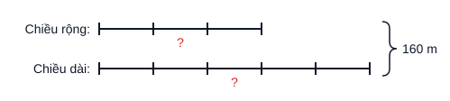
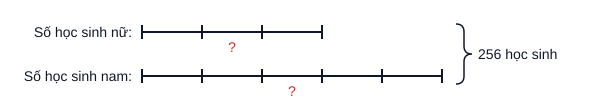
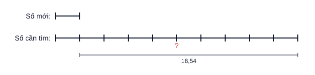
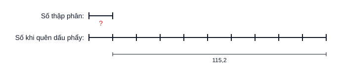
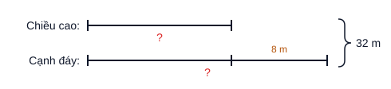
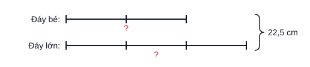
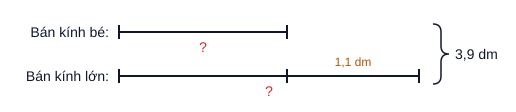
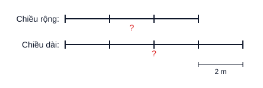

# 5T · Số thập phân — 12 câu GIẢI THỬ theo luật `k5T.md` (v2, 04/10, chưa ghi DB)

> **⭐ LÔ SÁCH 1 (CĐ1–9, 26 câu — CEO đã trả lời 3 câu hỏi 08–09/10) · LÔ SÁCH 2 (CĐ10–17, 26 câu — CEO đã trả lời 2 câu hỏi 09/10) · LÔ SÁCH 3 (CĐ18–24 hình học, 23 câu — chờ CEO duyệt 09/10) ở CUỐI FILE**, nguồn "Tài liệu tham khảo Toán 5". 12 câu dưới đây là lô 04/10 từ kho cũ.
>
> v2: mỗi câu chia **Phần 1. Hướng dẫn** (giải thích) / **Phần 2. Trình bày** (chỉ cái viết vào bài thi) — CEO 04/10.
> 2 câu/dạng. Đáp số cả 12 câu đã được code tính lại, khớp `dap_an` hiện có.

---

## 020201 · Tính chất số thập phân

### T15T020201001 — Điền dấu: $5+0,5+0,05+0,005+0,0005 \;\square\; \dfrac{55557}{10000}$

**Phần 1. Hướng dẫn**

Đưa hai vế về cùng là số thập phân rồi so sánh. Vế trái: cộng các số thập phân. Vế phải: phân số có mẫu $10000$ thì viết được thành số thập phân có $4$ chữ số ở phần thập phân.

So sánh hai số thập phân: phần nguyên bằng nhau thì so sánh lần lượt từng hàng phần mười, phần trăm, phần nghìn, phần chục nghìn. Ở đây chỉ khác nhau ở hàng phần chục nghìn: $5 < 7$.

**Phần 2. Trình bày**

$5+0,5+0,05+0,005+0,0005 = 5,5555$

$\dfrac{55557}{10000} = 5,5557$

$5,5555 < 5,5557$

Vậy $5+0,5+0,05+0,005+0,0005 < \dfrac{55557}{10000}$.

### T15T020206029 — Tìm các số tự nhiên $x$: $78,32 < x < 80,1$

**Phần 1. Hướng dẫn**

Số tự nhiên lớn hơn $78,32$ thì phải lớn hơn $78$, nên nhỏ nhất là $79$. Số tự nhiên nhỏ hơn $80,1$ thì lớn nhất là $80$. Liệt kê các số tự nhiên từ $79$ đến $80$.

**Phần 2. Trình bày**

$78,32 < x < 80,1$

$x = 79$ hoặc $x = 80$.

---

## 020202 · Tính thuận tiện

### T15T020202007 — $C = 37,25+48,42+54,73-(7,25+8,42+4,73)$

**Phần 1. Hướng dẫn**

Một tổng trừ đi một tổng thì ta trừ lần lượt từng số hạng. Để ý các cặp có phần thập phân giống nhau: $37,25$ và $7,25$; $48,42$ và $8,42$; $54,73$ và $4,73$. Nhóm từng cặp thì mỗi hiệu là số tròn chục.

**Phần 2. Trình bày**

$C = 37,25+48,42+54,73-7,25-8,42-4,73$

$C = (37,25-7,25)+(48,42-8,42)+(54,73-4,73)$

$C = 30+40+50$

$C = 120$

### T15T020202013 — $(1,345 \times 4,67 + 2,1) \times (8,4 - 1,2 \times 7)$

**Phần 1. Hướng dẫn**

Đừng tính thừa số thứ nhất vội. Xét thừa số thứ hai: $1,2 \times 7 = 8,4$, nên thừa số thứ hai bằng $0$. Một tích có một thừa số bằng $0$ thì tích bằng $0$.

**Phần 2. Trình bày**

$(1,345 \times 4,67 + 2,1) \times (8,4 - 1,2 \times 7)$

$= (1,345 \times 4,67 + 2,1) \times (8,4 - 8,4)$

$= (1,345 \times 4,67 + 2,1) \times 0$

$= 0$

---

## 020203 · Biểu thức hỗn hợp

### T15T020203007 — $26,8 : 100 + 3,7 \times 0,1$

**Phần 1. Hướng dẫn**

Làm phép chia, phép nhân trước rồi mới cộng.

Chia một số thập phân cho $100$: dịch dấu phẩy sang trái hai chữ số. Nhân một số thập phân với $0,1$: dịch dấu phẩy sang trái một chữ số.

**Phần 2. Trình bày**

$26,8 : 100 + 3,7 \times 0,1$

$= 0,268 + 0,37$

$= 0,638$

### T15T020203037 — $3\dfrac{1}{5}-0,7+\dfrac{3}{10}$

**Phần 1. Hướng dẫn**

Đổi hỗn số và phân số ra số thập phân: $3\dfrac{1}{5} = 3\dfrac{2}{10} = 3,2$; $\dfrac{3}{10} = 0,3$. Biểu thức chỉ có cộng, trừ nên tính lần lượt từ trái sang phải.

**Phần 2. Trình bày**

$3\dfrac{1}{5}-0,7+\dfrac{3}{10}$

$= 3,2 - 0,7 + 0,3$

$= 2,5 + 0,3$

$= 2,8$

---

## 020204 · Tìm $y$

### T15T020204007 — $1-(1,1+y):8\dfrac{1}{10}=0$

**Phần 1. Hướng dẫn**

Đổi $8\dfrac{1}{10} = 8,1$. Gỡ dần từ ngoài vào trong:

- $1$ trừ đi một số bằng $0$ thì số đó bằng $1$ (số trừ bằng số bị trừ khi hiệu bằng $0$).
- $(1,1+y)$ là số bị chia: muốn tìm số bị chia, lấy thương nhân với số chia.
- $y$ là số hạng: muốn tìm số hạng chưa biết, lấy tổng trừ đi số hạng đã biết.

**Phần 2. Trình bày**

$1-(1,1+y):8,1=0$

$(1,1+y):8,1=1$

$1,1+y=1 \times 8,1$

$1,1+y=8,1$

$y=8,1-1,1$

$y=7$

### T15T020204013 — $y:0,1+y\times10=2,5$

**Phần 1. Hướng dẫn**

Chia một số cho $0,1$ cũng chính là nhân số đó với $10$, nên $y:0,1 = y \times 10$. Khi đó có hai lần $y \times 10$, dùng tính chất nhân một số với một tổng để gộp lại. Cuối cùng $y$ là thừa số chưa biết: lấy tích chia cho thừa số đã biết.

**Phần 2. Trình bày**

$y:0,1+y\times10=2,5$

$y\times10+y\times10=2,5$

$y\times(10+10)=2,5$

$y\times20=2,5$

$y=2,5:20$

$y=0,125$

---

## 020205 · Bài toán lời văn

### T15T020205007 — Kho A hơn kho B 37 tạ; chuyển 4,5 tạ từ A sang B thì B bằng 0,6 lần A. Hai kho có tất cả bao nhiêu tạ?

**Phần 1. Hướng dẫn**

Chuyển $4,5$ tạ từ kho A sang kho B: kho A bớt $4,5$ tạ, kho B thêm $4,5$ tạ, nên khoảng cách giữa hai kho giảm $2$ lần $4,5$ tạ.

Đổi $0,6 = \dfrac{3}{5}$: sau khi chuyển, kho A là $5$ phần, kho B là $3$ phần, A hơn B $2$ phần. Đây là bài toán hiệu – tỉ.

Chuyển thóc qua lại giữa hai kho thì tổng số thóc không đổi, nên tổng lúc sau cũng là tổng ban đầu.

**Phần 2. Trình bày**

Bài giải

Sau khi chuyển, kho A hơn kho B số tạ thóc là:

$37 - 4,5 \times 2 = 28$ (tạ)

$0,6 = \dfrac{3}{5}$

Hiệu số phần bằng nhau là:

$5 - 3 = 2$ (phần)

Số thóc kho A sau khi chuyển là:

$28 : 2 \times 5 = 70$ (tạ)

Số thóc kho B sau khi chuyển là:

$70 - 28 = 42$ (tạ)

Hai kho có tất cả số tạ thóc là:

$70 + 42 = 112$ (tạ)

Đáp số: $112$ tạ thóc.

### T15T020205013 — Hiện nay tuổi con bằng 1/5 tuổi bố; sau 10 năm tuổi con bằng 0,36 lần tuổi bố. Tính tuổi mỗi người hiện nay.

**Phần 1. Hướng dẫn**

Hiệu số tuổi của hai bố con không thay đổi theo thời gian — đây là bài toán "hai tỉ số, hiệu không đổi".

- Hiện nay: con $1$ phần, bố $5$ phần, bố hơn con $4$ phần nên tuổi con bằng $\dfrac{1}{4}$ hiệu.
- Sau 10 năm: $0,36 = \dfrac{9}{25}$: con $9$ phần, bố $25$ phần, bố hơn con $16$ phần nên tuổi con bằng $\dfrac{9}{16}$ hiệu.

Coi hiệu là $16$ phần thì tuổi con hiện nay $4$ phần, tuổi con sau 10 năm $9$ phần. Hai số này hơn kém nhau đúng $10$ tuổi.

*(Ghi chú: câu này dùng phương pháp của dạng "Hai tỉ số" T15T010303, không phải kiến thức số thập phân.)*

**Phần 2. Trình bày**

Bài giải

$0,36 = \dfrac{9}{25}$

Hiện nay, tuổi con bằng: $\dfrac{1}{5-1} = \dfrac{1}{4}$ hiệu số tuổi.

Sau 10 năm, tuổi con bằng: $\dfrac{9}{25-9} = \dfrac{9}{16}$ hiệu số tuổi.

$\dfrac{1}{4} = \dfrac{4}{16}$

Hiệu số phần bằng nhau là:

$9 - 4 = 5$ (phần)

Tuổi con hiện nay là:

$10 : 5 \times 4 = 8$ (tuổi)

Tuổi bố hiện nay là:

$8 \times 5 = 40$ (tuổi)

Đáp số: Con $8$ tuổi; bố $40$ tuổi.

---

## 020206 · Nâng cao cấu tạo số thập phân

### T15T020206055 — Dịch dấu phẩy của $A$ sang trái 1 chữ số được $B$, sang phải 1 chữ số được $C$. $A+B+C=746,586$. Tìm $A$.

**Phần 1. Hướng dẫn**

Dịch dấu phẩy sang trái một chữ số = giảm đi $10$ lần; sang phải một chữ số = gấp lên $10$ lần. Vậy $A$ gấp $10$ lần $B$, $C$ gấp $10$ lần $A$ tức gấp $100$ lần $B$.

Coi $B$ là $1$ phần thì $A$ là $10$ phần, $C$ là $100$ phần. Đây là bài toán tổng – tỉ: tìm giá trị một phần rồi suy ra $A$.

**Phần 2. Trình bày**

Bài giải

Coi $B$ là $1$ phần thì $A$ là $10$ phần, $C$ là $100$ phần.

Tổng số phần bằng nhau là:

$1 + 10 + 100 = 111$ (phần)

Số $B$ là:

$746,586 : 111 = 6,726$

Số $A$ là:

$6,726 \times 10 = 67,26$

Đáp số: $A = 67,26$.

### T15T020206047 — Tìm số thập phân $\overline{a,bc}$ biết $\overline{a,bc} \times 5 = \overline{d,ad}$

**Phần 1. Hướng dẫn**

- Tích $\overline{d,ad}$ có phần nguyên một chữ số nên nhỏ hơn $10$ nên $\overline{a,bc}$ nhỏ hơn $10:5 = 2$ nên $a$ là $0$ hoặc $1$.
- Bỏ dấu phẩy hai số (cùng có hai chữ số ở phần thập phân): $\overline{abc} \times 5 = \overline{dad}$. Số nhân với $5$ thì tận cùng là $0$ hoặc $5$ nên $d$ là $0$ hoặc $5$.
- $d = 0$: tích nhỏ hơn $1$ nên $\overline{a,bc}$ nhỏ hơn $0,2$ nên $a = 0$ nên tất cả các chữ số bằng $0$, loại.
- $d = 5$: tích là $5,a5$, không nhỏ hơn $5$ nên $\overline{a,bc}$ không nhỏ hơn $1$ nên $a = 1$. Từ đó tích $= 5,15$, chia cho $5$ ra số cần tìm.

**Phần 2. Trình bày**

$\overline{d,ad} < 10$ nên $\overline{a,bc} < 10 : 5 = 2$, do đó $a = 0$ hoặc $a = 1$.

$\overline{abc} \times 5 = \overline{dad}$ nên $d = 0$ hoặc $d = 5$.

Nếu $d = 0$ thì $\overline{a,bc} < 0,2$, nên $a = 0$. Khi đó tích $\overline{d,ad} = 0,00$, nên số cần tìm bằng $0$ (loại).

Vậy $d = 5$, khi đó tích không nhỏ hơn $5$ nên $\overline{a,bc}$ không nhỏ hơn $1$, do đó $a = 1$.

$\overline{1,bc} = 5,15 : 5 = 1,03$

Thử lại: $1,03 \times 5 = 5,15$ (đúng).

Vậy $\overline{a,bc} = 1,03$.

---

# LÔ SÁCH 1 — CĐ1–9 (Tài liệu tham khảo Toán 5) · 26 câu · chờ CEO duyệt (08/10)

> Bước 1 (README §0): giải **một lượt qua các dạng bài** của sách — lô này phủ CĐ1–9, mỗi dạng chính trong "Tóm tắt lí thuyết" ít
> nhất 1 câu. Không gán dạng (giải ≠ gán dạng); dòng **Dạng sách** chỉ để theo dõi độ phủ. Đề lấy nguyên văn sách (công thức đọc
> từ MathType trong WMF — `scripts/kho/mathtype-thu/wmf-mtef.mjs`). **Đáp số 26/26 máy tính lại từ đề, khớp.** 5 sơ đồ máy vẽ đúng tỉ lệ.
> Khuôn trình bày bám "Bài làm" trong VÍ DỤ của sách 5T; chỗ sách không có mẫu thì theo `k4T.md` v1.

## Câu 1 — LT 1.2d · Tính: $7\dfrac{3}{7}-\left(1\dfrac{1}{4}+3\dfrac{3}{7}\right)$

**Dạng sách:** CĐ1 · Các phép tính với hỗn số

**Phần 1. Hướng dẫn**

Mấu chốt: $7\dfrac{3}{7}$ và $3\dfrac{3}{7}$ có **cùng phần phân số** $\dfrac{3}{7}$, trừ cho nhau ra ngay số tự nhiên $4$. Muốn đưa hai số đó lại gần nhau thì dùng quy tắc **trừ một tổng**: lấy số bị trừ trừ lần lượt từng số hạng.

Còn lại $4-1\dfrac{1}{4}$: phần phân số của $4$ là $0$, không trừ được $\dfrac{1}{4}$ ⇒ mượn $1$ đơn vị: $4=3\dfrac{4}{4}$.

**Phần 2. Trình bày**

$7\dfrac{3}{7}-\left(1\dfrac{1}{4}+3\dfrac{3}{7}\right)$

$=7\dfrac{3}{7}-3\dfrac{3}{7}-1\dfrac{1}{4}$

$=4-1\dfrac{1}{4}$

$=3\dfrac{4}{4}-1\dfrac{1}{4}$

$=2\dfrac{3}{4}$

---

## Câu 2 — LT 1.4e · Tìm $y$, biết: $y\times 1\dfrac{5}{9}-y\times\dfrac{7}{9}+y\times\dfrac{5}{9}=4$

**Dạng sách:** CĐ1 · Tìm $y$ với phân số, hỗn số

**Phần 1. Hướng dẫn**

Mấu chốt: $y$ có mặt ở cả ba tích ⇒ dùng tính chất **nhân một số với một tổng (hiệu)** để gom về "$y$ nhân với một số". Đổi hỗn số $1\dfrac{5}{9}=\dfrac{14}{9}$ cho cùng mẫu với hai phân số kia rồi tính trong ngoặc.

Khi đã còn $y\times\dfrac{4}{3}=4$: muốn tìm thừa số chưa biết, ta lấy tích chia cho thừa số đã biết.

**Phần 2. Trình bày**

$\begin{array}{l} y\times 1\dfrac{5}{9}-y\times\dfrac{7}{9}+y\times\dfrac{5}{9}=4 \\ y\times\left(\dfrac{14}{9}-\dfrac{7}{9}+\dfrac{5}{9}\right)=4 \\ y\times\dfrac{4}{3}=4 \\ y=4:\dfrac{4}{3} \\ y=3 \end{array}$

---

## Câu 3 — LT 1.6e · So sánh (giải thích cách làm): $\dfrac{2022}{2023}$ và $\dfrac{2023}{2024}$

**Dạng sách:** CĐ1 · So sánh phân số (phần bù)

**Phần 1. Hướng dẫn**

Quy đồng thì mẫu số rất lớn. Dấu hiệu: cả hai phân số đều **kém $1$ đúng một phân số có tử $1$** (tử kém mẫu $1$ đơn vị) ⇒ so sánh **phần bù đến $1$**. Phân số nào có phần bù **lớn hơn** thì phân số đó **bé hơn** (vì "thiếu" nhiều hơn mới đủ $1$).

Hai phần bù $\dfrac{1}{2023}$ và $\dfrac{1}{2024}$ cùng tử số $1$: mẫu số nào lớn hơn thì phân số đó bé hơn.

**Phần 2. Trình bày**

Bước 1: Tìm phần bù đến $1$ của mỗi phân số:

$1-\dfrac{2022}{2023}=\dfrac{1}{2023}$

$1-\dfrac{2023}{2024}=\dfrac{1}{2024}$

Bước 2: So sánh phần bù: $\dfrac{1}{2023}>\dfrac{1}{2024}$

Vậy $\dfrac{2022}{2023}<\dfrac{2023}{2024}$.

---

## Câu 4 — LT 2.3 · Một người đi bộ tham gia marathon với chiều dài quãng đường là $24$ km trong ba giờ. Trong giờ thứ nhất, người đó đi được $\dfrac{1}{3}$ quãng đường. Trong giờ thứ hai, người đó đi được $\dfrac{5}{8}$ quãng đường còn lại. Hỏi trong giờ thứ ba người đó đi được bao nhiêu ki-lô-mét?

**Dạng sách:** CĐ2 · Tìm giá trị phân số của một số (nhiều bước, "phần còn lại")

**Phần 1. Hướng dẫn**

Mấu chốt: $\dfrac{5}{8}$ là phân số của **quãng đường còn lại** sau giờ thứ nhất, **không phải** của cả $24$ km. Nên phải đi lần lượt: giờ thứ nhất → phần còn lại → giờ thứ hai → giờ thứ ba chính là phần còn lại sau giờ thứ hai.

Chú ý: lấy $24\times\dfrac{5}{8}$ là sai ngay chỗ này.

**Phần 2. Trình bày**

Bài giải

Quãng đường người đó đi trong giờ thứ nhất là: $24\times\dfrac{1}{3}=8$ (km)

Quãng đường còn lại sau giờ thứ nhất là: $24-8=16$ (km)

Quãng đường người đó đi trong giờ thứ hai là: $16\times\dfrac{5}{8}=10$ (km)

Quãng đường người đó đi trong giờ thứ ba là: $16-10=6$ (km)

Đáp số: $6$ km

---

## Câu 5 — LT 2.10 · Một cửa hàng sau khi bán $\dfrac{2}{5}$ số hộp bánh và $3$ hộp thì còn lại $36$ hộp bánh. Hỏi lúc đầu cửa hàng có bao nhiêu hộp bánh?

**Dạng sách:** CĐ2 · Tìm một số khi biết giá trị một phân số của số đó

**Phần 1. Hướng dẫn**

Mấu chốt: $3$ hộp bán thêm **không phải** một phân số, nên gộp nó với $36$ hộp còn lại: nếu chỉ bán $\dfrac{2}{5}$ số hộp thì còn $36+3=39$ hộp. $39$ hộp này ứng với phần còn lại $1-\dfrac{2}{5}=\dfrac{3}{5}$ số hộp lúc đầu.

Biết giá trị của một phân số thì tìm số đó bằng phép **chia** cho phân số (như VD 2.2 của sách).

**Phần 2. Trình bày**

Bài giải

Nếu chỉ bán $\dfrac{2}{5}$ số hộp bánh thì cửa hàng còn lại: $36+3=39$ (hộp)

$39$ hộp bánh tương ứng với: $1-\dfrac{2}{5}=\dfrac{3}{5}$ (số hộp bánh lúc đầu)

Số hộp bánh lúc đầu cửa hàng có là: $39:\dfrac{3}{5}=65$ (hộp)

Đáp số: $65$ hộp bánh

---

## Câu 6 — LT 2.20 · Số táo trong giỏ thứ nhất ít hơn số táo trong giỏ thứ hai $12$ kg. Biết rằng $\dfrac{2}{3}$ số táo trong giỏ thứ nhất bằng $\dfrac{1}{2}$ số táo trong giỏ thứ hai. Hỏi cả hai giỏ có tất cả bao nhiêu ki-lô-gam táo?

**Dạng sách:** CĐ2 · Tỉ số của hai số (đưa về hiệu – tỉ)

**Phần 1. Hướng dẫn**

Mấu chốt: đổi câu "$\dfrac{2}{3}$ giỏ thứ nhất bằng $\dfrac{1}{2}$ giỏ thứ hai" thành **số phần bằng nhau** bằng cách **quy đồng tử số**: $\dfrac{1}{2}=\dfrac{2}{4}$. Lúc đó $2$ phần (khi chia giỏ thứ nhất thành $3$ phần) bằng $2$ phần (khi chia giỏ thứ hai thành $4$ phần) ⇒ các phần này bằng nhau: giỏ thứ nhất $3$ phần, giỏ thứ hai $4$ phần.

Đề cho **hiệu** $12$ kg ⇒ bài toán hiệu – tỉ. Chú ý: câu hỏi là **cả hai giỏ**, tìm xong từng giỏ phải cộng lại.

**Phần 2. Trình bày**

Bài giải

Ta có: $\dfrac{1}{2}=\dfrac{2}{4}$ nên $\dfrac{2}{3}$ số táo giỏ thứ nhất bằng $\dfrac{2}{4}$ số táo giỏ thứ hai.

Hay số táo giỏ thứ nhất bằng $\dfrac{3}{4}$ số táo giỏ thứ hai.

Ta có sơ đồ:

Hiệu số phần bằng nhau là: $4-3=1$ (phần)

Số táo trong giỏ thứ nhất là: $12:1\times 3=36$ (kg)

Số táo trong giỏ thứ hai là: $36+12=48$ (kg)

Cả hai giỏ có số táo là: $36+48=84$ (kg)

Đáp số: $84$ kg táo

---

## Câu 7 — LT 2.25 · Trên bản đồ tỉ lệ $1:500$, một mảnh đất hình chữ nhật có chiều dài $8$ cm, chiều rộng $5$ cm. Tính diện tích mảnh đất đó trên thực tế theo đơn vị mét vuông.

**Dạng sách:** CĐ2 · Tỉ số của hai số (tỉ lệ bản đồ)

**Phần 1. Hướng dẫn**

Tỉ lệ $1:500$ nghĩa là $1$ cm trên bản đồ ứng với $500$ cm trên thực tế. Mấu chốt: đổi **từng cạnh** ra độ dài thật rồi mới tính diện tích.

Chú ý bẫy: lấy diện tích trên bản đồ $8\times 5=40$ cm² rồi nhân $500$ là **sai** — diện tích thật gấp $500\times 500$ lần chứ không phải $500$ lần. Đề hỏi mét vuông ⇒ đổi cm ra m **trước** khi nhân cho số gọn.

**Phần 2. Trình bày**

Bài giải

Chiều dài mảnh đất trên thực tế là: $8\times 500=4000$ (cm)

Đổi: $4000$ cm $=40$ m

Chiều rộng mảnh đất trên thực tế là: $5\times 500=2500$ (cm)

Đổi: $2500$ cm $=25$ m

Diện tích mảnh đất trên thực tế là: $40\times 25=1000$ ($\text{m}^2$)

Đáp số: $1000\ \text{m}^2$

---

## Câu 8 — LT 3.4 · Một bể có hai cái vòi, vòi A chảy vào bể và vòi B tháo nước ra. Khi bể đang cạn, nếu chỉ mở vòi A thì sau $5$ giờ đầy bể. Khi bể đang đầy, nếu chỉ mở vòi B thì sau $6$ giờ bể cạn. Hỏi khi bể đang cạn, nếu mở cả hai vòi thì sau bao lâu đầy bể?

**Dạng sách:** CĐ3 · Công việc chung (một vòi chảy vào, một vòi tháo ra)

**Phần 1. Hướng dẫn**

Như mọi bài công việc chung: coi cả bể là $1$, tính **mỗi giờ mỗi vòi làm được mấy phần bể**. Khác ở chỗ vòi B **tháo ra**, nên mở cả hai vòi thì mỗi giờ bể chỉ có thêm phần **hiệu** $\dfrac{1}{5}-\dfrac{1}{6}$, không phải tổng.

Có phần bể đầy thêm sau $1$ giờ thì thời gian đầy bể $=1$ chia cho phần đó.

**Phần 2. Trình bày**

Bài giải

Trong $1$ giờ, vòi A chảy vào được: $1:5=\dfrac{1}{5}$ (bể)

Trong $1$ giờ, vòi B tháo ra được: $1:6=\dfrac{1}{6}$ (bể)

Trong $1$ giờ, mở cả hai vòi thì lượng nước trong bể tăng thêm: $\dfrac{1}{5}-\dfrac{1}{6}=\dfrac{1}{30}$ (bể)

Thời gian để bể đầy là: $1:\dfrac{1}{30}=30$ (giờ)

Đáp số: $30$ giờ

---

## Câu 9 — LT 3.10 · Anh dọn nhà một mình thì sau $10$ phút sẽ xong. Khi người anh làm được $5$ phút thì em đến làm cùng nên cả hai anh em làm tiếp trong $3$ phút là xong. Hỏi nếu em làm một mình thì sau bao lâu sẽ xong việc dọn nhà?

**Dạng sách:** CĐ3 · Công việc chung (làm riêng một đoạn rồi làm chung)

**Phần 1. Hướng dẫn**

Mấu chốt: công việc chia **hai đoạn**. Đoạn đầu chỉ anh làm $5$ phút ⇒ được $\dfrac{1}{10}\times 5=\dfrac{1}{2}$ công việc. Nửa còn lại do **hai anh em** làm trong $3$ phút ⇒ mỗi phút hai người làm được $\dfrac{1}{2}:3$.

Lấy phần cả hai làm trong $1$ phút trừ phần của anh ⇒ phần của em trong $1$ phút ⇒ thời gian em làm một mình.

**Phần 2. Trình bày**

Bài giải

Trong $1$ phút, anh làm được: $1:10=\dfrac{1}{10}$ (công việc)

Trong $5$ phút, anh làm được: $\dfrac{1}{10}\times 5=\dfrac{1}{2}$ (công việc)

Phần việc hai anh em cùng làm là: $1-\dfrac{1}{2}=\dfrac{1}{2}$ (công việc)

Trong $1$ phút, hai anh em cùng làm được: $\dfrac{1}{2}:3=\dfrac{1}{6}$ (công việc)

Trong $1$ phút, em làm được: $\dfrac{1}{6}-\dfrac{1}{10}=\dfrac{1}{15}$ (công việc)

Nếu em làm một mình thì xong việc dọn nhà sau: $1:\dfrac{1}{15}=15$ (phút)

Đáp số: $15$ phút

---

## Câu 10 — LT 4.1b · Tính: $B=\dfrac{2}{1\times 3}+\dfrac{2}{3\times 5}+\dfrac{2}{5\times 7}+\dfrac{2}{7\times 9}+\ldots+\dfrac{2}{35\times 37}$

**Dạng sách:** CĐ4 · Dãy phân số có quy luật (tử bằng hiệu hai thừa số ở mẫu)

**Phần 1. Hướng dẫn**

Dấu hiệu: ở mỗi số hạng, **tử số bằng hiệu hai thừa số ở mẫu** ($3-1=2$, $5-3=2$, …). Khi đó mỗi số hạng tách được thành hiệu hai phân số: $\dfrac{2}{1\times 3}=\dfrac{1}{1}-\dfrac{1}{3}$ (thử lại: $1-\dfrac{1}{3}=\dfrac{2}{3}$).

Viết hết ra thì các phân số ở giữa **triệt tiêu từng cặp** ($-\dfrac{1}{3}+\dfrac{1}{3}$, …), chỉ còn số đầu trừ số cuối — đúng cách VD 4.1 của sách.

**Phần 2. Trình bày**

$B=\dfrac{2}{1\times 3}+\dfrac{2}{3\times 5}+\dfrac{2}{5\times 7}+\dfrac{2}{7\times 9}+\ldots+\dfrac{2}{35\times 37}$

$B=\dfrac{1}{1}-\dfrac{1}{3}+\dfrac{1}{3}-\dfrac{1}{5}+\dfrac{1}{5}-\dfrac{1}{7}+\dfrac{1}{7}-\dfrac{1}{9}+\ldots+\dfrac{1}{35}-\dfrac{1}{37}$

$B=1-\dfrac{1}{37}$

$B=\dfrac{36}{37}$

---

## Câu 11 — LT 4.8b · Tính: $B=\dfrac{1}{5}+\dfrac{1}{10}+\dfrac{1}{20}+\dfrac{1}{40}+\ldots+\dfrac{1}{1280}$

**Dạng sách:** CĐ4 · Dãy phân số có quy luật (mẫu sau gấp đôi mẫu trước)

**Phần 1. Hướng dẫn**

Dấu hiệu: **mẫu số sau gấp đôi mẫu số trước** ($5$, $10$, $20$, …, $1280$) — số hạng sau bằng một nửa số hạng trước. Nhân cả $B$ với $2$ thì mỗi số hạng thành số hạng đứng trước nó: dãy $2\times B$ có gần như đủ các số hạng của $B$, chỉ thêm $\dfrac{2}{5}$ ở đầu và thiếu $\dfrac{1}{1280}$ ở cuối.

Lấy $2\times B-B$: các số hạng giống nhau triệt tiêu hết, còn $\dfrac{2}{5}-\dfrac{1}{1280}$, và $2\times B-B$ chính là $B$.

**Phần 2. Trình bày**

$B=\dfrac{1}{5}+\dfrac{1}{10}+\dfrac{1}{20}+\dfrac{1}{40}+\ldots+\dfrac{1}{1280}$

$2\times B=\dfrac{2}{5}+\dfrac{1}{5}+\dfrac{1}{10}+\dfrac{1}{20}+\ldots+\dfrac{1}{640}$

$2\times B-B=\dfrac{2}{5}-\dfrac{1}{1280}$

$B=\dfrac{512}{1280}-\dfrac{1}{1280}$

$B=\dfrac{511}{1280}$

---

## Câu 12 — LT 5.1 · Trong chiến dịch chuyển hàng ủng hộ đồng bào bị ảnh hưởng bởi bão lụt, một đơn vị vận tải đã huy động $16$ xe chở được $240$ tấn hàng. Hỏi nếu đơn vị được giao vận chuyển $480$ tấn hàng thì phải huy động thêm bao nhiêu xe? Biết rằng trọng tải của mỗi xe như nhau.

**Dạng sách:** CĐ5 · Tỉ lệ thuận

**Phần 1. Hướng dẫn**

Trọng tải mỗi xe như nhau ⇒ số tấn hàng và số xe là hai đại lượng **tỉ lệ thuận**. Cách rút về đơn vị: tìm $1$ xe chở được mấy tấn, rồi tìm số xe cần cho $480$ tấn. *(Cách khác: $480$ tấn gấp $240$ tấn $2$ lần nên số xe cũng gấp $2$ lần.)*

Chú ý: đề hỏi **huy động thêm** bao nhiêu xe ⇒ phải trừ đi $16$ xe đã có.

**Phần 2. Trình bày**

Bài giải

Mỗi xe chở được số tấn hàng là: $240:16=15$ (tấn)

Số xe cần để chở $480$ tấn hàng là: $480:15=32$ (xe)

Số xe phải huy động thêm là: $32-16=16$ (xe)

Đáp số: $16$ xe

---

## Câu 13 — LT 5.6 · Một người mua $30$ quyển vở, giá $12000$ đồng một quyển thì vừa hết số tiền đang có. Cũng với số tiền đó nếu mua quyển vở với giá $15000$ đồng một quyển thì người đó mua được bao nhiêu quyển vở?

**Dạng sách:** CĐ5 · Tỉ lệ nghịch

**Phần 1. Hướng dẫn**

Số tiền **không đổi** ⇒ giá một quyển và số quyển mua được là hai đại lượng **tỉ lệ nghịch** (giá tăng thì mua được ít đi). Cách gọn nhất: tính ra **đại lượng không đổi** (số tiền) trước, rồi chia cho giá mới.

**Phần 2. Trình bày**

Bài giải

Số tiền người đó có là: $12000\times 30=360000$ (đồng)

Với giá $15000$ đồng một quyển, người đó mua được số quyển vở là: $360000:15000=24$ (quyển)

Đáp số: $24$ quyển vở

---

## Câu 14 — LT 5.14 · Một tổ công nhân có $15$ người trong $6$ ngày làm được $180$ sản phẩm. Hỏi nếu tổ có $18$ người trong $8$ ngày thì làm được bao nhiêu sản phẩm? Biết năng suất mỗi người như nhau.

**Dạng sách:** CĐ5 · Tỉ lệ kép

**Phần 1. Hướng dẫn**

Hai đại lượng cùng đổi một lúc (số người **và** số ngày) ⇒ bài **tỉ lệ kép**. Rút về đơn vị hai lần: tìm **$1$ người làm trong $1$ ngày** được mấy sản phẩm, rồi nhân với số người và số ngày mới. *(Sách còn cách "phương pháp ba dòng" và "tam suất kép" — VD 5.3.)*

**Phần 2. Trình bày**

Bài giải

$1$ người làm trong $6$ ngày được số sản phẩm là: $180:15=12$ (sản phẩm)

$1$ người làm trong $1$ ngày được số sản phẩm là: $12:6=2$ (sản phẩm)

$18$ người làm trong $8$ ngày được số sản phẩm là: $2\times 18\times 8=288$ (sản phẩm)

Đáp số: $288$ sản phẩm

---

## Câu 15 — LT 6.4 · Xe thứ nhất chở $267$ kg thóc. Xe thứ hai chở nhiều hơn xe thứ nhất $32$ kg thóc. Xe thứ ba chở số thóc bằng trung bình cộng số thóc của cả ba xe. Xe thứ tư chở nhiều hơn trung bình cộng số thóc của cả bốn xe là $6$ kg thóc. Hỏi xe thứ tư chở bao nhiêu ki-lô-gam thóc?

**Dạng sách:** CĐ6 · Trung bình cộng (bằng TBC · hơn TBC)

**Phần 1. Hướng dẫn**

Hai mấu chốt:

(1) Xe thứ ba **bằng** trung bình cộng của cả ba xe ⇒ thêm xe thứ ba vào không làm trung bình cộng thay đổi ⇒ xe thứ ba bằng trung bình cộng của **hai xe đầu**.

(2) Xe thứ tư **hơn** trung bình cộng của bốn xe $6$ kg ⇒ ba xe đầu phải "bù" lại: ba xe đầu bằng $3$ lần trung bình cộng **bớt** $6$ kg. Vậy **$3$ lần trung bình cộng $=$ tổng ba xe đầu $+6$** (cách VD 13.5 sách 4T).

**Phần 2. Trình bày**

Bài giải

Xe thứ hai chở số thóc là: $267+32=299$ (kg)

Xe thứ ba chở số thóc bằng trung bình cộng của hai xe đầu, là: $\left(267+299\right):2=283$ (kg)

Ta có sơ đồ:

Ba lần trung bình cộng số thóc của bốn xe là: $267+299+283+6=855$ (kg)

Trung bình cộng số thóc của bốn xe là: $855:3=285$ (kg)

Xe thứ tư chở số thóc là: $285+6=291$ (kg)

Đáp số: $291$ kg thóc

---

## Câu 16 — LT 6.8 · Bình và Minh có tất cả $46$ viên bi. Nếu Bình cho Minh $10$ viên bi thì Minh sẽ có nhiều hơn Bình $4$ viên. Hỏi mỗi bạn có bao nhiêu viên bi?

**Dạng sách:** CĐ6 · Tìm hai số khi biết tổng và hiệu

**Phần 1. Hướng dẫn**

Mấu chốt: cho nhau thì **tổng không đổi** ($46$). Hiệu "Minh hơn Bình $4$ viên" là hiệu **lúc sau**, nên giải tổng – hiệu cho **lúc sau** trước, rồi mới đi ngược về lúc đầu (Bình lúc đầu nhiều hơn lúc sau $10$ viên).

Chú ý bẫy: dùng hiệu $4$ cho lúc đầu là sai.

**Phần 2. Trình bày**

Bài giải

Tổng số bi của hai bạn không đổi.

Ta có sơ đồ:

Số bi của Bình sau khi cho Minh là: $\left(46-4\right):2=21$ (viên)

Số bi của Bình lúc đầu là: $21+10=31$ (viên)

Số bi của Minh lúc đầu là: $46-31=15$ (viên)

Đáp số: Bình: $31$ viên bi; Minh: $15$ viên bi

---

## Câu 17 — LT 6.15 · Hiện nay con $7$ tuổi, mẹ $34$ tuổi. Hỏi sau bao nhiêu năm nữa thì tuổi mẹ gấp $4$ lần tuổi con?

**Dạng sách:** CĐ6 · Tìm hai số khi biết hiệu và tỉ số (tuổi)

**Phần 1. Hướng dẫn**

Mấu chốt: **hiệu số tuổi không đổi** theo thời gian, luôn là $34-7=27$ tuổi. Vẽ sơ đồ ở **thời điểm có tỉ số** (khi mẹ gấp $4$ lần con): con $1$ phần, mẹ $4$ phần, hiệu $3$ phần ứng với $27$ tuổi ⇒ tuổi con lúc đó.

Đề hỏi **bao nhiêu năm nữa** ⇒ lấy tuổi con lúc đó trừ tuổi con hiện nay.

**Phần 2. Trình bày**

Bài giải

Mẹ hơn con số tuổi là: $34-7=27$ (tuổi)

Hiệu số tuổi của hai mẹ con không đổi theo thời gian.

Ta có sơ đồ:

Hiệu số phần bằng nhau là: $4-1=3$ (phần)

Tuổi con khi tuổi mẹ gấp $4$ lần tuổi con là: $27:3=9$ (tuổi)

Số năm nữa để tuổi mẹ gấp $4$ lần tuổi con là: $9-7=2$ (năm)

Đáp số: $2$ năm

---

## Câu 18 — LT 6.17 · Mai và Hà có $55$ quyển vở, biết $\dfrac{3}{5}$ số vở của Mai bằng $\dfrac{1}{2}$ số vở của Hà. Hỏi mỗi bạn có bao nhiêu quyển vở?

**Dạng sách:** CĐ6 · Tìm hai số khi biết tổng và tỉ số (tỉ số ẩn)

**Phần 1. Hướng dẫn**

Mấu chốt: đổi "$\dfrac{3}{5}$ số vở của Mai bằng $\dfrac{1}{2}$ số vở của Hà" thành số phần bằng nhau bằng **quy đồng tử số**: $\dfrac{1}{2}=\dfrac{3}{6}$ ⇒ Mai $5$ phần, Hà $6$ phần. Đề cho **tổng** $55$ ⇒ bài tổng – tỉ.

**Phần 2. Trình bày**

Bài giải

Ta có: $\dfrac{1}{2}=\dfrac{3}{6}$ nên $\dfrac{3}{5}$ số vở của Mai bằng $\dfrac{3}{6}$ số vở của Hà.

Hay số vở của Mai bằng $\dfrac{5}{6}$ số vở của Hà.

Ta có sơ đồ:

Tổng số phần bằng nhau là: $5+6=11$ (phần)

Số vở của Mai là: $55:11\times 5=25$ (quyển)

Số vở của Hà là: $55-25=30$ (quyển)

Đáp số: Mai: $25$ quyển vở; Hà: $30$ quyển vở

---

## Câu 19 — LT 7.5 · Anh chia táo cho các em. Nếu mỗi em được $4$ quả thì thừa $7$ quả, nếu mỗi em được $6$ quả thì thiếu $5$ quả. Hỏi có bao nhiêu quả táo và bao nhiêu em được chia táo?

**Dạng sách:** CĐ7 · Hai hiệu số (một cách thừa, một cách thiếu)

**Phần 1. Hướng dẫn**

Hai cách chia cho **cùng số em**. So sánh hai cách:

- mỗi em chênh nhau $6-4=2$ quả (**hiệu thứ nhất**);
- tổng số táo cần để chia chênh nhau: từ chỗ **thừa** $7$ quả đến chỗ **thiếu** $5$ quả là $7+5=12$ quả (**hiệu thứ hai** — một thừa một thiếu thì **cộng**; cả hai cùng thừa hoặc cùng thiếu thì **trừ**).

Số em $=$ hiệu thứ hai : hiệu thứ nhất. Rồi tính số táo theo một cách chia bất kì.

**Phần 2. Trình bày**

Bài giải

Ta có sơ đồ:

Chênh lệch số táo của một em giữa hai cách chia là: $6-4=2$ (quả)

Chênh lệch tổng số táo giữa hai cách chia là: $7+5=12$ (quả)

Số em được chia táo là: $12:2=6$ (em)

Số táo là: $4\times 6+7=31$ (quả)

Đáp số: $6$ em; $31$ quả táo

---

## Câu 20 — LT 7.14 · Ở một lớp học, nếu xếp mỗi bàn $3$ bạn thì còn $6$ bạn không có chỗ ngồi, nếu xếp mỗi bàn $4$ bạn thì thừa $2$ bàn. Hỏi lớp có bao nhiêu học sinh và bao nhiêu bàn?

**Dạng sách:** CĐ7 · Hai hiệu số (thừa đơn vị chứa — "thừa bàn")

**Phần 1. Hướng dẫn**

Mấu chốt: "thừa $2$ bàn" là thừa **bàn**, không cùng loại với "$6$ bạn không có chỗ". Đổi ra số **chỗ ngồi**: nếu xếp đủ $4$ bạn vào cả $2$ bàn thừa thì còn thiếu $4\times 2=8$ bạn.

Lúc này: cách $1$ thừa $6$ bạn, cách $2$ (ngồi kín mọi bàn) thiếu $8$ bạn ⇒ chênh lệch tổng $6+8=14$; mỗi bàn chênh $4-3=1$ bạn ⇒ số bàn.

**Phần 2. Trình bày**

Bài giải

Ta có sơ đồ:

Nếu xếp mỗi bàn $4$ bạn cho kín cả $2$ bàn thừa thì còn thiếu: $4\times 2=8$ (bạn)

Chênh lệch số bạn ngồi ở một bàn giữa hai cách xếp là: $4-3=1$ (bạn)

Chênh lệch tổng số bạn giữa hai cách xếp là: $6+8=14$ (bạn)

Số bàn của lớp là: $14:1=14$ (bàn)

Số học sinh của lớp là: $3\times 14+6=48$ (học sinh)

Đáp số: $48$ học sinh; $14$ bàn

---

## Câu 21 — LT 8.3 · Một giá sách gồm hai ngăn. Số sách ở ngăn trên bằng $\dfrac{1}{3}$ số sách ở ngăn dưới. Nếu xếp thêm $24$ quyển sách vào ngăn trên thì số sách ở ngăn trên bằng $\dfrac{7}{9}$ số sách ở ngăn dưới. Hỏi lúc đầu mỗi ngăn có bao nhiêu quyển?

**Dạng sách:** CĐ8 · Hai tỉ số — một đại lượng không đổi

**Phần 1. Hướng dẫn**

Mấu chốt: chỉ ngăn trên được thêm sách, **ngăn dưới giữ nguyên** ⇒ lấy số sách ngăn dưới làm "đơn vị" cho cả hai tỉ số. Lúc đầu ngăn trên $=\dfrac{1}{3}$ ngăn dưới, lúc sau $=\dfrac{7}{9}$ ngăn dưới ⇒ $24$ quyển thêm vào ứng với $\dfrac{7}{9}-\dfrac{1}{3}$ số sách ngăn dưới (như VD 8.1 của sách).

**Phần 2. Trình bày**

Bài giải

Số sách ở ngăn dưới không đổi.

$24$ quyển sách ứng với: $\dfrac{7}{9}-\dfrac{1}{3}=\dfrac{4}{9}$ (số sách ngăn dưới)

Số sách ở ngăn dưới là: $24:\dfrac{4}{9}=54$ (quyển)

Số sách ở ngăn trên lúc đầu là: $54\times\dfrac{1}{3}=18$ (quyển)

Đáp số: Ngăn trên: $18$ quyển; ngăn dưới: $54$ quyển

---

## Câu 22 — LT 8.9 · Mai có số kẹo bằng $\dfrac{2}{3}$ số kẹo của Lam. Nếu Mai cho Lam $6$ cái kẹo thì lúc này tỉ số số kẹo của Mai và Lam là $\dfrac{3}{7}$. Hỏi lúc đầu mỗi bạn có bao nhiêu cái kẹo?

**Dạng sách:** CĐ8 · Hai tỉ số — tổng không đổi

**Phần 1. Hướng dẫn**

Mấu chốt: Mai cho Lam ⇒ **tổng số kẹo của hai bạn không đổi** ⇒ đổi cả hai tỉ số thành "số kẹo của Mai bằng mấy phần **tổng**". Lúc đầu Mai $2$ phần, Lam $3$ phần ⇒ Mai $=\dfrac{2}{5}$ tổng; lúc sau Mai $3$ phần, Lam $7$ phần ⇒ Mai $=\dfrac{3}{10}$ tổng. Mai bớt đi $6$ cái ⇒ $6$ cái ứng với $\dfrac{2}{5}-\dfrac{3}{10}$ tổng (như VD 8.2).

**Phần 2. Trình bày**

Bài giải

Tổng số kẹo của hai bạn không đổi.

Lúc đầu, số kẹo của Mai bằng: $\dfrac{2}{2+3}=\dfrac{2}{5}$ (tổng số kẹo)

Lúc sau, số kẹo của Mai bằng: $\dfrac{3}{3+7}=\dfrac{3}{10}$ (tổng số kẹo)

$6$ cái kẹo ứng với: $\dfrac{2}{5}-\dfrac{3}{10}=\dfrac{1}{10}$ (tổng số kẹo)

Tổng số kẹo của hai bạn là: $6:\dfrac{1}{10}=60$ (cái)

Số kẹo của Mai lúc đầu là: $60\times\dfrac{2}{5}=24$ (cái)

Số kẹo của Lam lúc đầu là: $60-24=36$ (cái)

Đáp số: Mai: $24$ cái kẹo; Lam: $36$ cái kẹo

---

## Câu 23 — LT 8.16 · Hiện nay, tuổi mẹ gấp bốn lần tuổi con. Bốn năm trước, tuổi mẹ gấp bảy lần tuổi con. Tính tuổi của mỗi người hiện nay.

**Dạng sách:** CĐ8 · Hai tỉ số — hiệu không đổi

**Phần 1. Hướng dẫn**

Mấu chốt: **hiệu số tuổi không đổi** ⇒ đổi cả hai tỉ số thành "tuổi con bằng mấy phần **hiệu**". Hiện nay mẹ gấp $4$ lần con ⇒ hiệu bằng $3$ lần tuổi con ⇒ con $=\dfrac{1}{3}$ hiệu. Bốn năm trước mẹ gấp $7$ lần ⇒ con $=\dfrac{1}{6}$ hiệu. Tuổi con kém đi $4$ ⇒ $4$ tuổi ứng với $\dfrac{1}{3}-\dfrac{1}{6}$ hiệu (như VD 8.3).

**Phần 2. Trình bày**

Bài giải

Hiệu số tuổi của hai mẹ con không đổi.

Hiện nay, tuổi con bằng: $\dfrac{1}{4-1}=\dfrac{1}{3}$ (hiệu số tuổi)

Bốn năm trước, tuổi con bằng: $\dfrac{1}{7-1}=\dfrac{1}{6}$ (hiệu số tuổi)

$4$ tuổi ứng với: $\dfrac{1}{3}-\dfrac{1}{6}=\dfrac{1}{6}$ (hiệu số tuổi)

Hiệu số tuổi của hai mẹ con là: $4:\dfrac{1}{6}=24$ (tuổi)

Tuổi con hiện nay là: $24\times\dfrac{1}{3}=8$ (tuổi)

Tuổi mẹ hiện nay là: $8\times 4=32$ (tuổi)

Đáp số: Con: $8$ tuổi; Mẹ: $32$ tuổi

---

## Câu 24 — LT 9.2 · Tìm một số, biết lấy số đó trừ đi $102$ rồi chia cho $11$, lấy thương tìm được cộng với $26$, được bao nhiêu nhân với $25$ thì được kết quả là $2025$.

**Dạng sách:** CĐ9 · Tính ngược (lưu đồ)

**Phần 1. Hướng dẫn**

Biết kết quả cuối của một chuỗi phép tính ⇒ **tính ngược từ cuối lên**, mỗi phép đổi thành phép ngược: nhân $25$ ⇒ chia $25$; cộng $26$ ⇒ trừ $26$; chia $11$ ⇒ nhân $11$; trừ $102$ ⇒ cộng $102$.

Thử lại: $\left(707-102\right):11=55$; $55+26=81$; $81\times 25=2025$.

**Phần 2. Trình bày**

Bài giải

Số nhân với $25$ được $2025$ là: $2025:25=81$

Số cộng với $26$ được $81$ là: $81-26=55$

Số chia cho $11$ được $55$ là: $55\times 11=605$

Số cần tìm là: $605+102=707$

Đáp số: $707$

---

## Câu 25 — LT 9.10 · An đọc một quyển truyện trong ba ngày. Ngày đầu An đọc được $\dfrac{1}{5}$ số trang và $16$ trang. Ngày thứ hai An đọc tiếp $\dfrac{3}{10}$ số trang còn lại và $20$ trang, ngày thứ ba An đọc $\dfrac{3}{4}$ số trang còn lại sau ngày hai và $30$ trang cuối. Hỏi quyển truyện đó có bao nhiêu trang?

**Dạng sách:** CĐ9 · Tính ngược (phân số và số)

**Phần 1. Hướng dẫn**

Tính ngược **từ ngày thứ ba**. Mấu chốt: mỗi phân số tính trên một "tổng" **khác nhau** — $\dfrac{3}{4}$ là của số trang còn lại sau ngày hai, $\dfrac{3}{10}$ là của số trang còn lại sau ngày một, $\dfrac{1}{5}$ là của cả quyển.

- Ngày ba: đọc $\dfrac{3}{4}$ rồi $30$ trang là hết ⇒ $30$ trang là $\dfrac{1}{4}$ số trang còn lại sau ngày hai.
- Ngày hai: nếu không đọc thêm $20$ trang thì còn (số trang sau ngày hai) $+20$, ứng với $1-\dfrac{3}{10}=\dfrac{7}{10}$ số trang còn lại sau ngày một.
- Ngày một: tương tự, (số trang còn lại sau ngày một) $+16$ ứng với $\dfrac{4}{5}$ cả quyển.

**Phần 2. Trình bày**

Bài giải

$30$ trang ứng với: $1-\dfrac{3}{4}=\dfrac{1}{4}$ (số trang còn lại sau ngày thứ hai)

Số trang còn lại sau ngày thứ hai là: $30:\dfrac{1}{4}=120$ (trang)

Nếu ngày thứ hai không đọc thêm $20$ trang thì số trang còn lại là: $120+20=140$ (trang)

$140$ trang ứng với: $1-\dfrac{3}{10}=\dfrac{7}{10}$ (số trang còn lại sau ngày thứ nhất)

Số trang còn lại sau ngày thứ nhất là: $140:\dfrac{7}{10}=200$ (trang)

Nếu ngày thứ nhất không đọc thêm $16$ trang thì số trang còn lại là: $200+16=216$ (trang)

$216$ trang ứng với: $1-\dfrac{1}{5}=\dfrac{4}{5}$ (số trang của quyển truyện)

Số trang của quyển truyện là: $216:\dfrac{4}{5}=270$ (trang)

Đáp số: $270$ trang

---

## Câu 26 — LT 9.12 · Thái, Thiện, Chương có tất cả $36$ quả bóng bàn. Nếu Chương cho Thái $6$ quả rồi Thái cho Thiện $6$ quả và Thiện cho Chương $4$ quả thì lúc này số bóng bàn của mỗi bạn bằng nhau. Hỏi lúc đầu mỗi bạn có bao nhiêu quả bóng?

**Dạng sách:** CĐ9 · Tính ngược (lập bảng — chuyển qua lại nhiều người)

**Phần 1. Hướng dẫn**

Chuyển qua lại giữa **ba người** ⇒ **lập bảng**, đi ngược từ dòng cuối (mỗi bạn $36:3=12$ quả) lên dòng đầu. Ở mỗi lượt cho, đi ngược thì **người cho được cộng lại**, **người nhận bị trừ đi** đúng số quả đó; người không liên quan giữ nguyên.

Thứ tự ngược: Thiện cho Chương $4$ ⇒ Thái cho Thiện $6$ ⇒ Chương cho Thái $6$. Thử lại: tổng mỗi dòng luôn bằng $36$.

**Phần 2. Trình bày**

Bài giải

Ta có bảng sau:

$\begin{array}{|l|c|c|c|} \hline & \text{Thái} & \text{Thiện} & \text{Chương} \\ \hline \text{Cuối cùng} & 12 & 12 & 12 \\ \hline \text{Trước khi Thiện cho Chương} & 12 & 12+4=16 & 12-4=8 \\ \hline \text{Trước khi Thái cho Thiện} & 12+6=18 & 16-6=10 & 8 \\ \hline \text{Trước khi Chương cho Thái (lúc đầu)} & 18-6=12 & 10 & 8+6=14 \\ \hline \end{array}$

Giải thích bảng:

Lúc cuối mỗi bạn có số quả bóng là: $36:3=12$ (quả)

Số quả bóng của Thái lúc đầu là: $12+6-6=12$ (quả)

Số quả bóng của Thiện lúc đầu là: $12+4-6=10$ (quả)

Số quả bóng của Chương lúc đầu là: $12-4+6=14$ (quả)

Đáp số: Thái: $12$ quả; Thiện: $10$ quả; Chương: $14$ quả

---

## Bảng tóm tắt lô sách 1

| # | Nguồn | Dạng sách | Đáp số | Ghi chú |
|---|---|---|---|---|
| 1 | LT 1.2d | CĐ1 phép tính hỗn số | $2\dfrac{3}{4}$ | mượn 1: $4=3\dfrac{4}{4}$ như VD 1.4 |
| 2 | LT 1.4e | CĐ1 tìm $y$ | $3$ | viết theo cột (`array`) như 4T |
| 3 | LT 1.6e | CĐ1 so sánh phân số | $\dfrac{2022}{2023}<\dfrac{2023}{2024}$ | phần bù, khuôn "Bước 1/Bước 2" của 4T |
| 4 | LT 2.3 | CĐ2 phân số của một số | $6$ km | |
| 5 | LT 2.10 | CĐ2 tìm số biết phân số | $65$ hộp | "tương ứng với … (số hộp bánh lúc đầu)" như VD 2.2 |
| 6 | LT 2.20 | CĐ2 tỉ số | $84$ kg | sơ đồ |
| 7 | LT 2.25 | CĐ2 tỉ lệ bản đồ | $1000\ \text{m}^2$ | |
| 8 | LT 3.4 | CĐ3 vòi vào – vòi tháo | $30$ giờ | |
| 9 | LT 3.10 | CĐ3 làm riêng rồi làm chung | $15$ phút | |
| 10 | LT 4.1b | CĐ4 dãy hiệu-tích | $\dfrac{36}{37}$ | |
| 11 | LT 4.8b | CĐ4 dãy mẫu gấp đôi | $\dfrac{511}{1280}$ | "$2\times B-B$" |
| 12 | LT 5.1 | CĐ5 tỉ lệ thuận | $16$ xe | rút về đơn vị |
| 13 | LT 5.6 | CĐ5 tỉ lệ nghịch | $24$ quyển | |
| 14 | LT 5.14 | CĐ5 tỉ lệ kép | $288$ sản phẩm | |
| 15 | LT 6.4 | CĐ6 trung bình cộng | $291$ kg | sơ đồ |
| 16 | LT 6.8 | CĐ6 tổng – hiệu | Bình $31$, Minh $15$ | sơ đồ lúc sau |
| 17 | LT 6.15 | CĐ6 hiệu – tỉ (tuổi) | $2$ năm | sơ đồ |
| 18 | LT 6.17 | CĐ6 tổng – tỉ | Mai $25$, Hà $30$ | sơ đồ |
| 19 | LT 7.5 | CĐ7 hai hiệu số (thừa – thiếu) | $6$ em, $31$ quả | sơ đồ 3 hàng như VD 7.1 (CEO: có sơ đồ là tốt nhất) |
| 20 | LT 7.14 | CĐ7 hai hiệu số (thừa bàn) | $48$ HS, $14$ bàn | sơ đồ |
| 21 | LT 8.3 | CĐ8 một đại lượng không đổi | $18$ và $54$ | phân số của đại lượng không đổi, như VD 8.1 |
| 22 | LT 8.9 | CĐ8 tổng không đổi | Mai $24$, Lam $36$ | như VD 8.2 |
| 23 | LT 8.16 | CĐ8 hiệu không đổi | Con $8$, mẹ $32$ | như VD 8.3 |
| 24 | LT 9.2 | CĐ9 lưu đồ | $707$ | |
| 25 | LT 9.10 | CĐ9 phân số và số | $270$ trang | |
| 26 | LT 9.12 | CĐ9 lập bảng | $12$; $10$; $14$ | bảng bằng `array` (KaTeX vẽ được trên app) |

**Câu hỏi cho CEO trong lô này:**

1. **Bài sách cho nhiều cách** (tỉ lệ: rút về đơn vị / tỉ số / tam suất; tính ngược: sơ đồ / phân số): em trình bày **một cách** ở Phần 2, cách khác nhắc ở Phần 1 (luật 4T). Mặc định chọn **rút về đơn vị** cho tỉ lệ, **phân số** cho tính ngược — đúng ý chị không?
2. **Hai hiệu số (CĐ7)**: VD 7.1 sách có "Ta có sơ đồ:" kèm hình (sơ đồ đặc biệt — hai hàng chia kẹo). Máy vẽ hiện chỉ có sơ đồ đoạn thẳng tổng–hiệu–tỉ, chưa vẽ được kiểu này ⇒ câu 19–20 em **bỏ sơ đồ**. Chị có cần sơ đồ cho dạng này không?
3. **Hai tỉ số (CĐ8)**: sách giải bằng **phân số của đại lượng không đổi**, không vẽ sơ đồ ⇒ câu 21–23 em theo sách, không vẽ. Đúng không?

---

# LÔ SÁCH 2 — CĐ10–17 (số thập phân · đơn vị đo · tỉ số phần trăm) · 26 câu · chờ CEO duyệt (09/10)

> Theo luật đã chốt ở lô 1 (§2b bảng nhiều cách: tỉ lệ = rút về đơn vị, tìm số biết phân số/phần trăm = phép chia…). Bài nhiều ý
> độc lập chỉ lấy 1 ý (đánh chữ sau mã, vd LT 12.3c); bài nhiều mục không đánh nhãn (LT 11.3, 14.1) giữ cả bài một câu.
> **Đáp số 26/26 máy tính lại từ đề, khớp** (máy bắt 1 chỗ em nhẩm sai giá trị kì vọng ở LT 11.7 — đáp số đúng 2,4 tấn).
> 4 sơ đồ máy vẽ đúng tỉ lệ (máy vẽ vừa được dạy đọc số thập phân dấu phẩy — 135 sơ đồ 4T vẽ lại y hệt).

## Câu 1 — LT 10.5 · Tìm tất cả các số thập phân $x$ có ba chữ số ở phần thập phân thỏa mãn: $0,00565<x<\dfrac{1}{100}$

**Dạng sách:** CĐ10 · So sánh số thập phân

**Phần 1. Hướng dẫn**

Mấu chốt: đổi $\dfrac{1}{100}$ ra số thập phân $0,01$ để hai bên cùng là số thập phân. Số cần tìm có **đúng ba chữ số ở phần thập phân** nên có dạng $0,00\square$ hoặc $0,0\square\square$; so sánh từng hàng từ trái sang phải.

Chú ý hai đầu: $0,005=0,00500<0,00565$ nên **không lấy**; $0,010=0,01$ không bé hơn $0,01$ nên **không lấy**.

**Phần 2. Trình bày**

$\dfrac{1}{100}=0,01$ nên $0,00565<x<0,01$

Vậy $x=0,006;\ 0,007;\ 0,008;\ 0,009$.

---

## Câu 2 — LT 10.7b · Tìm chữ số $y$ thỏa mãn: $\overline{5,726}<\overline{5,7y7}<\overline{5,755}$

**Dạng sách:** CĐ10 · So sánh số thập phân (tìm chữ số)

**Phần 1. Hướng dẫn**

Ba số cùng phần nguyên $5$, cùng chữ số hàng phần mười $7$ ⇒ so sánh bắt đầu từ **hàng phần trăm**, nơi có $y$. Xét riêng từng vế, chú ý chữ số hàng phần nghìn quyết định ở hai trường hợp sát biên: $y=2$ cho $5,727>5,726$ (lấy được); $y=5$ cho $5,757>5,755$ (không lấy được).

**Phần 2. Trình bày**

Ba số có cùng phần nguyên là $5$ và cùng chữ số hàng phần mười là $7$.

Vì $\overline{5,7y7}>5,726$ mà $5,727>5,726$ nên $y$ là một trong các chữ số $2;3;4;5;6;7;8;9$.

Vì $\overline{5,7y7}<5,755$ mà $5,757>5,755$ nên $y$ là một trong các chữ số $0;1;2;3;4$.

Vậy $y=2;\ 3;\ 4$.

---

## Câu 3 — LT 10.12 · Từ bốn chữ số 1 ; 2 ; 3 ; 4, viết được tất cả bao nhiêu số thập phân có bốn chữ số khác nhau mà phần thập phân có một chữ số?

**Dạng sách:** CĐ10 · Số thập phân (đếm số viết được)

**Phần 1. Hướng dẫn**

Số thập phân bốn chữ số, phần thập phân một chữ số ⇒ có dạng $\overline{abc,d}$. Đếm như đếm số tự nhiên (khuôn 4T): chọn lần lượt từng hàng, các chữ số **khác nhau** nên hàng sau ít hơn hàng trước một cách. Không có chữ số $0$ nên hàng trăm không phải bớt.

**Phần 2. Trình bày**

Bài giải

Số thập phân cần viết có dạng $\overline{abc,d}$ ($a,b,c,d$ khác nhau, lấy từ $1;2;3;4$).

Chữ số $a$ có $4$ cách chọn, chữ số $b$ có $3$ cách chọn, chữ số $c$ có $2$ cách chọn, chữ số $d$ có $1$ cách chọn.

Số số thập phân viết được là: $4\times 3\times 2\times 1=24$ (số)

Đáp số: $24$ số

---

## Câu 4 — LT 11.3 · Đổi đơn vị đo diện tích: $23694\ \text{cm}^2=…\ \text{m}^2$ · $2304\ \text{hm}^2=…\ \text{km}^2$ · $2\ \text{km}^2\,45\ \text{dam}^2=…\ \text{km}^2$ · $5\ \text{hm}^2\,437\ \text{m}^2=…\ \text{hm}^2$ · $4,12\ \text{m}^2=…\ \text{m}^2\ …\ \text{dm}^2$ · $21,32\ \text{km}^2=…\ \text{km}^2\ …\ \text{dam}^2$

**Dạng sách:** CĐ11 · Viết số đo diện tích dưới dạng số thập phân

**Phần 1. Hướng dẫn**

Mấu chốt: hai đơn vị diện tích liền nhau gấp, kém nhau **$100$ lần** (không phải $10$ như độ dài) ⇒ mỗi đơn vị ứng với **hai chữ số**. $1\ \text{m}^2=10000\ \text{cm}^2$ (cách $2$ bậc), $1\ \text{km}^2=10000\ \text{dam}^2$.

Viết qua hỗn số có phân số thập phân như VD 11.2 của sách rồi mới ra số thập phân. Chú ý $2\ \text{km}^2\,45\ \text{dam}^2$: $45\ \text{dam}^2=\dfrac{45}{10000}\ \text{km}^2$ nên phải có hai chữ số $0$ chen vào: $2,0045$.

**Phần 2. Trình bày**

$23694\ \text{cm}^2=\dfrac{23694}{10000}\ \text{m}^2=2,3694\ \text{m}^2$

$2304\ \text{hm}^2=\dfrac{2304}{100}\ \text{km}^2=23,04\ \text{km}^2$

$2\ \text{km}^2\,45\ \text{dam}^2=2\dfrac{45}{10000}\ \text{km}^2=2,0045\ \text{km}^2$

$5\ \text{hm}^2\,437\ \text{m}^2=5\dfrac{437}{10000}\ \text{hm}^2=5,0437\ \text{hm}^2$

$4,12\ \text{m}^2=4\ \text{m}^2\,12\ \text{dm}^2$

$21,32\ \text{km}^2=21\ \text{km}^2\,3200\ \text{dam}^2$

---

## Câu 5 — LT 11.7 · Một thửa ruộng hình chữ nhật có nửa chu vi là $160$ m, chiều rộng bằng $\dfrac{3}{5}$ chiều dài. Trung bình cứ $500\ \text{m}^2$ thu được $200$ kg lúa. Hỏi người ta thu được bao nhiêu tấn lúa trên thửa ruộng đó?

**Dạng sách:** CĐ11 · Đơn vị đo (lời văn: tổng – tỉ + tỉ lệ thuận + đổi đơn vị)

**Phần 1. Hướng dẫn**

Ba bước: (1) **nửa chu vi** chính là tổng chiều dài và chiều rộng ⇒ bài tổng – tỉ (rộng $3$ phần, dài $5$ phần); (2) tính diện tích; (3) số lúa tỉ lệ thuận với diện tích ⇒ **rút về đơn vị**: $1\ \text{m}^2$ thu được bao nhiêu ki-lô-gam.

Chú ý: đề hỏi **tấn** ⇒ đổi ở dòng cuối.

**Phần 2. Trình bày**

Bài giải

Ta có sơ đồ:

Tổng số phần bằng nhau là: $3+5=8$ (phần)

Chiều dài thửa ruộng là: $160:8\times 5=100$ (m)

Chiều rộng thửa ruộng là: $160-100=60$ (m)

Diện tích thửa ruộng là: $100\times 60=6000$ ($\text{m}^2$)

$1\ \text{m}^2$ thu được số lúa là: $200:500=0,4$ (kg)

Số lúa thu được trên thửa ruộng là: $0,4\times 6000=2400$ (kg)

Đổi: $2400$ kg $=2,4$ tấn

Đáp số: $2,4$ tấn lúa

---

## Câu 6 — LT 11.13 · Nếu cắt đi $\dfrac{1}{4}$ chiều dài của một miếng bìa hình chữ nhật thì diện tích miếng bìa giảm đi $120\ \text{cm}^2$. Hỏi diện tích ban đầu của miếng bìa là bao nhiêu đề-xi-mét vuông?

**Dạng sách:** CĐ11 · Đơn vị đo diện tích (lời văn)

**Phần 1. Hướng dẫn**

Mấu chốt: phần bị cắt là một hình chữ nhật **cùng chiều rộng** với miếng bìa, chiều dài bằng $\dfrac{1}{4}$ chiều dài miếng bìa ⇒ diện tích phần cắt bằng **$\dfrac{1}{4}$ diện tích** miếng bìa. Biết $\dfrac{1}{4}$ diện tích là $120\ \text{cm}^2$ ⇒ tìm cả diện tích bằng phép chia.

Chú ý: đề hỏi $\text{dm}^2$: $100\ \text{cm}^2=1\ \text{dm}^2$.

**Phần 2. Trình bày**

Bài giải

Phần bìa bị cắt là hình chữ nhật có chiều rộng bằng chiều rộng miếng bìa, chiều dài bằng $\dfrac{1}{4}$ chiều dài miếng bìa nên diện tích phần bị cắt bằng $\dfrac{1}{4}$ diện tích miếng bìa.

Diện tích ban đầu của miếng bìa là: $120:\dfrac{1}{4}=480$ ($\text{cm}^2$)

Đổi: $480\ \text{cm}^2=4,8\ \text{dm}^2$

Đáp số: $4,8\ \text{dm}^2$

---

## Câu 7 — LT 12.3c · Tính thuận tiện: $C=37,25+48,42+54,73-\left(7,25+8,42+4,73\right)$

**Dạng sách:** CĐ12 · Phép cộng, phép trừ số thập phân (tính thuận tiện)

**Phần 1. Hướng dẫn**

Dấu hiệu: mỗi số trong ngoặc có **cùng phần thập phân** với một số ở ngoài ($37,25$ – $7,25$; $48,42$ – $8,42$; $54,73$ – $4,73$). Dùng quy tắc **trừ một tổng** (trừ lần lượt từng số hạng) rồi ghép từng cặp, mỗi cặp ra số tròn chục.

**Phần 2. Trình bày**

$C=37,25+48,42+54,73-\left(7,25+8,42+4,73\right)$

$C=\left(37,25-7,25\right)+\left(48,42-8,42\right)+\left(54,73-4,73\right)$

$C=30+40+50$

$C=120$

---

## Câu 8 — LT 12.5c · Tính thuận tiện: $0,6\times 31,17\times 6+3\times 18,83\times 1,2$

**Dạng sách:** CĐ12 · Phép nhân số thập phân (nhân một số với một tổng)

**Phần 1. Hướng dẫn**

Hai tích chưa có thừa số chung. Mấu chốt: gom $0,6\times 6=3,6$ và $3\times 1,2=3,6$ ⇒ cả hai tích cùng có thừa số $3,6$. Khi đó dùng **nhân một số với một tổng**: $3,6\times\left(31,17+18,83\right)$, và $31,17+18,83=50$ tròn.

**Phần 2. Trình bày**

$0,6\times 31,17\times 6+3\times 18,83\times 1,2$

$=\left(0,6\times 6\right)\times 31,17+\left(3\times 1,2\right)\times 18,83$

$=3,6\times 31,17+3,6\times 18,83$

$=3,6\times\left(31,17+18,83\right)$

$=3,6\times 50$

$=180$

---

## Câu 9 — LT 12.9d · Tìm $y$, biết: $y:0,4-y:0,5=1,2$

**Dạng sách:** CĐ12 · Tìm $y$ với số thập phân

**Phần 1. Hướng dẫn**

$y$ có mặt ở hai số hạng nhưng là phép **chia**, chưa gom được. Mấu chốt: **chia cho $0,4$ chính là nhân với $2,5$** (vì $1:0,4=2,5$), chia cho $0,5$ chính là nhân với $2$. Đổi xong thì đưa về "$y$ nhân với một hiệu", rồi tìm thừa số chưa biết.

**Phần 2. Trình bày**

$\begin{array}{l} y:0,4-y:0,5=1,2 \\ y\times 2,5-y\times 2=1,2 \\ y\times\left(2,5-2\right)=1,2 \\ y\times 0,5=1,2 \\ y=1,2:0,5 \\ y=2,4 \end{array}$

---

## Câu 10 — LT 12.10a · Thay các chữ cái bằng các chữ số thích hợp: $\overline{a3,2}+\overline{c,7}+\overline{10,b}=24,5$

**Dạng sách:** CĐ12 · Phép cộng số thập phân (tìm chữ số)

**Phần 1. Hướng dẫn**

Đặt tính thẳng cột theo dấu phẩy, xét **từ hàng thấp nhất lên**, nhớ sang hàng trên:

- hàng phần mười: $2+7+b$ có tận cùng $5$ ⇒ $9+b=15$ ⇒ $b=6$, nhớ $1$;
- hàng đơn vị: $3+c+0+1$ có tận cùng $4$; $c$ là chữ số nên $4+c$ không thể là $14$ ⇒ $c=0$;
- hàng chục: $a+1=2$ ⇒ $a=1$.

Thử lại bằng phép cộng thật.

**Phần 2. Trình bày**

Xét hàng phần mười: $2+7+b$ có chữ số tận cùng là $5$ nên $9+b=15$, suy ra $b=6$ (nhớ $1$ sang hàng đơn vị).

Xét hàng đơn vị: $3+c+0+1$ có chữ số tận cùng là $4$ mà $c$ là chữ số nên $4+c=4$, suy ra $c=0$.

Xét hàng chục: $a+1=2$, suy ra $a=1$.

Thử lại: $13,2+0,7+10,6=24,5$ (đúng).

Vậy $a=1;\ b=6;\ c=0$.

---

## Câu 11 — LT 13.4 · Cho dãy số 2,4 ; 2,7 ; 3 ; …. ; 11,7 ; 12. a) Dãy số trên có bao nhiêu số hạng? b) Tính tổng các số hạng của dãy trên.

**Dạng sách:** CĐ13 · Dãy số thập phân cách đều

**Phần 1. Hướng dẫn**

Hai số liền nhau cách nhau $0,3$ ($2,7-2,4$) ⇒ dãy cách đều, dùng đúng hai công thức của dãy số tự nhiên (sách 4T CĐ6, VD 13.1 sách 5T): số số hạng $=$ (số cuối $-$ số đầu) : khoảng cách $+1$; tổng $=$ (số đầu $+$ số cuối) $\times$ số số hạng $:2$. Ý b dùng kết quả ý a nên giữ một câu.
**Phần 2. Trình bày**

a) Số số hạng của dãy là: $\left(12-2,4\right):0,3+1=33$ (số hạng)

b) Tổng các số hạng của dãy là: $\left(2,4+12\right)\times 33:2=237,6$

Đáp số: a) $33$ số hạng; b) $237,6$

---

## Câu 12 — LT 13.10 · Khối 5 ở một trường có $256$ học sinh, biết tỉ số giữa số học sinh nữ và số học sinh nam là $0,6$. Hỏi khối 5 của trường đó có bao nhiêu học sinh nam, bao nhiêu học sinh nữ?

**Dạng sách:** CĐ13 · Bài toán về số thập phân (tổng – tỉ, tỉ số là số thập phân)

**Phần 1. Hướng dẫn**

Mấu chốt: tỉ số viết dạng số thập phân thì **đổi ra phân số tối giản** để đọc số phần: $0,6=\dfrac{6}{10}=\dfrac{3}{5}$ ⇒ nữ $3$ phần, nam $5$ phần. Đề cho **tổng** $256$ ⇒ bài tổng – tỉ.

**Phần 2. Trình bày**

Bài giải

Ta có: $0,6=\dfrac{3}{5}$ nên số học sinh nữ bằng $\dfrac{3}{5}$ số học sinh nam.

Ta có sơ đồ:

Tổng số phần bằng nhau là: $3+5=8$ (phần)

Số học sinh nữ là: $256:8\times 3=96$ (học sinh)

Số học sinh nam là: $256-96=160$ (học sinh)

Đáp số: Nam: $160$ học sinh; nữ: $96$ học sinh

---

## Câu 13 — LT 13.24 · Khi dịch dấu phẩy của một số thập phân sang bên trái một hàng thì số đó giảm đi $18,54$ đơn vị. Tìm số thập phân đó.

**Dạng sách:** CĐ13 · Dịch chuyển dấu phẩy (hiệu)

**Phần 1. Hướng dẫn**

Mấu chốt: dịch dấu phẩy sang **trái một hàng** = số đó **giảm đi $10$ lần** ⇒ số mới $1$ phần, số cần tìm $10$ phần. "Giảm đi $18,54$ đơn vị" là **hiệu** hai số ⇒ bài hiệu – tỉ (như VD 13.2 của sách).

Thử lại: $20,6$ dịch trái thành $2,06$; $20,6-2,06=18,54$.

**Phần 2. Trình bày**

Bài giải

Khi dịch dấu phẩy của một số thập phân sang bên trái một hàng thì số đó giảm đi $10$ lần.

Ta có sơ đồ:

Hiệu số phần bằng nhau là: $10-1=9$ (phần)

Giá trị một phần là: $18,54:9=2,06$

Số thập phân đó là: $2,06\times 10=20,6$

Đáp số: $20,6$

---

## Câu 14 — LT 13.41 · Tổng của một số tự nhiên và một số thập phân có một chữ số ở phần thập phân là $259,8$. Khi cộng hai số này, một bạn đã quên viết dấu phẩy của số thập phân và đặt tính cộng như hai số tự nhiên nên được kết quả là $375$. Tìm số tự nhiên và số thập phân đã cho.

**Dạng sách:** CĐ13 · Dịch chuyển dấu phẩy (quên dấu phẩy)

**Phần 1. Hướng dẫn**

Mấu chốt: số thập phân có **một** chữ số ở phần thập phân, bỏ quên dấu phẩy thì nó **gấp lên $10$ lần**; số tự nhiên giữ nguyên. Nên kết quả sai hơn kết quả đúng đúng bằng **phần tăng thêm của số thập phân** $=375-259,8=115,2$, ứng với $10-1=9$ phần (số thập phân là $1$ phần). Ra số thập phân rồi lấy tổng trừ đi để ra số tự nhiên.

Thử lại: $247+12,8=259,8$; $247+128=375$.

**Phần 2. Trình bày**

Bài giải

Quên dấu phẩy của số thập phân có một chữ số ở phần thập phân thì số đó gấp lên $10$ lần, số tự nhiên không đổi.

Kết quả sai hơn kết quả đúng là: $375-259,8=115,2$

Ta có sơ đồ:

Hiệu số phần bằng nhau là: $10-1=9$ (phần)

Số thập phân đã cho là: $115,2:9=12,8$

Số tự nhiên đã cho là: $259,8-12,8=247$

Đáp số: Số tự nhiên: $247$; số thập phân: $12,8$

---

## Câu 15 — LT 14.1 · Viết các số sau thành tỉ số phần trăm: $0,39;\ 1,28;\ 0,308;\ \dfrac{16}{50};\ \dfrac{5}{8};\ 1\dfrac{3}{125};\ \dfrac{27}{12}$.

**Dạng sách:** CĐ14 · Đổi số thập phân, phân số sang tỉ số phần trăm

**Phần 1. Hướng dẫn**

Tỉ số phần trăm là phân số có **mẫu số $100$** viết gọn bằng kí hiệu $\%$. Nên: số thập phân ⇒ viết thành phân số mẫu $100$; phân số mẫu đổi được về $100$ ($\dfrac{16}{50}$) ⇒ nhân cả tử và mẫu; phân số mẫu không đổi gọn về $100$ ($\dfrac{5}{8}$, $\dfrac{27}{12}$, hỗn số) ⇒ **chia tử cho mẫu** ra số thập phân trước.

Chú ý: số lớn hơn $1$ thì tỉ số phần trăm lớn hơn $100\%$ ($1,28=128\%$).

**Phần 2. Trình bày**

$0,39=\dfrac{39}{100}=39\%$

$1,28=\dfrac{128}{100}=128\%$

$0,308=\dfrac{30,8}{100}=30,8\%$

$\dfrac{16}{50}=\dfrac{32}{100}=32\%$

$\dfrac{5}{8}=5:8=0,625=62,5\%$

$1\dfrac{3}{125}=\dfrac{128}{125}=128:125=1,024=102,4\%$

$\dfrac{27}{12}=27:12=2,25=225\%$

---

## Câu 16 — LT 14.6b · Tính: $5\dfrac{1}{2}-20\%+1,2\times 25\%$

**Dạng sách:** CĐ14 · Các phép toán với tỉ số phần trăm

**Phần 1. Hướng dẫn**

Biểu thức trộn hỗn số, phần trăm, số thập phân ⇒ **đổi hết về số thập phân** cho cùng một kiểu: $5\dfrac{1}{2}=5,5$; $20\%=0,2$; $25\%=0,25$. Rồi theo thứ tự: nhân trước, cộng trừ sau (từ trái sang phải).

**Phần 2. Trình bày**

$5\dfrac{1}{2}-20\%+1,2\times 25\%$

$=5,5-0,2+1,2\times 0,25$

$=5,5-0,2+0,3$

$=5,6$

---

## Câu 17 — LT 14.11 · Hai tổ công nhân có $48$ người. Nếu chuyển $25\%$ số công nhân của tổ một sang tổ hai thì hai tổ có số công nhân bằng nhau. Hỏi mỗi tổ có bao nhiêu công nhân?

**Dạng sách:** CĐ14 · Tỉ số phần trăm (lời văn)

**Phần 1. Hướng dẫn**

Mấu chốt: chuyển qua lại thì **tổng vẫn là $48$**; sau khi chuyển hai tổ bằng nhau ⇒ mỗi tổ $24$ người. Tổ một sau khi chuyển đi $25\%$ thì **còn $75\%$** số người của chính nó ⇒ $24$ người là $75\%$ tổ một ⇒ tìm tổ một bằng phép chia cho $75\%$.

Thử lại: $25\%$ của $32$ là $8$; $32-8=24$, $16+8=24$.

**Phần 2. Trình bày**

Bài giải

Sau khi chuyển, mỗi tổ có số công nhân là: $48:2=24$ (người)

Sau khi chuyển, số công nhân còn lại của tổ một chiếm: $100\%-25\%=75\%$ (số công nhân tổ một)

Số công nhân tổ một là: $24:75\%=32$ (người)

Số công nhân tổ hai là: $48-32=16$ (người)

Đáp số: Tổ một: $32$ người; tổ hai: $16$ người

---

## Câu 18 — LT 15.3 · Một cửa hàng xe máy đặt mục tiêu tháng này bán được $80$ chiếc xe, nhưng thực tế cửa hàng bán được $100$ chiếc xe. Hỏi: a) Cửa hàng đã thực hiện được bao nhiêu phần trăm kế hoạch? b) Cửa hàng đã vượt mức kế hoạch bao nhiêu phần trăm so với kế hoạch?

**Dạng sách:** CĐ15 · Tìm tỉ số phần trăm của hai số

**Phần 1. Hướng dẫn**

"Thực hiện được bao nhiêu phần trăm kế hoạch" = tỉ số phần trăm của **thực tế so với kế hoạch** ⇒ $100:80$ (kế hoạch đứng sau, làm "số so sánh"). "Vượt bao nhiêu phần trăm" = phần **hơn $100\%$**. Ý b dùng ý a nên giữ một câu.

Chú ý bẫy: lấy $80:100=80\%$ là đảo ngược hai số.

**Phần 2. Trình bày**

Bài giải

a) Tỉ số phần trăm số xe bán được so với kế hoạch là: $100:80=1,25=125\%$

b) Cửa hàng đã vượt mức kế hoạch là: $125\%-100\%=25\%$

Đáp số: a) $125\%$; b) $25\%$

---

## Câu 19 — LT 15.13 · Một ô tô đi một quãng đường dài $200$ km trong $3$ giờ. Giờ thứ nhất ô tô đi được $25\%$ quãng đường. Giờ thứ hai, ô tô đi được $60\%$ quãng đường còn lại. Tính quãng đường ô tô đi trong giờ thứ ba.

**Dạng sách:** CĐ15 · Tìm $a\%$ của một số (nhiều bước, "phần còn lại")

**Phần 1. Hướng dẫn**

Giống bài phân số "phần còn lại" (lô 1 câu 4): $60\%$ là của **quãng đường còn lại** sau giờ thứ nhất, không phải của $200$ km. Đi lần lượt: giờ thứ nhất → còn lại → giờ thứ hai → giờ thứ ba là phần còn lại cuối.

Tìm $a\%$ của $M$: lấy $M$ nhân với $a\%$ (quy tắc trong Tóm tắt lí thuyết CĐ15).

**Phần 2. Trình bày**

Bài giải

Quãng đường ô tô đi trong giờ thứ nhất là: $200\times 25\%=50$ (km)

Quãng đường còn lại sau giờ thứ nhất là: $200-50=150$ (km)

Quãng đường ô tô đi trong giờ thứ hai là: $150\times 60\%=90$ (km)

Quãng đường ô tô đi trong giờ thứ ba là: $150-90=60$ (km)

Đáp số: $60$ km

---

## Câu 20 — LT 15.18 · Đậu phộng đem ép thì được $35\%$ dầu ăn. Hỏi để có $70$ kg dầu ăn thì phải đem ép bao nhiêu tạ đậu phộng?

**Dạng sách:** CĐ15 · Tìm một số khi biết $b\%$ của số đó

**Phần 1. Hướng dẫn**

$70$ kg dầu là $35\%$ của số đậu phộng cần ép ⇒ biết $b\%$ của một số là $M$ thì tìm số đó bằng $M:b\%$ (quy tắc CĐ15). Đề hỏi **tạ** ⇒ đổi ở cuối: $100$ kg $=1$ tạ.

**Phần 2. Trình bày**

Bài giải

Số đậu phộng cần đem ép là: $70:35\%=200$ (kg)

Đổi: $200$ kg $=2$ tạ

Đáp số: $2$ tạ đậu phộng

---

## Câu 21 — LT 16.2 · Bình A chứa $500$ g dung dịch nước đường có $2,4\%$ đường. Người ta đun sôi bình A thì thấy giảm đi $100$ g. Hỏi dung dịch nước đường mới có bao nhiêu phần trăm đường?

**Dạng sách:** CĐ16 · Bài toán phần trăm có một yếu tố không đổi

**Phần 1. Hướng dẫn**

Mấu chốt: đun sôi thì **nước bay hơi, đường không mất** ⇒ khối lượng đường không đổi. Tính lượng đường, tính khối lượng dung dịch mới ($500-100$), rồi tìm tỉ số phần trăm đường so với dung dịch mới.

**Phần 2. Trình bày**

Bài giải

Khối lượng đường không đổi.

Khối lượng đường trong $500$ g dung dịch là: $500\times 2,4\%=12$ (g)

Khối lượng dung dịch sau khi đun là: $500-100=400$ (g)

Tỉ số phần trăm đường trong dung dịch mới là: $12:400=0,03=3\%$

Đáp số: $3\%$

---

## Câu 22 — LT 16.7 · Để tạo ra $700$ g dung dịch nước đường $12\%$, cần trộn $300$ g dung dịch nước đường $8\%$ với dung dịch nước đường bao nhiêu phần trăm đường?

**Dạng sách:** CĐ16 · Bài toán về trộn dung dịch

**Phần 1. Hướng dẫn**

Khi trộn: **khối lượng dung dịch cộng lại, khối lượng đường cộng lại**. Biết dung dịch sau trộn ($700$ g, $12\%$) và một phần đem trộn ($300$ g, $8\%$) ⇒ phần còn lại là dung dịch cần tìm: khối lượng $700-300$, lượng đường $=$ đường lúc sau $-$ đường của phần $300$ g.

**Phần 2. Trình bày**

Bài giải

Khối lượng đường trong $700$ g dung dịch $12\%$ là: $700\times 12\%=84$ (g)

Khối lượng đường trong $300$ g dung dịch $8\%$ là: $300\times 8\%=24$ (g)

Khối lượng dung dịch cần trộn thêm là: $700-300=400$ (g)

Khối lượng đường trong dung dịch cần trộn thêm là: $84-24=60$ (g)

Tỉ số phần trăm đường của dung dịch cần trộn thêm là: $60:400=0,15=15\%$

Đáp số: $15\%$

---

## Câu 23 — LT 16.14 · Hạt tươi có tỉ lệ nước là $80\%$, hạt khô có tỉ lệ nước là $20\%$. Hỏi nếu phơi khô $60$ kg hạt tươi thì thu được bao nhiêu ki-lô-gam hạt khô?

**Dạng sách:** CĐ16 · Bài toán hạt tươi – hạt khô (một yếu tố không đổi)

**Phần 1. Hướng dẫn**

Mấu chốt: phơi khô chỉ mất nước, **khối lượng thuần hạt (phần không phải nước) không đổi** (như VD 16.2). Thuần hạt chiếm $20\%$ hạt tươi và chiếm $80\%$ hạt khô ⇒ tính thuần hạt từ hạt tươi, rồi tìm hạt khô biết $80\%$ của nó.

Chú ý bẫy: lấy $60\times 20\%$ rồi dừng là ra thuần hạt chứ chưa phải hạt khô (hạt khô vẫn còn $20\%$ nước).

**Phần 2. Trình bày**

Bài giải

Khối lượng thuần hạt không đổi.

Thuần hạt chiếm: $100\%-80\%=20\%$ (hạt tươi)

Khối lượng thuần hạt trong $60$ kg hạt tươi là: $60\times 20\%=12$ (kg)

Thuần hạt chiếm: $100\%-20\%=80\%$ (hạt khô)

Khối lượng hạt khô thu được là: $12:80\%=15$ (kg)

Đáp số: $15$ kg

---

## Câu 24 — LT 17.6 · Nếu tăng chiều dài của hình chữ nhật thêm $25\%$ và bớt chiều rộng của hình chữ nhật đi $25\%$ thì diện tích của hình chữ nhật sẽ tăng hay giảm bao nhiêu phần trăm?

**Dạng sách:** CĐ17 · Bài toán khác về tỉ số phần trăm (thay đổi kích thước)

**Phần 1. Hướng dẫn**

Coi chiều dài, chiều rộng, diện tích ban đầu đều là $100\%$. Chiều dài mới $125\%$, chiều rộng mới $75\%$; diện tích $=$ dài $\times$ rộng nên diện tích mới $=125\%\times 75\%$ diện tích cũ. Nhân hai tỉ số phần trăm thì đổi ra số thập phân rồi nhân: $1,25\times 0,75$.

Chú ý bẫy: "tăng $25\%$ rồi giảm $25\%$ thì diện tích không đổi" là **sai** — phần trăm nhân với nhau, không bù trừ.

**Phần 2. Trình bày**

Bài giải

Chiều dài mới bằng: $100\%+25\%=125\%$ (chiều dài cũ)

Chiều rộng mới bằng: $100\%-25\%=75\%$ (chiều rộng cũ)

Diện tích mới bằng: $125\%\times 75\%=1,25\times 0,75=0,9375=93,75\%$ (diện tích cũ)

Diện tích hình chữ nhật giảm đi: $100\%-93,75\%=6,25\%$

Đáp số: Giảm $6,25\%$

---

## Câu 25 — LT 17.12 · Một nhà máy cải tiến dây chuyền sản xuất khẩu trang nên năng suất lao động của công nhân tăng thêm $60\%$ so với trước khi cải tiến. Hỏi thời gian hoàn thiện một chiếc khẩu trang giảm đi bao nhiêu phần trăm so với trước khi cải tiến?

**Dạng sách:** CĐ17 · Bài toán khác về tỉ số phần trăm (tỉ lệ nghịch)

**Phần 1. Hướng dẫn**

Mấu chốt: cùng làm một chiếc khẩu trang thì **năng suất và thời gian tỉ lệ nghịch** (năng suất gấp lên bao nhiêu lần thì thời gian giảm đi bấy nhiêu lần — như VD 28.1 của sách với vận tốc và thời gian). Năng suất mới $=160\%=\dfrac{8}{5}$ năng suất cũ ⇒ thời gian mới $=\dfrac{5}{8}$ thời gian cũ.

Chú ý bẫy: thời gian **không** giảm $60\%$.

**Phần 2. Trình bày**

Bài giải

Năng suất mới bằng: $100\%+60\%=160\%$ (năng suất cũ)

Ta có: $160\%=\dfrac{160}{100}=\dfrac{8}{5}$

Năng suất và thời gian hoàn thiện một chiếc khẩu trang là hai đại lượng tỉ lệ nghịch nên thời gian mới bằng $\dfrac{5}{8}$ thời gian cũ.

$\dfrac{5}{8}=5:8=0,625=62,5\%$

Thời gian hoàn thiện một chiếc khẩu trang giảm đi: $100\%-62,5\%=37,5\%$

Đáp số: $37,5\%$

---

## Câu 26 — LT 17.20 · Một cửa hàng bán $\dfrac{3}{8}$ số hàng và được lãi $40\%$ so với giá nhập về. Số còn lại bán lỗ $10\%$ so với giá nhập về. Hỏi khi bán hết số hàng thì cửa hàng lỗ hay lãi bao nhiêu phần trăm so với giá nhập về?

**Dạng sách:** CĐ17 · Bài toán khác về tỉ số phần trăm (lãi – lỗ)

**Phần 1. Hướng dẫn**

Coi **tiền vốn của toàn bộ số hàng là $100\%$** (mọi hàng nhập cùng giá nên $\dfrac{3}{8}$ số hàng có vốn bằng $\dfrac{3}{8}$ tổng vốn). Phần lãi $40\%$ bán được $140\%$ vốn của nó; phần lỗ $10\%$ bán được $90\%$ vốn của nó. Cộng tiền bán hai phần rồi so với $100\%$.

Chú ý bẫy: lấy $40\%-10\%=30\%$ là sai, vì hai phần hàng không bằng nhau.

**Phần 2. Trình bày**

Bài giải

Coi tiền vốn của toàn bộ số hàng là $100\%$.

Tiền vốn của $\dfrac{3}{8}$ số hàng là: $100\%\times\dfrac{3}{8}=37,5\%$

Tiền vốn của số hàng còn lại là: $100\%-37,5\%=62,5\%$

Tiền bán $\dfrac{3}{8}$ số hàng là: $37,5\%\times\left(100\%+40\%\right)=0,375\times 1,4=0,525=52,5\%$

Tiền bán số hàng còn lại là: $62,5\%\times\left(100\%-10\%\right)=0,625\times 0,9=0,5625=56,25\%$

Tổng số tiền bán hàng là: $52,5\%+56,25\%=108,75\%$

Cửa hàng lãi: $108,75\%-100\%=8,75\%$

Đáp số: Lãi $8,75\%$

---

## Bảng tóm tắt lô sách 2

| # | Nguồn | Dạng sách | Đáp số | Ghi chú |
|---|---|---|---|---|
| 1 | LT 10.5 | CĐ10 so sánh STP | $0,006;0,007;0,008;0,009$ | khuôn VD 10.3 |
| 2 | LT 10.7b | CĐ10 tìm chữ số | $y=2;3;4$ | lập luận "Vì … mà … nên" |
| 3 | LT 10.12 | CĐ10 đếm STP | $24$ số | khuôn đếm 4T |
| 4 | LT 11.3 | CĐ11 đổi diện tích | 6 mục | qua hỗn số như VD 11.2 |
| 5 | LT 11.7 | CĐ11 lời văn | $2,4$ tấn | sơ đồ tổng–tỉ; tỉ lệ = rút về đơn vị (§2b B) |
| 6 | LT 11.13 | CĐ11 lời văn diện tích | $4,8\ \text{dm}^2$ | |
| 7 | LT 12.3c | CĐ12 thuận tiện cộng trừ | $120$ | |
| 8 | LT 12.5c | CĐ12 thuận tiện nhân | $180$ | |
| 9 | LT 12.9d | CĐ12 tìm $y$ | $2,4$ | theo cột |
| 10 | LT 12.10a | CĐ12 tìm chữ số | $a=1;b=6;c=0$ | |
| 11 | LT 13.4 | CĐ13 dãy STP | $33$; $237,6$ | |
| 12 | LT 13.10 | CĐ13 tổng–tỉ (tỉ số STP) | nam $160$, nữ $96$ | sơ đồ |
| 13 | LT 13.24 | CĐ13 dịch dấu phẩy | $20,6$ | sơ đồ như VD 13.2 |
| 14 | LT 13.41 | CĐ13 quên dấu phẩy | $247$ và $12,8$ | sơ đồ |
| 15 | LT 14.1 | CĐ14 đổi ra % | 7 mục | |
| 16 | LT 14.6b | CĐ14 tính với % | $5,6$ | |
| 17 | LT 14.11 | CĐ14 lời văn | $32$ và $16$ | |
| 18 | LT 15.3 | CĐ15 tìm tỉ số % | $125\%$; $25\%$ | |
| 19 | LT 15.13 | CĐ15 tìm $a\%$ của số | $60$ km | |
| 20 | LT 15.18 | CĐ15 tìm số biết $b\%$ | $2$ tạ | |
| 21 | LT 16.2 | CĐ16 một yếu tố không đổi | $3\%$ | |
| 22 | LT 16.7 | CĐ16 trộn dung dịch | $15\%$ | |
| 23 | LT 16.14 | CĐ16 hạt tươi – hạt khô | $15$ kg | |
| 24 | LT 17.6 | CĐ17 thay đổi kích thước | giảm $6,25\%$ | |
| 25 | LT 17.12 | CĐ17 tỉ lệ nghịch với % | $37,5\%$ | |
| 26 | LT 17.20 | CĐ17 lãi – lỗ | lãi $8,75\%$ | |

**Câu hỏi cho CEO trong lô này:**

1. **Cách viết "tìm $a\%$ của một số" — sách viết 2 kiểu** (thêm vào bảng nhiều cách §2b, dòng G): ① $200\times 25\%=50$ (Tóm tắt lí thuyết CĐ15 + VD 15.2) · ② $200\times 25:100=50$ (VD 16.1–16.3). Lô này em dùng **①** cho đồng bộ cả CĐ14–17 (và chiều ngược "tìm số biết $b\%$" là $M:b\%$). Chị chốt ① hay ②?
2. **Nhân hai tỉ số phần trăm** (câu 24, 26): em viết thẳng $125\%\times 75\%=93,75\%$. Có cần đổi ra số thập phân ($1,25\times 0,75=0,9375=93,75\%$) cho HS dễ hiểu hơn không?

---

# LÔ SÁCH 3 — CĐ18–24 (hình học: tam giác · hình thang · hình tròn · hình hộp · xếp hình · sơn mặt) · 23 câu · chờ CEO duyệt (09/10)

> 7 câu có hình trong đề — hình gốc của sách, đã soát từng hình khớp đề (`hinh-de/5T-*.png`, cùng đường hình đề của 4T lô 11).
> **13 bài của sách có hình HỎNG** (vùng tô màu thành khối đen đặc che mất nét — lỗi ngay trong file Word, không phải lỗi đọc) nên lô
> này không chọn: LT 18.12, 19.1, 19.2, 20.9, 21.4, 21.10, 23.1, VD 20.2, Ôn 91, 92, 95, 99, 100 — xem câu hỏi 1. LT 19.18 hình ghi
> nhãn **E** trong khi đề gọi **M** — cũng không chọn. **Đáp số 23/23 máy tính lại** (tỉ số diện tích tính bằng TOẠ ĐỘ thật; sơn mặt /
> xếp hình đếm từng khối nhỏ). 4 sơ đồ máy vẽ đúng tỉ lệ.

## Câu 1 — LT 18.4 · Tính chiều cao của một hình tam giác, biết diện tích hình tam giác đó là $105,6\ \text{cm}^2$ và độ dài cạnh đáy là $16$ cm.

**Dạng sách:** CĐ18 · Chiều cao từ diện tích

**Phần 1. Hướng dẫn**

Diện tích tam giác $=$ đáy $\times$ chiều cao $:2$ ⇒ đi ngược: **chiều cao $=$ diện tích $\times 2:$ đáy** (Tóm tắt lí thuyết CĐ18: $h=\dfrac{S\times 2}{a}$). Chú ý nhân $2$ trước rồi mới chia — quên nhân $2$ là ra một nửa chiều cao.

**Phần 2. Trình bày**

Bài giải

Chiều cao của hình tam giác là: $105,6\times 2:16=13,2$ (cm)

Đáp số: $13,2$ cm

---

## Câu 2 — LT 18.8 · Một tấm bảng quảng cáo hình tam giác có tổng cạnh đáy và chiều cao tương ứng là $32$ m, cạnh đáy hơn chiều cao $8$ m. Tính diện tích tấm bảng quảng cáo đó.

**Dạng sách:** CĐ18 · Diện tích tam giác (tổng – hiệu)

**Phần 1. Hướng dẫn**

Biết **tổng** ($32$ m) và **hiệu** ($8$ m) của cạnh đáy và chiều cao ⇒ bài tổng – hiệu tìm hai số trước, rồi mới tính diện tích. Số bé là chiều cao $=($tổng $-$ hiệu$):2$.

**Phần 2. Trình bày**

Bài giải

Ta có sơ đồ:

Chiều cao của tấm bảng là: $\left(32-8\right):2=12$ (m)

Cạnh đáy của tấm bảng là: $12+8=20$ (m)

Diện tích tấm bảng quảng cáo là: $20\times 12:2=120$ ($\text{m}^2$)

Đáp số: $120\ \text{m}^2$

---

## Câu 3 — LT 18.13 · Một hình tam giác có cạnh đáy bằng $\dfrac{7}{4}$ chiều cao. Nếu kéo dài cạnh đáy thêm $5$ cm thì diện tích của hình tam giác tăng thêm $30\ \text{cm}^2$. Tính diện tích hình tam giác đó.

**Dạng sách:** CĐ18 · Diện tích tam giác (kéo dài cạnh đáy)

**Phần 1. Hướng dẫn**

Mấu chốt: kéo dài cạnh đáy thêm $5$ cm thì phần **tăng thêm là một tam giác** có đáy $5$ cm và **cùng chiều cao** với tam giác ban đầu. Từ diện tích phần tăng ($30\ \text{cm}^2$) tìm được chiều cao, rồi tìm cạnh đáy ($\dfrac{7}{4}$ chiều cao), rồi diện tích.

**Phần 2. Trình bày**

Bài giải

Phần tăng thêm là hình tam giác có cạnh đáy $5$ cm và chiều cao bằng chiều cao của tam giác ban đầu.

Chiều cao của tam giác ban đầu là: $30\times 2:5=12$ (cm)

Cạnh đáy của tam giác ban đầu là: $12\times\dfrac{7}{4}=21$ (cm)

Diện tích hình tam giác ban đầu là: $21\times 12:2=126$ ($\text{cm}^2$)

Đáp số: $126\ \text{cm}^2$

---

## Câu 4 — LT 18.16 · Cho tam giác ABC, đường cao AH (hình vẽ), biết BH $=9$ cm và $\text{HB}=\dfrac{3}{2}\text{HC}$. Tính diện tích tam giác AHC, biết tam giác AHB có diện tích $54\ \text{cm}^2$.

**Dạng sách:** CĐ18 · Diện tích tam giác (chung đường cao)

**Phần 1. Hướng dẫn**

Hai tam giác AHB và AHC đều vuông tại H và **chung chiều cao AH**. Từ tam giác AHB biết diện tích và đáy BH ⇒ tìm AH. Từ $HB=\dfrac{3}{2}HC$ ⇒ $HC=9:3\times 2$. Có đáy HC và chiều cao AH thì tính diện tích AHC.

**Phần 2. Trình bày**

Bài giải

Độ dài đoạn thẳng HC là: $9:3\times 2=6$ (cm)

Độ dài đường cao AH là: $54\times 2:9=12$ (cm)

Diện tích tam giác AHC là: $12\times 6:2=36$ ($\text{cm}^2$)

Đáp số: $36\ \text{cm}^2$

---

## Câu 5 — LT 19.8 · Cho tam giác ABC có diện tích là $96\ \text{cm}^2$. Lấy điểm M trên cạnh BC sao cho $BM=\dfrac{1}{3}BC$. Tính diện tích tam giác AMC.

**Dạng sách:** CĐ19 · Tính diện tích tam giác sử dụng tỉ lệ cạnh

**Phần 1. Hướng dẫn**

Mấu chốt: tam giác AMC và tam giác ABC **chung đường cao hạ từ A xuống BC**, nên tỉ số diện tích bằng tỉ số hai cạnh đáy: $\dfrac{S_{AMC}}{S_{ABC}}=\dfrac{MC}{BC}$. Vì $BM=\dfrac{1}{3}BC$ nên $MC=\dfrac{2}{3}BC$. Theo sách: tam giác cần tính để ở **tử số**, tam giác đã biết diện tích ở mẫu số.

**Phần 2. Trình bày**

Bài giải

Vì $BM=\dfrac{1}{3}BC$ nên $MC=\dfrac{2}{3}BC$.

$\dfrac{S_{AMC}}{S_{ABC}}=\dfrac{MC}{BC}=\dfrac{2}{3}$ (chung đường cao hạ từ A đến BC)

$S_{AMC}=\dfrac{2}{3}\times S_{ABC}=\dfrac{2}{3}\times 96=64\ (\text{cm}^2)$

Đáp số: $64\ \text{cm}^2$

---

## Câu 6 — LT 19.12 · Cho hình vẽ bên. Trên cạnh BC lấy điểm M sao cho BM $=$ MC, trên AC lấy điểm N sao cho $\text{CN}=\dfrac{1}{3}\text{AC}$. Biết $S_{CMN}=5\ \text{cm}^2$, tính $S_{ABC}$.

**Dạng sách:** CĐ19 · Tỉ lệ cạnh (hai bước, đi qua tam giác trung gian)

**Phần 1. Hướng dẫn**

Tam giác CMN và tam giác ABC không có chung đường cao ⇒ đi qua **tam giác trung gian CMA** (đã có sẵn đoạn AM trên hình):

- CMN và CMA chung đường cao hạ từ M xuống AC ⇒ $\dfrac{S_{CMN}}{S_{CMA}}=\dfrac{CN}{CA}=\dfrac{1}{3}$ ⇒ $S_{CMA}=5\times 3$;
- CMA và CBA chung đường cao hạ từ A xuống BC ⇒ $\dfrac{S_{CMA}}{S_{CBA}}=\dfrac{CM}{CB}=\dfrac{1}{2}$ ⇒ $S_{ABC}=S_{CMA}\times 2$.

**Phần 2. Trình bày**

Bài giải

$\dfrac{S_{CMN}}{S_{CMA}}=\dfrac{CN}{CA}=\dfrac{1}{3}$ (chung đường cao hạ từ M đến AC)

$S_{CMA}=5\times 3=15\ (\text{cm}^2)$

$\dfrac{S_{CMA}}{S_{CBA}}=\dfrac{CM}{CB}=\dfrac{1}{2}$ (chung đường cao hạ từ A đến BC)

$S_{ABC}=15\times 2=30\ (\text{cm}^2)$

Đáp số: $30\ \text{cm}^2$

---

## Câu 7 — LT 19.16 · Cho tam giác ABC có diện tích là $150\ \text{cm}^2$, D là điểm chính giữa cạnh AB. Trên cạnh AC lấy điểm E sao cho AE gấp đôi EC. Tính diện tích tam giác AED.

**Dạng sách:** CĐ19 · Tỉ lệ cạnh (nối thêm đoạn phụ)

**Phần 1. Hướng dẫn**

Tam giác AED và ABC chung góc A nhưng không chung đường cao ⇒ **nối B với E** (như VD 19.3 của sách "Nối B với N") để có tam giác trung gian ABE:

- AED và ABE chung đường cao hạ từ E xuống AB ⇒ $\dfrac{S_{AED}}{S_{ABE}}=\dfrac{AD}{AB}=\dfrac{1}{2}$;
- ABE và ABC chung đường cao hạ từ B xuống AC ⇒ $\dfrac{S_{ABE}}{S_{ABC}}=\dfrac{AE}{AC}=\dfrac{2}{3}$ (AE gấp đôi EC ⇒ AE là $2$ phần, AC là $3$ phần).

**Phần 2. Trình bày**

Bài giải

Nối B với E.

Vì AE gấp đôi EC nên $AE=\dfrac{2}{3}AC$.

$\dfrac{S_{ABE}}{S_{ABC}}=\dfrac{AE}{AC}=\dfrac{2}{3}$ (chung đường cao hạ từ B đến AC)

$S_{ABE}=\dfrac{2}{3}\times 150=100\ (\text{cm}^2)$

$\dfrac{S_{AED}}{S_{ABE}}=\dfrac{AD}{AB}=\dfrac{1}{2}$ (chung đường cao hạ từ E đến AB)

$S_{AED}=\dfrac{1}{2}\times 100=50\ (\text{cm}^2)$

Đáp số: $50\ \text{cm}^2$

---

## Câu 8 — LT 19.25 · Cho tam giác ABC, M là điểm nằm trên cạnh BC. Trên cạnh AM lấy điểm N là trung điểm của AM. Biết $S_{ABC}=48\ \text{cm}^2$. Tính $S_{NBC}$.

**Dạng sách:** CĐ19 · Tỉ lệ cạnh (cộng hai phần)

**Phần 1. Hướng dẫn**

Mấu chốt: đoạn AM chia tam giác ABC thành hai tam giác ABM và ACM; đoạn NM chia tam giác NBC thành NBM và NCM. Mỗi cặp **chung đường cao** (từ B, từ C xuống AM) và có đáy $NM=\dfrac{1}{2}AM$ ⇒ mỗi tam giác nhỏ bằng một nửa tam giác lớn tương ứng ⇒ $S_{NBC}$ bằng một nửa $S_{ABC}$, **dù M nằm ở đâu trên BC**.

**Phần 2. Trình bày**

Bài giải

$\dfrac{S_{NBM}}{S_{ABM}}=\dfrac{NM}{AM}=\dfrac{1}{2}$ (chung đường cao hạ từ B đến AM)

$\dfrac{S_{NCM}}{S_{ACM}}=\dfrac{NM}{AM}=\dfrac{1}{2}$ (chung đường cao hạ từ C đến AM)

$S_{NBC}=S_{NBM}+S_{NCM}=\dfrac{1}{2}\times\left(S_{ABM}+S_{ACM}\right)=\dfrac{1}{2}\times S_{ABC}$

$S_{NBC}=\dfrac{1}{2}\times 48=24\ (\text{cm}^2)$

Đáp số: $24\ \text{cm}^2$

---

## Câu 9 — LT 20.6 · Một hình thang có diện tích $135\ \text{cm}^2$. Biết chiều cao bằng $12$ cm và đáy lớn gấp rưỡi đáy bé. Tính độ dài hai đáy của hình thang đó.

**Dạng sách:** CĐ20 · Diện tích hình thang (đi ngược + tổng – tỉ)

**Phần 1. Hướng dẫn**

Hai bước: (1) từ diện tích và chiều cao tìm **tổng hai đáy** $=S\times 2:h$; (2) "đáy lớn **gấp rưỡi** đáy bé" nghĩa là gấp $1,5=\dfrac{3}{2}$ lần ⇒ đáy bé $2$ phần, đáy lớn $3$ phần ⇒ bài tổng – tỉ.

**Phần 2. Trình bày**

Bài giải

Tổng độ dài hai đáy của hình thang là: $135\times 2:12=22,5$ (cm)

Đáy lớn gấp rưỡi đáy bé nên đáy lớn bằng $\dfrac{3}{2}$ đáy bé.

Ta có sơ đồ:

Tổng số phần bằng nhau là: $2+3=5$ (phần)

Độ dài đáy bé là: $22,5:5\times 2=9$ (cm)

Độ dài đáy lớn là: $22,5-9=13,5$ (cm)

Đáp số: Đáy bé: $9$ cm; đáy lớn: $13,5$ cm

---

## Câu 10 — LT 20.10 · Hình thang ABCD có đáy bé AB $=9$ cm, đáy lớn DC $=16$ cm. Biết DM $=7$ cm, $S_{BMC}=37,8\ \text{cm}^2$. Tính diện tích hình thang ABCD.

**Dạng sách:** CĐ20 · Diện tích hình thang (chiều cao từ tam giác)

**Phần 1. Hướng dẫn**

Mấu chốt: chiều cao của tam giác BMC hạ từ B xuống MC **chính là chiều cao của hình thang** (khoảng cách giữa hai đáy). Có $MC=16-7$ và diện tích BMC ⇒ tìm chiều cao, rồi tính diện tích hình thang.

**Phần 2. Trình bày**

Bài giải

Độ dài đoạn thẳng MC là: $16-7=9$ (cm)

Chiều cao của tam giác BMC, cũng là chiều cao của hình thang ABCD, là: $37,8\times 2:9=8,4$ (cm)

Diện tích hình thang ABCD là: $\left(9+16\right)\times 8,4:2=105$ ($\text{cm}^2$)

Đáp số: $105\ \text{cm}^2$

---

## Câu 11 — LT 20.12 · Một mảnh đất hình thang có tổng độ dài hai đáy là $49$ m. Nếu kéo dài đáy bé thêm $4,5$ m và đáy lớn thêm $12,5$ m về cùng một phía thì diện tích mảnh đất sẽ tăng thêm $144,5\ \text{m}^2$. Tính diện tích mảnh đất hình thang lúc đầu.

**Dạng sách:** CĐ20 · Diện tích hình thang (kéo dài hai đáy — như VD 20.2)

**Phần 1. Hướng dẫn**

Mấu chốt (VD 20.2 của sách): phần tăng thêm là **một hình thang** có hai đáy $4,5$ m và $12,5$ m và **cùng chiều cao** với hình thang ban đầu. Từ diện tích phần tăng tìm chiều cao, rồi tính diện tích ban đầu với tổng hai đáy $49$ m.

**Phần 2. Trình bày**

Bài giải

Phần tăng thêm là hình thang có hai đáy $4,5$ m, $12,5$ m và chiều cao bằng chiều cao mảnh đất ban đầu.

Chiều cao của mảnh đất hình thang là: $144,5\times 2:\left(4,5+12,5\right)=17$ (m)

Diện tích mảnh đất hình thang lúc đầu là: $49\times 17:2=416,5$ ($\text{m}^2$)

Đáp số: $416,5\ \text{m}^2$

---

## Câu 12 — LT 21.3b · Tính diện tích hình tròn có chu vi là $C=25,12$ dm.

**Dạng sách:** CĐ21 · Chu vi, diện tích hình tròn (đi ngược từ chu vi)

**Phần 1. Hướng dẫn**

Chu vi $=$ đường kính $\times 3,14$ ⇒ đường kính $=$ chu vi $:3,14$; bán kính $=$ đường kính $:2$; diện tích $=$ bán kính $\times$ bán kính $\times 3,14$. Chú ý: diện tích dùng **bán kính**, không dùng đường kính.

**Phần 2. Trình bày**

Bài giải

Đường kính của hình tròn là: $25,12:3,14=8$ (dm)

Bán kính của hình tròn là: $8:2=4$ (dm)

Diện tích của hình tròn là: $4\times 4\times 3,14=50,24$ ($\text{dm}^2$)

Đáp số: $50,24\ \text{dm}^2$

---

## Câu 13 — LT 21.7 · Tính diện tích hình tròn đường kính AB, biết tam giác MAB có diện tích là $6\ \text{cm}^2$ và MH $=2$ cm.

**Dạng sách:** CĐ21 · Diện tích hình tròn (kết hợp tam giác)

**Phần 1. Hướng dẫn**

Trên hình, MH vuông góc với AB nên MH là **chiều cao** của tam giác MAB ứng với **đáy AB** — mà AB lại là đường kính hình tròn. Tìm AB từ diện tích tam giác, rồi bán kính, rồi diện tích hình tròn.

**Phần 2. Trình bày**

Bài giải

Độ dài đường kính AB là: $6\times 2:2=6$ (cm)

Bán kính của hình tròn là: $6:2=3$ (cm)

Diện tích của hình tròn là: $3\times 3\times 3,14=28,26$ ($\text{cm}^2$)

Đáp số: $28,26\ \text{cm}^2$

---

## Câu 14 — LT 21.9 · Hai hình tròn có tổng hai bán kính là $3,9$ dm và có hiệu hai chu vi là $6,908$ dm. Tính diện tích mỗi hình tròn.

**Dạng sách:** CĐ21 · Hình tròn (tổng – hiệu)

**Phần 1. Hướng dẫn**

Mấu chốt: chu vi $=$ bán kính $\times 2\times 3,14$ ⇒ **hiệu hai chu vi $=$ hiệu hai bán kính $\times 2\times 3,14$**. Từ hiệu chu vi tìm được hiệu hai bán kính; cùng với tổng hai bán kính ⇒ bài tổng – hiệu.

**Phần 2. Trình bày**

Bài giải

Hiệu hai bán kính là: $6,908:3,14:2=1,1$ (dm)

Ta có sơ đồ:

Bán kính hình tròn bé là: $\left(3,9-1,1\right):2=1,4$ (dm)

Bán kính hình tròn lớn là: $1,4+1,1=2,5$ (dm)

Diện tích hình tròn lớn là: $2,5\times 2,5\times 3,14=19,625$ ($\text{dm}^2$)

Diện tích hình tròn bé là: $1,4\times 1,4\times 3,14=6,1544$ ($\text{dm}^2$)

Đáp số: $19,625\ \text{dm}^2$ và $6,1544\ \text{dm}^2$

---

## Câu 15 — LT 22.5 · Một cái thùng sắt hình hộp chữ nhật có chiều rộng bằng $\dfrac{3}{4}$ chiều dài và kém chiều dài $2$ m; chiều cao bằng $2$ m. a) Tính diện tích toàn phần của cái thùng. b) Người ta sơn kín mặt ngoài của cái thùng, cứ $4\ \text{m}^2$ tốn $3$ kg sơn. Hỏi cần bao nhiêu ki-lô-gam sơn?

**Dạng sách:** CĐ22 · Hình hộp chữ nhật (diện tích toàn phần)

**Phần 1. Hướng dẫn**

Ba bước: (1) chiều rộng $=\dfrac{3}{4}$ chiều dài, kém $2$ m ⇒ bài hiệu – tỉ (rộng $3$ phần, dài $4$ phần); (2) $S_{tp}=S_{xq}+2$ đáy, $S_{xq}=$ chu vi đáy $\times$ chiều cao; (3) lượng sơn tỉ lệ thuận với diện tích ⇒ **rút về đơn vị**: $1\ \text{m}^2$ tốn bao nhiêu ki-lô-gam (§2b B). Ý b dùng ý a nên giữ một câu.

**Phần 2. Trình bày**

Bài giải

Ta có sơ đồ:

Hiệu số phần bằng nhau là: $4-3=1$ (phần)

Chiều dài cái thùng là: $2:1\times 4=8$ (m)

Chiều rộng cái thùng là: $8-2=6$ (m)

a) Diện tích xung quanh cái thùng là: $\left(8+6\right)\times 2\times 2=56$ ($\text{m}^2$)

Diện tích một mặt đáy là: $8\times 6=48$ ($\text{m}^2$)

Diện tích toàn phần cái thùng là: $56+48\times 2=152$ ($\text{m}^2$)

b) $1\ \text{m}^2$ tốn số sơn là: $3:4=0,75$ (kg)

Số sơn cần dùng là: $0,75\times 152=114$ (kg)

Đáp số: a) $152\ \text{m}^2$; b) $114$ kg sơn

---

## Câu 16 — LT 22.25 · Cho một hình lập phương có diện tích toàn phần lớn hơn diện tích xung quanh là $98\ \text{cm}^2$. Tính thể tích hình lập phương đó.

**Dạng sách:** CĐ22 · Hình lập phương

**Phần 1. Hướng dẫn**

Mấu chốt: diện tích toàn phần hơn diện tích xung quanh đúng **hai mặt đáy** ⇒ $98\ \text{cm}^2$ là diện tích $2$ mặt ⇒ một mặt $49\ \text{cm}^2$. Một mặt là hình vuông: tìm số nhân với chính nó được $49$ ⇒ cạnh $7$ cm (như VD 22.2 của sách).

**Phần 2. Trình bày**

Bài giải

Diện tích một mặt của hình lập phương là: $98:2=49$ ($\text{cm}^2$)

Vì $49=7\times 7$ nên cạnh của hình lập phương là $7$ cm.

Thể tích hình lập phương là: $7\times 7\times 7=343$ ($\text{cm}^3$)

Đáp số: $343\ \text{cm}^3$

---

## Câu 17 — LT 22.28 · Một bể kính nuôi cá hình hộp chữ nhật có chiều dài $50$ cm, chiều rộng $20$ cm, chiều cao $30$ cm. Lúc đầu mực nước trong bể bằng $\dfrac{4}{5}$ chiều cao của bể. Lúc sau người ta bỏ vào trong bể một hòn đá ngập hoàn toàn trong nước thì mực nước trong bể dâng lên bằng $\dfrac{5}{6}$ chiều cao của bể. Tính thể tích của hòn đá.

**Dạng sách:** CĐ22 · Thể tích hình hộp (vật chìm trong nước)

**Phần 1. Hướng dẫn**

Mấu chốt: hòn đá ngập hoàn toàn thì **thể tích hòn đá bằng thể tích phần nước dâng lên** — là một hình hộp có đáy bằng đáy bể và chiều cao bằng **mực nước dâng thêm**. Tính hai mực nước (trước và sau) để ra phần dâng.

**Phần 2. Trình bày**

Bài giải

Mực nước lúc đầu là: $30\times\dfrac{4}{5}=24$ (cm)

Mực nước lúc sau là: $30\times\dfrac{5}{6}=25$ (cm)

Mực nước dâng thêm là: $25-24=1$ (cm)

Thể tích hòn đá bằng thể tích phần nước dâng thêm, là: $50\times 20\times 1=1000$ ($\text{cm}^3$)

Đáp số: $1000\ \text{cm}^3$

---

## Câu 18 — LT 23.6 · Xếp các hình lập phương nhỏ cạnh $2$ cm thành một hình lập phương lớn có diện tích xung quanh là $256\ \text{cm}^2$. Hỏi cần tất cả bao nhiêu hình lập phương nhỏ?

**Dạng sách:** CĐ23 · Xếp hình đơn vị

**Phần 1. Hướng dẫn**

Diện tích xung quanh hình lập phương là $4$ mặt ⇒ một mặt $256:4=64$, cạnh $8$ cm. Theo cách chốt §2b E: **cạnh lớn gấp cạnh nhỏ mấy lần** ($8:2=4$) thì mỗi chiều xếp được $4$ hình nhỏ ⇒ số hình nhỏ $=4\times 4\times 4$.

**Phần 2. Trình bày**

Bài giải

Diện tích một mặt của hình lập phương lớn là: $256:4=64$ ($\text{cm}^2$)

Vì $64=8\times 8$ nên cạnh hình lập phương lớn là $8$ cm.

Cạnh hình lập phương lớn gấp cạnh hình lập phương nhỏ số lần là: $8:2=4$ (lần)

Số hình lập phương nhỏ cần dùng là: $4\times 4\times 4=64$ (hình)

Đáp số: $64$ hình

---

## Câu 19 — LT 23.10b · Cho một cái hộp hình hộp chữ nhật dài $8$ dm; rộng $4$ dm; cao $3$ dm. Nếu người ta xếp các hộp bánh hình lập phương cạnh $4$ cm vào hộp đó thì xếp được nhiều nhất bao nhiêu hộp bánh?

**Dạng sách:** CĐ23 · Xếp hình đơn vị (có phần thừa)

**Phần 1. Hướng dẫn**

Đổi về cùng đơn vị cm trước. Mỗi chiều xếp được bao nhiêu hộp bánh $=$ chiều đó chia cho $4$; chiều nào **chia có dư** thì phần dư bỏ trống, chỉ lấy **phần nguyên** (như VD 23.3b của sách). Chiều cao $30:4=7$ dư $2$ ⇒ chỉ xếp được $7$ lớp.

**Phần 2. Trình bày**

Bài giải

Đổi: $8$ dm $=80$ cm; $4$ dm $=40$ cm; $3$ dm $=30$ cm

Chiều dài cái hộp gấp cạnh hộp bánh số lần là: $80:4=20$ (lần)

Chiều rộng cái hộp gấp cạnh hộp bánh số lần là: $40:4=10$ (lần)

Vì $30:4=7$ (dư $2$) nên chiều cao cái hộp xếp được $7$ lớp hộp bánh và thừa $2$ cm.

Số hộp bánh xếp được nhiều nhất là: $20\times 10\times 7=1400$ (hộp)

Đáp số: $1400$ hộp bánh

---

## Câu 20 — LT 23.13 · Người ta xếp các khối lập phương nhỏ có cạnh là $1$ cm thành một khối lập phương lớn có diện tích toàn phần là $294\ \text{cm}^2$. Sau đó từ mỗi đỉnh của khối lập phương lớn lấy ra một khối lập phương nhỏ. Tính diện tích toàn phần của khối còn lại.

**Dạng sách:** CĐ23 · Xếp hình đơn vị (lấy bớt khối)

**Phần 1. Hướng dẫn**

Mấu chốt: khối nhỏ ở đỉnh có **$3$ mặt lộ ra ngoài**. Lấy khối đó ra thì mất $3$ mặt ngoài ($3\ \text{cm}^2$), nhưng **lộ ra $3$ mặt mới** của các khối bên cạnh, cũng $3\ \text{cm}^2$ ⇒ diện tích toàn phần **không đổi**. Không cần biết cạnh khối lớn.

Chú ý bẫy: trừ đi $8\times 3=24\ \text{cm}^2$ là sai vì quên phần mặt mới lộ ra.

**Phần 2. Trình bày**

Bài giải

Mỗi khối nhỏ ở đỉnh có $3$ mặt nằm ở mặt ngoài khối lớn.

Lấy ra một khối nhỏ ở đỉnh thì mất đi $3$ mặt ngoài nhưng lộ ra $3$ mặt mới bằng nhau, nên diện tích toàn phần không thay đổi.

Diện tích toàn phần của khối còn lại là: $294\ \text{cm}^2$

Đáp số: $294\ \text{cm}^2$

---

## Câu 21 — LT 24.1 · Một khối lập phương lớn được xếp bởi $216$ khối lập phương nhỏ giống nhau. Sau đó người ta sơn toàn bộ mặt ngoài của khối lập phương lớn. Hỏi có bao nhiêu khối lập phương nhỏ được sơn đúng $2$ mặt? Bao nhiêu khối lập phương nhỏ được sơn đúng $1$ mặt?

**Dạng sách:** CĐ24 · Bài toán sơn mặt

**Phần 1. Hướng dẫn**

Tìm mỗi cạnh có mấy khối: $216=6\times 6\times 6$ ⇒ $6$ khối. Theo VD 24.1 của sách: khối sơn **đúng $2$ mặt** nằm trên **cạnh, trừ $2$ đỉnh** ⇒ $12\times(6-2)$; khối sơn **đúng $1$ mặt** nằm trên **mặt, trừ phần sát cạnh** ⇒ $6\times(6-2)\times(6-2)$.

**Phần 2. Trình bày**

Bài giải

Vì $216=6\times 6\times 6$ nên mỗi cạnh khối lập phương lớn có $6$ khối nhỏ.

Mỗi cạnh có số khối được sơn đúng $2$ mặt là: $6-2=4$ (khối)

Số khối được sơn đúng $2$ mặt là: $12\times 4=48$ (khối)

Mỗi mặt có số khối được sơn đúng $1$ mặt là: $4\times 4=16$ (khối)

Số khối được sơn đúng $1$ mặt là: $6\times 16=96$ (khối)

Đáp số: $48$ khối sơn đúng $2$ mặt; $96$ khối sơn đúng $1$ mặt

---

## Câu 22 — LT 24.6 · Một hình lập phương lớn được xếp đầy bằng các hình lập phương nhỏ cạnh $1$ cm, sau đó sơn toàn bộ mặt ngoài của hình lập phương lớn. Biết có $180$ hình lập phương nhỏ được sơn đúng $2$ mặt. Tính diện tích toàn phần của hình lập phương lớn.

**Dạng sách:** CĐ24 · Bài toán sơn mặt (đi ngược)

**Phần 1. Hướng dẫn**

Đi ngược công thức của sách: số khối sơn đúng $2$ mặt $=12\times$(số khối mỗi cạnh $-2$) ⇒ mỗi cạnh (không kể $2$ đỉnh) có $180:12=15$ khối ⇒ mỗi cạnh có $15+2=17$ khối, tức cạnh $17$ cm (khối nhỏ cạnh $1$ cm).

**Phần 2. Trình bày**

Bài giải

Số khối được sơn đúng $2$ mặt trên mỗi cạnh là: $180:12=15$ (khối)

Số khối nhỏ trên mỗi cạnh của hình lập phương lớn là: $15+2=17$ (khối)

Cạnh hình lập phương lớn là: $17\times 1=17$ (cm)

Diện tích toàn phần của hình lập phương lớn là: $17\times 17\times 6=1734$ ($\text{cm}^2$)

Đáp số: $1734\ \text{cm}^2$

---

## Câu 23 — LT 24.9 · Người ta sơn toàn bộ bề mặt của một khối gỗ hình hộp chữ nhật có chiều dài $5$ dm; chiều rộng $3$ dm và chiều cao $2$ dm, sau đó người ta xẻ thành các khối lập phương cạnh $2$ cm. Hỏi có bao nhiêu khối gỗ lập phương không được sơn mặt nào?

**Dạng sách:** CĐ24 · Bài toán sơn mặt (hình hộp chữ nhật)

**Phần 1. Hướng dẫn**

Đổi ra cm rồi tìm mỗi chiều có mấy khối: $50:2=25$, $30:2=15$, $20:2=10$. Khối **không được sơn** nằm ở lõi bên trong — bỏ một lớp ở **cả hai đầu** mỗi chiều ⇒ lõi là hình hộp $(25-2)\times(15-2)\times(10-2)$ khối (như VD 24.1, áp cho hình hộp).

**Phần 2. Trình bày**

Bài giải

Đổi: $5$ dm $=50$ cm; $3$ dm $=30$ cm; $2$ dm $=20$ cm

Chiều dài khối gỗ có số khối nhỏ là: $50:2=25$ (khối)

Chiều rộng khối gỗ có số khối nhỏ là: $30:2=15$ (khối)

Chiều cao khối gỗ có số khối nhỏ là: $20:2=10$ (khối)

Số khối không được sơn mặt nào là: $\left(25-2\right)\times\left(15-2\right)\times\left(10-2\right)=2392$ (khối)

Đáp số: $2392$ khối

---

## Bảng tóm tắt lô sách 3

| # | Nguồn | Dạng sách | Đáp số | Ghi chú |
|---|---|---|---|---|
| 1 | LT 18.4 | CĐ18 chiều cao từ diện tích | $13,2$ cm | |
| 2 | LT 18.8 | CĐ18 tổng – hiệu | $120\ \text{m}^2$ | sơ đồ |
| 3 | LT 18.13 | CĐ18 kéo dài đáy | $126\ \text{cm}^2$ | |
| 4 | LT 18.16 | CĐ18 chung đường cao | $36\ \text{cm}^2$ | hình đề |
| 5 | LT 19.8 | CĐ19 tỉ lệ cạnh | $64\ \text{cm}^2$ | hình đề |
| 6 | LT 19.12 | CĐ19 tỉ lệ cạnh 2 bước | $30\ \text{cm}^2$ | hình đề |
| 7 | LT 19.16 | CĐ19 nối thêm đoạn phụ | $50\ \text{cm}^2$ | hình đề; "Nối B với E" như VD 19.3 |
| 8 | LT 19.25 | CĐ19 cộng hai phần | $24\ \text{cm}^2$ | hình đề |
| 9 | LT 20.6 | CĐ20 tổng – tỉ | $9$ cm; $13,5$ cm | sơ đồ |
| 10 | LT 20.10 | CĐ20 chiều cao từ tam giác | $105\ \text{cm}^2$ | hình đề |
| 11 | LT 20.12 | CĐ20 kéo dài hai đáy | $416,5\ \text{m}^2$ | khuôn VD 20.2 |
| 12 | LT 21.3b | CĐ21 từ chu vi | $50,24\ \text{dm}^2$ | |
| 13 | LT 21.7 | CĐ21 kết hợp tam giác | $28,26\ \text{cm}^2$ | hình đề |
| 14 | LT 21.9 | CĐ21 tổng – hiệu bán kính | $19,625$; $6,1544\ \text{dm}^2$ | sơ đồ |
| 15 | LT 22.5 | CĐ22 diện tích toàn phần | $152\ \text{m}^2$; $114$ kg | sơ đồ; rút về đơn vị |
| 16 | LT 22.25 | CĐ22 lập phương | $343\ \text{cm}^3$ | |
| 17 | LT 22.28 | CĐ22 vật chìm | $1000\ \text{cm}^3$ | |
| 18 | LT 23.6 | CĐ23 xếp hình | $64$ hình | §2b E② |
| 19 | LT 23.10b | CĐ23 xếp có dư | $1400$ hộp | |
| 20 | LT 23.13 | CĐ23 lấy bớt khối | $294\ \text{cm}^2$ | |
| 21 | LT 24.1 | CĐ24 sơn mặt | $48$; $96$ | |
| 22 | LT 24.6 | CĐ24 đi ngược | $1734\ \text{cm}^2$ | |
| 23 | LT 24.9 | CĐ24 hình hộp | $2392$ khối | |

**Câu hỏi cho CEO trong lô này:**

1. **13 bài có hình hỏng trong file sách** (vùng tô thành khối đen; LT 18.12, 19.1, 19.2, 20.9, 21.4, 21.10, 23.1, VD 20.2, Ôn 91, 92, 95, 99, 100) và LT 19.18 (hình ghi E, đề ghi M): ① **vẽ lại bằng code** theo đúng số liệu đề (như hình đề kho Hình — máy vẽ, máy kiểm) · ② chị gửi bản sách khác / bản PDF có hình đúng · ③ tạm bỏ các bài này. Em đề xuất **①**.
2. **Tỉ số diện tích (CĐ19):** em viết theo VD 19.2–19.3 của sách: dòng tỉ số $\dfrac{S_{AMC}}{S_{ABC}}=\dfrac{MC}{BC}=\dfrac{2}{3}$ kèm lý do "(chung đường cao hạ từ … đến …)", rồi dòng $S_{AMC}=\dfrac{2}{3}\times 96$. Có cần câu lời giải kiểu "Diện tích tam giác AMC là: …" như bài lời văn không, hay giữ khuôn ký hiệu của sách?
