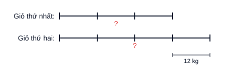
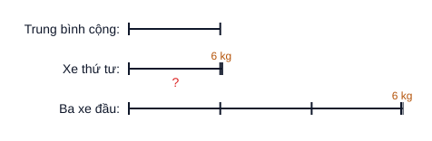
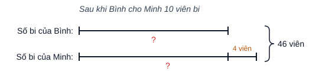
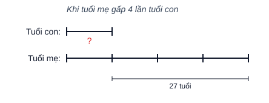
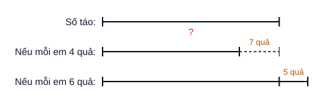
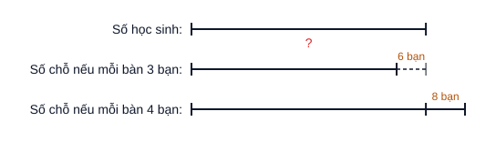

# 5T · Số thập phân — 12 câu GIẢI THỬ theo luật `k5T.md` (v2, 04/10, chưa ghi DB)

> **⭐ 08/10: LÔ SÁCH 1 (CĐ1–9, 26 câu, nguồn "Tài liệu tham khảo Toán 5") ở CUỐI FILE — chờ CEO duyệt.** 12 câu dưới đây là lô 04/10 từ kho cũ.
>
> v2: mỗi câu chia **Phần 1. Hướng dẫn** (giải thích) / **Phần 2. Trình bày** (chỉ cái viết vào bài thi) — CEO 04/10.
> 2 câu/dạng. Đáp số cả 12 câu đã được code tính lại, khớp `dap_an` hiện có.

---

## 020201 · Tính chất số thập phân

### T15T020201001 — Điền dấu: $5+0,5+0,05+0,005+0,0005 \;\square\; \dfrac{55557}{10000}$

**Phần 1. Hướng dẫn**

Đưa hai vế về cùng là số thập phân rồi so sánh. Vế trái: cộng các số thập phân. Vế phải: phân số có mẫu $10000$ thì viết được thành số thập phân có $4$ chữ số ở phần thập phân.

So sánh hai số thập phân: phần nguyên bằng nhau thì so sánh lần lượt từng hàng phần mười, phần trăm, phần nghìn, phần chục nghìn. Ở đây chỉ khác nhau ở hàng phần chục nghìn: $5 < 7$.

**Phần 2. Trình bày**

$5+0,5+0,05+0,005+0,0005 = 5,5555$

$\dfrac{55557}{10000} = 5,5557$

$5,5555 < 5,5557$

Vậy $5+0,5+0,05+0,005+0,0005 < \dfrac{55557}{10000}$.

### T15T020206029 — Tìm các số tự nhiên $x$: $78,32 < x < 80,1$

**Phần 1. Hướng dẫn**

Số tự nhiên lớn hơn $78,32$ thì phải lớn hơn $78$, nên nhỏ nhất là $79$. Số tự nhiên nhỏ hơn $80,1$ thì lớn nhất là $80$. Liệt kê các số tự nhiên từ $79$ đến $80$.

**Phần 2. Trình bày**

$78,32 < x < 80,1$

$x = 79$ hoặc $x = 80$.

---

## 020202 · Tính thuận tiện

### T15T020202007 — $C = 37,25+48,42+54,73-(7,25+8,42+4,73)$

**Phần 1. Hướng dẫn**

Một tổng trừ đi một tổng thì ta trừ lần lượt từng số hạng. Để ý các cặp có phần thập phân giống nhau: $37,25$ và $7,25$; $48,42$ và $8,42$; $54,73$ và $4,73$. Nhóm từng cặp thì mỗi hiệu là số tròn chục.

**Phần 2. Trình bày**

$C = 37,25+48,42+54,73-7,25-8,42-4,73$

$C = (37,25-7,25)+(48,42-8,42)+(54,73-4,73)$

$C = 30+40+50$

$C = 120$

### T15T020202013 — $(1,345 \times 4,67 + 2,1) \times (8,4 - 1,2 \times 7)$

**Phần 1. Hướng dẫn**

Đừng tính thừa số thứ nhất vội. Xét thừa số thứ hai: $1,2 \times 7 = 8,4$, nên thừa số thứ hai bằng $0$. Một tích có một thừa số bằng $0$ thì tích bằng $0$.

**Phần 2. Trình bày**

$(1,345 \times 4,67 + 2,1) \times (8,4 - 1,2 \times 7)$

$= (1,345 \times 4,67 + 2,1) \times (8,4 - 8,4)$

$= (1,345 \times 4,67 + 2,1) \times 0$

$= 0$

---

## 020203 · Biểu thức hỗn hợp

### T15T020203007 — $26,8 : 100 + 3,7 \times 0,1$

**Phần 1. Hướng dẫn**

Làm phép chia, phép nhân trước rồi mới cộng.

Chia một số thập phân cho $100$: dịch dấu phẩy sang trái hai chữ số. Nhân một số thập phân với $0,1$: dịch dấu phẩy sang trái một chữ số.

**Phần 2. Trình bày**

$26,8 : 100 + 3,7 \times 0,1$

$= 0,268 + 0,37$

$= 0,638$

### T15T020203037 — $3\dfrac{1}{5}-0,7+\dfrac{3}{10}$

**Phần 1. Hướng dẫn**

Đổi hỗn số và phân số ra số thập phân: $3\dfrac{1}{5} = 3\dfrac{2}{10} = 3,2$; $\dfrac{3}{10} = 0,3$. Biểu thức chỉ có cộng, trừ nên tính lần lượt từ trái sang phải.

**Phần 2. Trình bày**

$3\dfrac{1}{5}-0,7+\dfrac{3}{10}$

$= 3,2 - 0,7 + 0,3$

$= 2,5 + 0,3$

$= 2,8$

---

## 020204 · Tìm $y$

### T15T020204007 — $1-(1,1+y):8\dfrac{1}{10}=0$

**Phần 1. Hướng dẫn**

Đổi $8\dfrac{1}{10} = 8,1$. Gỡ dần từ ngoài vào trong:

- $1$ trừ đi một số bằng $0$ thì số đó bằng $1$ (số trừ bằng số bị trừ khi hiệu bằng $0$).
- $(1,1+y)$ là số bị chia: muốn tìm số bị chia, lấy thương nhân với số chia.
- $y$ là số hạng: muốn tìm số hạng chưa biết, lấy tổng trừ đi số hạng đã biết.

**Phần 2. Trình bày**

$1-(1,1+y):8,1=0$

$(1,1+y):8,1=1$

$1,1+y=1 \times 8,1$

$1,1+y=8,1$

$y=8,1-1,1$

$y=7$

### T15T020204013 — $y:0,1+y\times10=2,5$

**Phần 1. Hướng dẫn**

Chia một số cho $0,1$ cũng chính là nhân số đó với $10$, nên $y:0,1 = y \times 10$. Khi đó có hai lần $y \times 10$, dùng tính chất nhân một số với một tổng để gộp lại. Cuối cùng $y$ là thừa số chưa biết: lấy tích chia cho thừa số đã biết.

**Phần 2. Trình bày**

$y:0,1+y\times10=2,5$

$y\times10+y\times10=2,5$

$y\times(10+10)=2,5$

$y\times20=2,5$

$y=2,5:20$

$y=0,125$

---

## 020205 · Bài toán lời văn

### T15T020205007 — Kho A hơn kho B 37 tạ; chuyển 4,5 tạ từ A sang B thì B bằng 0,6 lần A. Hai kho có tất cả bao nhiêu tạ?

**Phần 1. Hướng dẫn**

Chuyển $4,5$ tạ từ kho A sang kho B: kho A bớt $4,5$ tạ, kho B thêm $4,5$ tạ, nên khoảng cách giữa hai kho giảm $2$ lần $4,5$ tạ.

Đổi $0,6 = \dfrac{3}{5}$: sau khi chuyển, kho A là $5$ phần, kho B là $3$ phần, A hơn B $2$ phần. Đây là bài toán hiệu – tỉ.

Chuyển thóc qua lại giữa hai kho thì tổng số thóc không đổi, nên tổng lúc sau cũng là tổng ban đầu.

**Phần 2. Trình bày**

Bài giải

Sau khi chuyển, kho A hơn kho B số tạ thóc là:

$37 - 4,5 \times 2 = 28$ (tạ)

$0,6 = \dfrac{3}{5}$

Hiệu số phần bằng nhau là:

$5 - 3 = 2$ (phần)

Số thóc kho A sau khi chuyển là:

$28 : 2 \times 5 = 70$ (tạ)

Số thóc kho B sau khi chuyển là:

$70 - 28 = 42$ (tạ)

Hai kho có tất cả số tạ thóc là:

$70 + 42 = 112$ (tạ)

Đáp số: $112$ tạ thóc.

### T15T020205013 — Hiện nay tuổi con bằng 1/5 tuổi bố; sau 10 năm tuổi con bằng 0,36 lần tuổi bố. Tính tuổi mỗi người hiện nay.

**Phần 1. Hướng dẫn**

Hiệu số tuổi của hai bố con không thay đổi theo thời gian — đây là bài toán "hai tỉ số, hiệu không đổi".

- Hiện nay: con $1$ phần, bố $5$ phần, bố hơn con $4$ phần nên tuổi con bằng $\dfrac{1}{4}$ hiệu.
- Sau 10 năm: $0,36 = \dfrac{9}{25}$: con $9$ phần, bố $25$ phần, bố hơn con $16$ phần nên tuổi con bằng $\dfrac{9}{16}$ hiệu.

Coi hiệu là $16$ phần thì tuổi con hiện nay $4$ phần, tuổi con sau 10 năm $9$ phần. Hai số này hơn kém nhau đúng $10$ tuổi.

*(Ghi chú: câu này dùng phương pháp của dạng "Hai tỉ số" T15T010303, không phải kiến thức số thập phân.)*

**Phần 2. Trình bày**

Bài giải

$0,36 = \dfrac{9}{25}$

Hiện nay, tuổi con bằng: $\dfrac{1}{5-1} = \dfrac{1}{4}$ hiệu số tuổi.

Sau 10 năm, tuổi con bằng: $\dfrac{9}{25-9} = \dfrac{9}{16}$ hiệu số tuổi.

$\dfrac{1}{4} = \dfrac{4}{16}$

Hiệu số phần bằng nhau là:

$9 - 4 = 5$ (phần)

Tuổi con hiện nay là:

$10 : 5 \times 4 = 8$ (tuổi)

Tuổi bố hiện nay là:

$8 \times 5 = 40$ (tuổi)

Đáp số: Con $8$ tuổi; bố $40$ tuổi.

---

## 020206 · Nâng cao cấu tạo số thập phân

### T15T020206055 — Dịch dấu phẩy của $A$ sang trái 1 chữ số được $B$, sang phải 1 chữ số được $C$. $A+B+C=746,586$. Tìm $A$.

**Phần 1. Hướng dẫn**

Dịch dấu phẩy sang trái một chữ số = giảm đi $10$ lần; sang phải một chữ số = gấp lên $10$ lần. Vậy $A$ gấp $10$ lần $B$, $C$ gấp $10$ lần $A$ tức gấp $100$ lần $B$.

Coi $B$ là $1$ phần thì $A$ là $10$ phần, $C$ là $100$ phần. Đây là bài toán tổng – tỉ: tìm giá trị một phần rồi suy ra $A$.

**Phần 2. Trình bày**

Bài giải

Coi $B$ là $1$ phần thì $A$ là $10$ phần, $C$ là $100$ phần.

Tổng số phần bằng nhau là:

$1 + 10 + 100 = 111$ (phần)

Số $B$ là:

$746,586 : 111 = 6,726$

Số $A$ là:

$6,726 \times 10 = 67,26$

Đáp số: $A = 67,26$.

### T15T020206047 — Tìm số thập phân $\overline{a,bc}$ biết $\overline{a,bc} \times 5 = \overline{d,ad}$

**Phần 1. Hướng dẫn**

- Tích $\overline{d,ad}$ có phần nguyên một chữ số nên nhỏ hơn $10$ nên $\overline{a,bc}$ nhỏ hơn $10:5 = 2$ nên $a$ là $0$ hoặc $1$.
- Bỏ dấu phẩy hai số (cùng có hai chữ số ở phần thập phân): $\overline{abc} \times 5 = \overline{dad}$. Số nhân với $5$ thì tận cùng là $0$ hoặc $5$ nên $d$ là $0$ hoặc $5$.
- $d = 0$: tích nhỏ hơn $1$ nên $\overline{a,bc}$ nhỏ hơn $0,2$ nên $a = 0$ nên tất cả các chữ số bằng $0$, loại.
- $d = 5$: tích là $5,a5$, không nhỏ hơn $5$ nên $\overline{a,bc}$ không nhỏ hơn $1$ nên $a = 1$. Từ đó tích $= 5,15$, chia cho $5$ ra số cần tìm.

**Phần 2. Trình bày**

$\overline{d,ad} < 10$ nên $\overline{a,bc} < 10 : 5 = 2$, do đó $a = 0$ hoặc $a = 1$.

$\overline{abc} \times 5 = \overline{dad}$ nên $d = 0$ hoặc $d = 5$.

Nếu $d = 0$ thì $\overline{a,bc} < 0,2$, nên $a = 0$. Khi đó tích $\overline{d,ad} = 0,00$, nên số cần tìm bằng $0$ (loại).

Vậy $d = 5$, khi đó tích không nhỏ hơn $5$ nên $\overline{a,bc}$ không nhỏ hơn $1$, do đó $a = 1$.

$\overline{1,bc} = 5,15 : 5 = 1,03$

Thử lại: $1,03 \times 5 = 5,15$ (đúng).

Vậy $\overline{a,bc} = 1,03$.

---

# LÔ SÁCH 1 — CĐ1–9 (Tài liệu tham khảo Toán 5) · 26 câu · chờ CEO duyệt (08/10)

> Bước 1 (README §0): giải **một lượt qua các dạng bài** của sách — lô này phủ CĐ1–9, mỗi dạng chính trong "Tóm tắt lí thuyết" ít
> nhất 1 câu. Không gán dạng (giải ≠ gán dạng); dòng **Dạng sách** chỉ để theo dõi độ phủ. Đề lấy nguyên văn sách (công thức đọc
> từ MathType trong WMF — `scripts/kho/mathtype-thu/wmf-mtef.mjs`). **Đáp số 26/26 máy tính lại từ đề, khớp.** 5 sơ đồ máy vẽ đúng tỉ lệ.
> Khuôn trình bày bám "Bài làm" trong VÍ DỤ của sách 5T; chỗ sách không có mẫu thì theo `k4T.md` v1.

## Câu 1 — LT 1.2d · Tính: $7\dfrac{3}{7}-\left(1\dfrac{1}{4}+3\dfrac{3}{7}\right)$

**Dạng sách:** CĐ1 · Các phép tính với hỗn số

**Phần 1. Hướng dẫn**

Mấu chốt: $7\dfrac{3}{7}$ và $3\dfrac{3}{7}$ có **cùng phần phân số** $\dfrac{3}{7}$, trừ cho nhau ra ngay số tự nhiên $4$. Muốn đưa hai số đó lại gần nhau thì dùng quy tắc **trừ một tổng**: lấy số bị trừ trừ lần lượt từng số hạng.

Còn lại $4-1\dfrac{1}{4}$: phần phân số của $4$ là $0$, không trừ được $\dfrac{1}{4}$ ⇒ mượn $1$ đơn vị: $4=3\dfrac{4}{4}$.

**Phần 2. Trình bày**

$7\dfrac{3}{7}-\left(1\dfrac{1}{4}+3\dfrac{3}{7}\right)$

$=7\dfrac{3}{7}-3\dfrac{3}{7}-1\dfrac{1}{4}$

$=4-1\dfrac{1}{4}$

$=3\dfrac{4}{4}-1\dfrac{1}{4}$

$=2\dfrac{3}{4}$

---

## Câu 2 — LT 1.4e · Tìm $y$, biết: $y\times 1\dfrac{5}{9}-y\times\dfrac{7}{9}+y\times\dfrac{5}{9}=4$

**Dạng sách:** CĐ1 · Tìm $y$ với phân số, hỗn số

**Phần 1. Hướng dẫn**

Mấu chốt: $y$ có mặt ở cả ba tích ⇒ dùng tính chất **nhân một số với một tổng (hiệu)** để gom về "$y$ nhân với một số". Đổi hỗn số $1\dfrac{5}{9}=\dfrac{14}{9}$ cho cùng mẫu với hai phân số kia rồi tính trong ngoặc.

Khi đã còn $y\times\dfrac{4}{3}=4$: muốn tìm thừa số chưa biết, ta lấy tích chia cho thừa số đã biết.

**Phần 2. Trình bày**

$\begin{array}{l} y\times 1\dfrac{5}{9}-y\times\dfrac{7}{9}+y\times\dfrac{5}{9}=4 \\ y\times\left(\dfrac{14}{9}-\dfrac{7}{9}+\dfrac{5}{9}\right)=4 \\ y\times\dfrac{4}{3}=4 \\ y=4:\dfrac{4}{3} \\ y=3 \end{array}$

---

## Câu 3 — LT 1.6e · So sánh (giải thích cách làm): $\dfrac{2022}{2023}$ và $\dfrac{2023}{2024}$

**Dạng sách:** CĐ1 · So sánh phân số (phần bù)

**Phần 1. Hướng dẫn**

Quy đồng thì mẫu số rất lớn. Dấu hiệu: cả hai phân số đều **kém $1$ đúng một phân số có tử $1$** (tử kém mẫu $1$ đơn vị) ⇒ so sánh **phần bù đến $1$**. Phân số nào có phần bù **lớn hơn** thì phân số đó **bé hơn** (vì "thiếu" nhiều hơn mới đủ $1$).

Hai phần bù $\dfrac{1}{2023}$ và $\dfrac{1}{2024}$ cùng tử số $1$: mẫu số nào lớn hơn thì phân số đó bé hơn.

**Phần 2. Trình bày**

Bước 1: Tìm phần bù đến $1$ của mỗi phân số:

$1-\dfrac{2022}{2023}=\dfrac{1}{2023}$

$1-\dfrac{2023}{2024}=\dfrac{1}{2024}$

Bước 2: So sánh phần bù: $\dfrac{1}{2023}>\dfrac{1}{2024}$

Vậy $\dfrac{2022}{2023}<\dfrac{2023}{2024}$.

---

## Câu 4 — LT 2.3 · Một người đi bộ tham gia marathon với chiều dài quãng đường là $24$ km trong ba giờ. Trong giờ thứ nhất, người đó đi được $\dfrac{1}{3}$ quãng đường. Trong giờ thứ hai, người đó đi được $\dfrac{5}{8}$ quãng đường còn lại. Hỏi trong giờ thứ ba người đó đi được bao nhiêu ki-lô-mét?

**Dạng sách:** CĐ2 · Tìm giá trị phân số của một số (nhiều bước, "phần còn lại")

**Phần 1. Hướng dẫn**

Mấu chốt: $\dfrac{5}{8}$ là phân số của **quãng đường còn lại** sau giờ thứ nhất, **không phải** của cả $24$ km. Nên phải đi lần lượt: giờ thứ nhất → phần còn lại → giờ thứ hai → giờ thứ ba chính là phần còn lại sau giờ thứ hai.

Chú ý: lấy $24\times\dfrac{5}{8}$ là sai ngay chỗ này.

**Phần 2. Trình bày**

Bài giải

Quãng đường người đó đi trong giờ thứ nhất là: $24\times\dfrac{1}{3}=8$ (km)

Quãng đường còn lại sau giờ thứ nhất là: $24-8=16$ (km)

Quãng đường người đó đi trong giờ thứ hai là: $16\times\dfrac{5}{8}=10$ (km)

Quãng đường người đó đi trong giờ thứ ba là: $16-10=6$ (km)

Đáp số: $6$ km

---

## Câu 5 — LT 2.10 · Một cửa hàng sau khi bán $\dfrac{2}{5}$ số hộp bánh và $3$ hộp thì còn lại $36$ hộp bánh. Hỏi lúc đầu cửa hàng có bao nhiêu hộp bánh?

**Dạng sách:** CĐ2 · Tìm một số khi biết giá trị một phân số của số đó

**Phần 1. Hướng dẫn**

Mấu chốt: $3$ hộp bán thêm **không phải** một phân số, nên gộp nó với $36$ hộp còn lại: nếu chỉ bán $\dfrac{2}{5}$ số hộp thì còn $36+3=39$ hộp. $39$ hộp này ứng với phần còn lại $1-\dfrac{2}{5}=\dfrac{3}{5}$ số hộp lúc đầu.

Biết giá trị của một phân số thì tìm số đó bằng phép **chia** cho phân số (như VD 2.2 của sách).

**Phần 2. Trình bày**

Bài giải

Nếu chỉ bán $\dfrac{2}{5}$ số hộp bánh thì cửa hàng còn lại: $36+3=39$ (hộp)

$39$ hộp bánh tương ứng với: $1-\dfrac{2}{5}=\dfrac{3}{5}$ (số hộp bánh lúc đầu)

Số hộp bánh lúc đầu cửa hàng có là: $39:\dfrac{3}{5}=65$ (hộp)

Đáp số: $65$ hộp bánh

---

## Câu 6 — LT 2.20 · Số táo trong giỏ thứ nhất ít hơn số táo trong giỏ thứ hai $12$ kg. Biết rằng $\dfrac{2}{3}$ số táo trong giỏ thứ nhất bằng $\dfrac{1}{2}$ số táo trong giỏ thứ hai. Hỏi cả hai giỏ có tất cả bao nhiêu ki-lô-gam táo?

**Dạng sách:** CĐ2 · Tỉ số của hai số (đưa về hiệu – tỉ)

**Phần 1. Hướng dẫn**

Mấu chốt: đổi câu "$\dfrac{2}{3}$ giỏ thứ nhất bằng $\dfrac{1}{2}$ giỏ thứ hai" thành **số phần bằng nhau** bằng cách **quy đồng tử số**: $\dfrac{1}{2}=\dfrac{2}{4}$. Lúc đó $2$ phần (khi chia giỏ thứ nhất thành $3$ phần) bằng $2$ phần (khi chia giỏ thứ hai thành $4$ phần) ⇒ các phần này bằng nhau: giỏ thứ nhất $3$ phần, giỏ thứ hai $4$ phần.

Đề cho **hiệu** $12$ kg ⇒ bài toán hiệu – tỉ. Chú ý: câu hỏi là **cả hai giỏ**, tìm xong từng giỏ phải cộng lại.

**Phần 2. Trình bày**

Bài giải

Ta có: $\dfrac{1}{2}=\dfrac{2}{4}$ nên $\dfrac{2}{3}$ số táo giỏ thứ nhất bằng $\dfrac{2}{4}$ số táo giỏ thứ hai.

Hay số táo giỏ thứ nhất bằng $\dfrac{3}{4}$ số táo giỏ thứ hai.

Ta có sơ đồ:

Hiệu số phần bằng nhau là: $4-3=1$ (phần)

Số táo trong giỏ thứ nhất là: $12:1\times 3=36$ (kg)

Số táo trong giỏ thứ hai là: $36+12=48$ (kg)

Cả hai giỏ có số táo là: $36+48=84$ (kg)

Đáp số: $84$ kg táo

---

## Câu 7 — LT 2.25 · Trên bản đồ tỉ lệ $1:500$, một mảnh đất hình chữ nhật có chiều dài $8$ cm, chiều rộng $5$ cm. Tính diện tích mảnh đất đó trên thực tế theo đơn vị mét vuông.

**Dạng sách:** CĐ2 · Tỉ số của hai số (tỉ lệ bản đồ)

**Phần 1. Hướng dẫn**

Tỉ lệ $1:500$ nghĩa là $1$ cm trên bản đồ ứng với $500$ cm trên thực tế. Mấu chốt: đổi **từng cạnh** ra độ dài thật rồi mới tính diện tích.

Chú ý bẫy: lấy diện tích trên bản đồ $8\times 5=40$ cm² rồi nhân $500$ là **sai** — diện tích thật gấp $500\times 500$ lần chứ không phải $500$ lần. Đề hỏi mét vuông ⇒ đổi cm ra m **trước** khi nhân cho số gọn.

**Phần 2. Trình bày**

Bài giải

Chiều dài mảnh đất trên thực tế là: $8\times 500=4000$ (cm)

Đổi: $4000$ cm $=40$ m

Chiều rộng mảnh đất trên thực tế là: $5\times 500=2500$ (cm)

Đổi: $2500$ cm $=25$ m

Diện tích mảnh đất trên thực tế là: $40\times 25=1000$ ($\text{m}^2$)

Đáp số: $1000\ \text{m}^2$

---

## Câu 8 — LT 3.4 · Một bể có hai cái vòi, vòi A chảy vào bể và vòi B tháo nước ra. Khi bể đang cạn, nếu chỉ mở vòi A thì sau $5$ giờ đầy bể. Khi bể đang đầy, nếu chỉ mở vòi B thì sau $6$ giờ bể cạn. Hỏi khi bể đang cạn, nếu mở cả hai vòi thì sau bao lâu đầy bể?

**Dạng sách:** CĐ3 · Công việc chung (một vòi chảy vào, một vòi tháo ra)

**Phần 1. Hướng dẫn**

Như mọi bài công việc chung: coi cả bể là $1$, tính **mỗi giờ mỗi vòi làm được mấy phần bể**. Khác ở chỗ vòi B **tháo ra**, nên mở cả hai vòi thì mỗi giờ bể chỉ có thêm phần **hiệu** $\dfrac{1}{5}-\dfrac{1}{6}$, không phải tổng.

Có phần bể đầy thêm sau $1$ giờ thì thời gian đầy bể $=1$ chia cho phần đó.

**Phần 2. Trình bày**

Bài giải

Trong $1$ giờ, vòi A chảy vào được: $1:5=\dfrac{1}{5}$ (bể)

Trong $1$ giờ, vòi B tháo ra được: $1:6=\dfrac{1}{6}$ (bể)

Trong $1$ giờ, mở cả hai vòi thì lượng nước trong bể tăng thêm: $\dfrac{1}{5}-\dfrac{1}{6}=\dfrac{1}{30}$ (bể)

Thời gian để bể đầy là: $1:\dfrac{1}{30}=30$ (giờ)

Đáp số: $30$ giờ

---

## Câu 9 — LT 3.10 · Anh dọn nhà một mình thì sau $10$ phút sẽ xong. Khi người anh làm được $5$ phút thì em đến làm cùng nên cả hai anh em làm tiếp trong $3$ phút là xong. Hỏi nếu em làm một mình thì sau bao lâu sẽ xong việc dọn nhà?

**Dạng sách:** CĐ3 · Công việc chung (làm riêng một đoạn rồi làm chung)

**Phần 1. Hướng dẫn**

Mấu chốt: công việc chia **hai đoạn**. Đoạn đầu chỉ anh làm $5$ phút ⇒ được $\dfrac{1}{10}\times 5=\dfrac{1}{2}$ công việc. Nửa còn lại do **hai anh em** làm trong $3$ phút ⇒ mỗi phút hai người làm được $\dfrac{1}{2}:3$.

Lấy phần cả hai làm trong $1$ phút trừ phần của anh ⇒ phần của em trong $1$ phút ⇒ thời gian em làm một mình.

**Phần 2. Trình bày**

Bài giải

Trong $1$ phút, anh làm được: $1:10=\dfrac{1}{10}$ (công việc)

Trong $5$ phút, anh làm được: $\dfrac{1}{10}\times 5=\dfrac{1}{2}$ (công việc)

Phần việc hai anh em cùng làm là: $1-\dfrac{1}{2}=\dfrac{1}{2}$ (công việc)

Trong $1$ phút, hai anh em cùng làm được: $\dfrac{1}{2}:3=\dfrac{1}{6}$ (công việc)

Trong $1$ phút, em làm được: $\dfrac{1}{6}-\dfrac{1}{10}=\dfrac{1}{15}$ (công việc)

Nếu em làm một mình thì xong việc dọn nhà sau: $1:\dfrac{1}{15}=15$ (phút)

Đáp số: $15$ phút

---

## Câu 10 — LT 4.1b · Tính: $B=\dfrac{2}{1\times 3}+\dfrac{2}{3\times 5}+\dfrac{2}{5\times 7}+\dfrac{2}{7\times 9}+\ldots+\dfrac{2}{35\times 37}$

**Dạng sách:** CĐ4 · Dãy phân số có quy luật (tử bằng hiệu hai thừa số ở mẫu)

**Phần 1. Hướng dẫn**

Dấu hiệu: ở mỗi số hạng, **tử số bằng hiệu hai thừa số ở mẫu** ($3-1=2$, $5-3=2$, …). Khi đó mỗi số hạng tách được thành hiệu hai phân số: $\dfrac{2}{1\times 3}=\dfrac{1}{1}-\dfrac{1}{3}$ (thử lại: $1-\dfrac{1}{3}=\dfrac{2}{3}$).

Viết hết ra thì các phân số ở giữa **triệt tiêu từng cặp** ($-\dfrac{1}{3}+\dfrac{1}{3}$, …), chỉ còn số đầu trừ số cuối — đúng cách VD 4.1 của sách.

**Phần 2. Trình bày**

$B=\dfrac{2}{1\times 3}+\dfrac{2}{3\times 5}+\dfrac{2}{5\times 7}+\dfrac{2}{7\times 9}+\ldots+\dfrac{2}{35\times 37}$

$B=\dfrac{1}{1}-\dfrac{1}{3}+\dfrac{1}{3}-\dfrac{1}{5}+\dfrac{1}{5}-\dfrac{1}{7}+\dfrac{1}{7}-\dfrac{1}{9}+\ldots+\dfrac{1}{35}-\dfrac{1}{37}$

$B=1-\dfrac{1}{37}$

$B=\dfrac{36}{37}$

---

## Câu 11 — LT 4.8b · Tính: $B=\dfrac{1}{5}+\dfrac{1}{10}+\dfrac{1}{20}+\dfrac{1}{40}+\ldots+\dfrac{1}{1280}$

**Dạng sách:** CĐ4 · Dãy phân số có quy luật (mẫu sau gấp đôi mẫu trước)

**Phần 1. Hướng dẫn**

Dấu hiệu: **mẫu số sau gấp đôi mẫu số trước** ($5$, $10$, $20$, …, $1280$) — số hạng sau bằng một nửa số hạng trước. Nhân cả $B$ với $2$ thì mỗi số hạng thành số hạng đứng trước nó: dãy $2\times B$ có gần như đủ các số hạng của $B$, chỉ thêm $\dfrac{2}{5}$ ở đầu và thiếu $\dfrac{1}{1280}$ ở cuối.

Lấy $2\times B-B$: các số hạng giống nhau triệt tiêu hết, còn $\dfrac{2}{5}-\dfrac{1}{1280}$, và $2\times B-B$ chính là $B$.

**Phần 2. Trình bày**

$B=\dfrac{1}{5}+\dfrac{1}{10}+\dfrac{1}{20}+\dfrac{1}{40}+\ldots+\dfrac{1}{1280}$

$2\times B=\dfrac{2}{5}+\dfrac{1}{5}+\dfrac{1}{10}+\dfrac{1}{20}+\ldots+\dfrac{1}{640}$

$2\times B-B=\dfrac{2}{5}-\dfrac{1}{1280}$

$B=\dfrac{512}{1280}-\dfrac{1}{1280}$

$B=\dfrac{511}{1280}$

---

## Câu 12 — LT 5.1 · Trong chiến dịch chuyển hàng ủng hộ đồng bào bị ảnh hưởng bởi bão lụt, một đơn vị vận tải đã huy động $16$ xe chở được $240$ tấn hàng. Hỏi nếu đơn vị được giao vận chuyển $480$ tấn hàng thì phải huy động thêm bao nhiêu xe? Biết rằng trọng tải của mỗi xe như nhau.

**Dạng sách:** CĐ5 · Tỉ lệ thuận

**Phần 1. Hướng dẫn**

Trọng tải mỗi xe như nhau ⇒ số tấn hàng và số xe là hai đại lượng **tỉ lệ thuận**. Cách rút về đơn vị: tìm $1$ xe chở được mấy tấn, rồi tìm số xe cần cho $480$ tấn. *(Cách khác: $480$ tấn gấp $240$ tấn $2$ lần nên số xe cũng gấp $2$ lần.)*

Chú ý: đề hỏi **huy động thêm** bao nhiêu xe ⇒ phải trừ đi $16$ xe đã có.

**Phần 2. Trình bày**

Bài giải

Mỗi xe chở được số tấn hàng là: $240:16=15$ (tấn)

Số xe cần để chở $480$ tấn hàng là: $480:15=32$ (xe)

Số xe phải huy động thêm là: $32-16=16$ (xe)

Đáp số: $16$ xe

---

## Câu 13 — LT 5.6 · Một người mua $30$ quyển vở, giá $12000$ đồng một quyển thì vừa hết số tiền đang có. Cũng với số tiền đó nếu mua quyển vở với giá $15000$ đồng một quyển thì người đó mua được bao nhiêu quyển vở?

**Dạng sách:** CĐ5 · Tỉ lệ nghịch

**Phần 1. Hướng dẫn**

Số tiền **không đổi** ⇒ giá một quyển và số quyển mua được là hai đại lượng **tỉ lệ nghịch** (giá tăng thì mua được ít đi). Cách gọn nhất: tính ra **đại lượng không đổi** (số tiền) trước, rồi chia cho giá mới.

**Phần 2. Trình bày**

Bài giải

Số tiền người đó có là: $12000\times 30=360000$ (đồng)

Với giá $15000$ đồng một quyển, người đó mua được số quyển vở là: $360000:15000=24$ (quyển)

Đáp số: $24$ quyển vở

---

## Câu 14 — LT 5.14 · Một tổ công nhân có $15$ người trong $6$ ngày làm được $180$ sản phẩm. Hỏi nếu tổ có $18$ người trong $8$ ngày thì làm được bao nhiêu sản phẩm? Biết năng suất mỗi người như nhau.

**Dạng sách:** CĐ5 · Tỉ lệ kép

**Phần 1. Hướng dẫn**

Hai đại lượng cùng đổi một lúc (số người **và** số ngày) ⇒ bài **tỉ lệ kép**. Rút về đơn vị hai lần: tìm **$1$ người làm trong $1$ ngày** được mấy sản phẩm, rồi nhân với số người và số ngày mới. *(Sách còn cách "phương pháp ba dòng" và "tam suất kép" — VD 5.3.)*

**Phần 2. Trình bày**

Bài giải

$1$ người làm trong $6$ ngày được số sản phẩm là: $180:15=12$ (sản phẩm)

$1$ người làm trong $1$ ngày được số sản phẩm là: $12:6=2$ (sản phẩm)

$18$ người làm trong $8$ ngày được số sản phẩm là: $2\times 18\times 8=288$ (sản phẩm)

Đáp số: $288$ sản phẩm

---

## Câu 15 — LT 6.4 · Xe thứ nhất chở $267$ kg thóc. Xe thứ hai chở nhiều hơn xe thứ nhất $32$ kg thóc. Xe thứ ba chở số thóc bằng trung bình cộng số thóc của cả ba xe. Xe thứ tư chở nhiều hơn trung bình cộng số thóc của cả bốn xe là $6$ kg thóc. Hỏi xe thứ tư chở bao nhiêu ki-lô-gam thóc?

**Dạng sách:** CĐ6 · Trung bình cộng (bằng TBC · hơn TBC)

**Phần 1. Hướng dẫn**

Hai mấu chốt:

(1) Xe thứ ba **bằng** trung bình cộng của cả ba xe ⇒ thêm xe thứ ba vào không làm trung bình cộng thay đổi ⇒ xe thứ ba bằng trung bình cộng của **hai xe đầu**.

(2) Xe thứ tư **hơn** trung bình cộng của bốn xe $6$ kg ⇒ ba xe đầu phải "bù" lại: ba xe đầu bằng $3$ lần trung bình cộng **bớt** $6$ kg. Vậy **$3$ lần trung bình cộng $=$ tổng ba xe đầu $+6$** (cách VD 13.5 sách 4T).

**Phần 2. Trình bày**

Bài giải

Xe thứ hai chở số thóc là: $267+32=299$ (kg)

Xe thứ ba chở số thóc bằng trung bình cộng của hai xe đầu, là: $\left(267+299\right):2=283$ (kg)

Ta có sơ đồ:

Ba lần trung bình cộng số thóc của bốn xe là: $267+299+283+6=855$ (kg)

Trung bình cộng số thóc của bốn xe là: $855:3=285$ (kg)

Xe thứ tư chở số thóc là: $285+6=291$ (kg)

Đáp số: $291$ kg thóc

---

## Câu 16 — LT 6.8 · Bình và Minh có tất cả $46$ viên bi. Nếu Bình cho Minh $10$ viên bi thì Minh sẽ có nhiều hơn Bình $4$ viên. Hỏi mỗi bạn có bao nhiêu viên bi?

**Dạng sách:** CĐ6 · Tìm hai số khi biết tổng và hiệu

**Phần 1. Hướng dẫn**

Mấu chốt: cho nhau thì **tổng không đổi** ($46$). Hiệu "Minh hơn Bình $4$ viên" là hiệu **lúc sau**, nên giải tổng – hiệu cho **lúc sau** trước, rồi mới đi ngược về lúc đầu (Bình lúc đầu nhiều hơn lúc sau $10$ viên).

Chú ý bẫy: dùng hiệu $4$ cho lúc đầu là sai.

**Phần 2. Trình bày**

Bài giải

Tổng số bi của hai bạn không đổi.

Ta có sơ đồ:

Số bi của Bình sau khi cho Minh là: $\left(46-4\right):2=21$ (viên)

Số bi của Bình lúc đầu là: $21+10=31$ (viên)

Số bi của Minh lúc đầu là: $46-31=15$ (viên)

Đáp số: Bình: $31$ viên bi; Minh: $15$ viên bi

---

## Câu 17 — LT 6.15 · Hiện nay con $7$ tuổi, mẹ $34$ tuổi. Hỏi sau bao nhiêu năm nữa thì tuổi mẹ gấp $4$ lần tuổi con?

**Dạng sách:** CĐ6 · Tìm hai số khi biết hiệu và tỉ số (tuổi)

**Phần 1. Hướng dẫn**

Mấu chốt: **hiệu số tuổi không đổi** theo thời gian, luôn là $34-7=27$ tuổi. Vẽ sơ đồ ở **thời điểm có tỉ số** (khi mẹ gấp $4$ lần con): con $1$ phần, mẹ $4$ phần, hiệu $3$ phần ứng với $27$ tuổi ⇒ tuổi con lúc đó.

Đề hỏi **bao nhiêu năm nữa** ⇒ lấy tuổi con lúc đó trừ tuổi con hiện nay.

**Phần 2. Trình bày**

Bài giải

Mẹ hơn con số tuổi là: $34-7=27$ (tuổi)

Hiệu số tuổi của hai mẹ con không đổi theo thời gian.

Ta có sơ đồ:

Hiệu số phần bằng nhau là: $4-1=3$ (phần)

Tuổi con khi tuổi mẹ gấp $4$ lần tuổi con là: $27:3=9$ (tuổi)

Số năm nữa để tuổi mẹ gấp $4$ lần tuổi con là: $9-7=2$ (năm)

Đáp số: $2$ năm

---

## Câu 18 — LT 6.17 · Mai và Hà có $55$ quyển vở, biết $\dfrac{3}{5}$ số vở của Mai bằng $\dfrac{1}{2}$ số vở của Hà. Hỏi mỗi bạn có bao nhiêu quyển vở?

**Dạng sách:** CĐ6 · Tìm hai số khi biết tổng và tỉ số (tỉ số ẩn)

**Phần 1. Hướng dẫn**

Mấu chốt: đổi "$\dfrac{3}{5}$ số vở của Mai bằng $\dfrac{1}{2}$ số vở của Hà" thành số phần bằng nhau bằng **quy đồng tử số**: $\dfrac{1}{2}=\dfrac{3}{6}$ ⇒ Mai $5$ phần, Hà $6$ phần. Đề cho **tổng** $55$ ⇒ bài tổng – tỉ.

**Phần 2. Trình bày**

Bài giải

Ta có: $\dfrac{1}{2}=\dfrac{3}{6}$ nên $\dfrac{3}{5}$ số vở của Mai bằng $\dfrac{3}{6}$ số vở của Hà.

Hay số vở của Mai bằng $\dfrac{5}{6}$ số vở của Hà.

Ta có sơ đồ:

Tổng số phần bằng nhau là: $5+6=11$ (phần)

Số vở của Mai là: $55:11\times 5=25$ (quyển)

Số vở của Hà là: $55-25=30$ (quyển)

Đáp số: Mai: $25$ quyển vở; Hà: $30$ quyển vở

---

## Câu 19 — LT 7.5 · Anh chia táo cho các em. Nếu mỗi em được $4$ quả thì thừa $7$ quả, nếu mỗi em được $6$ quả thì thiếu $5$ quả. Hỏi có bao nhiêu quả táo và bao nhiêu em được chia táo?

**Dạng sách:** CĐ7 · Hai hiệu số (một cách thừa, một cách thiếu)

**Phần 1. Hướng dẫn**

Hai cách chia cho **cùng số em**. So sánh hai cách:

- mỗi em chênh nhau $6-4=2$ quả (**hiệu thứ nhất**);
- tổng số táo cần để chia chênh nhau: từ chỗ **thừa** $7$ quả đến chỗ **thiếu** $5$ quả là $7+5=12$ quả (**hiệu thứ hai** — một thừa một thiếu thì **cộng**; cả hai cùng thừa hoặc cùng thiếu thì **trừ**).

Số em $=$ hiệu thứ hai : hiệu thứ nhất. Rồi tính số táo theo một cách chia bất kì.

**Phần 2. Trình bày**

Bài giải

Ta có sơ đồ:

Chênh lệch số táo của một em giữa hai cách chia là: $6-4=2$ (quả)

Chênh lệch tổng số táo giữa hai cách chia là: $7+5=12$ (quả)

Số em được chia táo là: $12:2=6$ (em)

Số táo là: $4\times 6+7=31$ (quả)

Đáp số: $6$ em; $31$ quả táo

---

## Câu 20 — LT 7.14 · Ở một lớp học, nếu xếp mỗi bàn $3$ bạn thì còn $6$ bạn không có chỗ ngồi, nếu xếp mỗi bàn $4$ bạn thì thừa $2$ bàn. Hỏi lớp có bao nhiêu học sinh và bao nhiêu bàn?

**Dạng sách:** CĐ7 · Hai hiệu số (thừa đơn vị chứa — "thừa bàn")

**Phần 1. Hướng dẫn**

Mấu chốt: "thừa $2$ bàn" là thừa **bàn**, không cùng loại với "$6$ bạn không có chỗ". Đổi ra số **chỗ ngồi**: nếu xếp đủ $4$ bạn vào cả $2$ bàn thừa thì còn thiếu $4\times 2=8$ bạn.

Lúc này: cách $1$ thừa $6$ bạn, cách $2$ (ngồi kín mọi bàn) thiếu $8$ bạn ⇒ chênh lệch tổng $6+8=14$; mỗi bàn chênh $4-3=1$ bạn ⇒ số bàn.

**Phần 2. Trình bày**

Bài giải

Ta có sơ đồ:

Nếu xếp mỗi bàn $4$ bạn cho kín cả $2$ bàn thừa thì còn thiếu: $4\times 2=8$ (bạn)

Chênh lệch số bạn ngồi ở một bàn giữa hai cách xếp là: $4-3=1$ (bạn)

Chênh lệch tổng số bạn giữa hai cách xếp là: $6+8=14$ (bạn)

Số bàn của lớp là: $14:1=14$ (bàn)

Số học sinh của lớp là: $3\times 14+6=48$ (học sinh)

Đáp số: $48$ học sinh; $14$ bàn

---

## Câu 21 — LT 8.3 · Một giá sách gồm hai ngăn. Số sách ở ngăn trên bằng $\dfrac{1}{3}$ số sách ở ngăn dưới. Nếu xếp thêm $24$ quyển sách vào ngăn trên thì số sách ở ngăn trên bằng $\dfrac{7}{9}$ số sách ở ngăn dưới. Hỏi lúc đầu mỗi ngăn có bao nhiêu quyển?

**Dạng sách:** CĐ8 · Hai tỉ số — một đại lượng không đổi

**Phần 1. Hướng dẫn**

Mấu chốt: chỉ ngăn trên được thêm sách, **ngăn dưới giữ nguyên** ⇒ lấy số sách ngăn dưới làm "đơn vị" cho cả hai tỉ số. Lúc đầu ngăn trên $=\dfrac{1}{3}$ ngăn dưới, lúc sau $=\dfrac{7}{9}$ ngăn dưới ⇒ $24$ quyển thêm vào ứng với $\dfrac{7}{9}-\dfrac{1}{3}$ số sách ngăn dưới (như VD 8.1 của sách).

**Phần 2. Trình bày**

Bài giải

Số sách ở ngăn dưới không đổi.

$24$ quyển sách ứng với: $\dfrac{7}{9}-\dfrac{1}{3}=\dfrac{4}{9}$ (số sách ngăn dưới)

Số sách ở ngăn dưới là: $24:\dfrac{4}{9}=54$ (quyển)

Số sách ở ngăn trên lúc đầu là: $54\times\dfrac{1}{3}=18$ (quyển)

Đáp số: Ngăn trên: $18$ quyển; ngăn dưới: $54$ quyển

---

## Câu 22 — LT 8.9 · Mai có số kẹo bằng $\dfrac{2}{3}$ số kẹo của Lam. Nếu Mai cho Lam $6$ cái kẹo thì lúc này tỉ số số kẹo của Mai và Lam là $\dfrac{3}{7}$. Hỏi lúc đầu mỗi bạn có bao nhiêu cái kẹo?

**Dạng sách:** CĐ8 · Hai tỉ số — tổng không đổi

**Phần 1. Hướng dẫn**

Mấu chốt: Mai cho Lam ⇒ **tổng số kẹo của hai bạn không đổi** ⇒ đổi cả hai tỉ số thành "số kẹo của Mai bằng mấy phần **tổng**". Lúc đầu Mai $2$ phần, Lam $3$ phần ⇒ Mai $=\dfrac{2}{5}$ tổng; lúc sau Mai $3$ phần, Lam $7$ phần ⇒ Mai $=\dfrac{3}{10}$ tổng. Mai bớt đi $6$ cái ⇒ $6$ cái ứng với $\dfrac{2}{5}-\dfrac{3}{10}$ tổng (như VD 8.2).

**Phần 2. Trình bày**

Bài giải

Tổng số kẹo của hai bạn không đổi.

Lúc đầu, số kẹo của Mai bằng: $\dfrac{2}{2+3}=\dfrac{2}{5}$ (tổng số kẹo)

Lúc sau, số kẹo của Mai bằng: $\dfrac{3}{3+7}=\dfrac{3}{10}$ (tổng số kẹo)

$6$ cái kẹo ứng với: $\dfrac{2}{5}-\dfrac{3}{10}=\dfrac{1}{10}$ (tổng số kẹo)

Tổng số kẹo của hai bạn là: $6:\dfrac{1}{10}=60$ (cái)

Số kẹo của Mai lúc đầu là: $60\times\dfrac{2}{5}=24$ (cái)

Số kẹo của Lam lúc đầu là: $60-24=36$ (cái)

Đáp số: Mai: $24$ cái kẹo; Lam: $36$ cái kẹo

---

## Câu 23 — LT 8.16 · Hiện nay, tuổi mẹ gấp bốn lần tuổi con. Bốn năm trước, tuổi mẹ gấp bảy lần tuổi con. Tính tuổi của mỗi người hiện nay.

**Dạng sách:** CĐ8 · Hai tỉ số — hiệu không đổi

**Phần 1. Hướng dẫn**

Mấu chốt: **hiệu số tuổi không đổi** ⇒ đổi cả hai tỉ số thành "tuổi con bằng mấy phần **hiệu**". Hiện nay mẹ gấp $4$ lần con ⇒ hiệu bằng $3$ lần tuổi con ⇒ con $=\dfrac{1}{3}$ hiệu. Bốn năm trước mẹ gấp $7$ lần ⇒ con $=\dfrac{1}{6}$ hiệu. Tuổi con kém đi $4$ ⇒ $4$ tuổi ứng với $\dfrac{1}{3}-\dfrac{1}{6}$ hiệu (như VD 8.3).

**Phần 2. Trình bày**

Bài giải

Hiệu số tuổi của hai mẹ con không đổi.

Hiện nay, tuổi con bằng: $\dfrac{1}{4-1}=\dfrac{1}{3}$ (hiệu số tuổi)

Bốn năm trước, tuổi con bằng: $\dfrac{1}{7-1}=\dfrac{1}{6}$ (hiệu số tuổi)

$4$ tuổi ứng với: $\dfrac{1}{3}-\dfrac{1}{6}=\dfrac{1}{6}$ (hiệu số tuổi)

Hiệu số tuổi của hai mẹ con là: $4:\dfrac{1}{6}=24$ (tuổi)

Tuổi con hiện nay là: $24\times\dfrac{1}{3}=8$ (tuổi)

Tuổi mẹ hiện nay là: $8\times 4=32$ (tuổi)

Đáp số: Con: $8$ tuổi; Mẹ: $32$ tuổi

---

## Câu 24 — LT 9.2 · Tìm một số, biết lấy số đó trừ đi $102$ rồi chia cho $11$, lấy thương tìm được cộng với $26$, được bao nhiêu nhân với $25$ thì được kết quả là $2025$.

**Dạng sách:** CĐ9 · Tính ngược (lưu đồ)

**Phần 1. Hướng dẫn**

Biết kết quả cuối của một chuỗi phép tính ⇒ **tính ngược từ cuối lên**, mỗi phép đổi thành phép ngược: nhân $25$ ⇒ chia $25$; cộng $26$ ⇒ trừ $26$; chia $11$ ⇒ nhân $11$; trừ $102$ ⇒ cộng $102$.

Thử lại: $\left(707-102\right):11=55$; $55+26=81$; $81\times 25=2025$.

**Phần 2. Trình bày**

Bài giải

Số nhân với $25$ được $2025$ là: $2025:25=81$

Số cộng với $26$ được $81$ là: $81-26=55$

Số chia cho $11$ được $55$ là: $55\times 11=605$

Số cần tìm là: $605+102=707$

Đáp số: $707$

---

## Câu 25 — LT 9.10 · An đọc một quyển truyện trong ba ngày. Ngày đầu An đọc được $\dfrac{1}{5}$ số trang và $16$ trang. Ngày thứ hai An đọc tiếp $\dfrac{3}{10}$ số trang còn lại và $20$ trang, ngày thứ ba An đọc $\dfrac{3}{4}$ số trang còn lại sau ngày hai và $30$ trang cuối. Hỏi quyển truyện đó có bao nhiêu trang?

**Dạng sách:** CĐ9 · Tính ngược (phân số và số)

**Phần 1. Hướng dẫn**

Tính ngược **từ ngày thứ ba**. Mấu chốt: mỗi phân số tính trên một "tổng" **khác nhau** — $\dfrac{3}{4}$ là của số trang còn lại sau ngày hai, $\dfrac{3}{10}$ là của số trang còn lại sau ngày một, $\dfrac{1}{5}$ là của cả quyển.

- Ngày ba: đọc $\dfrac{3}{4}$ rồi $30$ trang là hết ⇒ $30$ trang là $\dfrac{1}{4}$ số trang còn lại sau ngày hai.
- Ngày hai: nếu không đọc thêm $20$ trang thì còn (số trang sau ngày hai) $+20$, ứng với $1-\dfrac{3}{10}=\dfrac{7}{10}$ số trang còn lại sau ngày một.
- Ngày một: tương tự, (số trang còn lại sau ngày một) $+16$ ứng với $\dfrac{4}{5}$ cả quyển.

**Phần 2. Trình bày**

Bài giải

$30$ trang ứng với: $1-\dfrac{3}{4}=\dfrac{1}{4}$ (số trang còn lại sau ngày thứ hai)

Số trang còn lại sau ngày thứ hai là: $30:\dfrac{1}{4}=120$ (trang)

Nếu ngày thứ hai không đọc thêm $20$ trang thì số trang còn lại là: $120+20=140$ (trang)

$140$ trang ứng với: $1-\dfrac{3}{10}=\dfrac{7}{10}$ (số trang còn lại sau ngày thứ nhất)

Số trang còn lại sau ngày thứ nhất là: $140:\dfrac{7}{10}=200$ (trang)

Nếu ngày thứ nhất không đọc thêm $16$ trang thì số trang còn lại là: $200+16=216$ (trang)

$216$ trang ứng với: $1-\dfrac{1}{5}=\dfrac{4}{5}$ (số trang của quyển truyện)

Số trang của quyển truyện là: $216:\dfrac{4}{5}=270$ (trang)

Đáp số: $270$ trang

---

## Câu 26 — LT 9.12 · Thái, Thiện, Chương có tất cả $36$ quả bóng bàn. Nếu Chương cho Thái $6$ quả rồi Thái cho Thiện $6$ quả và Thiện cho Chương $4$ quả thì lúc này số bóng bàn của mỗi bạn bằng nhau. Hỏi lúc đầu mỗi bạn có bao nhiêu quả bóng?

**Dạng sách:** CĐ9 · Tính ngược (lập bảng — chuyển qua lại nhiều người)

**Phần 1. Hướng dẫn**

Chuyển qua lại giữa **ba người** ⇒ **lập bảng**, đi ngược từ dòng cuối (mỗi bạn $36:3=12$ quả) lên dòng đầu. Ở mỗi lượt cho, đi ngược thì **người cho được cộng lại**, **người nhận bị trừ đi** đúng số quả đó; người không liên quan giữ nguyên.

Thứ tự ngược: Thiện cho Chương $4$ ⇒ Thái cho Thiện $6$ ⇒ Chương cho Thái $6$. Thử lại: tổng mỗi dòng luôn bằng $36$.

**Phần 2. Trình bày**

Bài giải

Ta có bảng sau:

$\begin{array}{|l|c|c|c|} \hline & \text{Thái} & \text{Thiện} & \text{Chương} \\ \hline \text{Cuối cùng} & 12 & 12 & 12 \\ \hline \text{Trước khi Thiện cho Chương} & 12 & 12+4=16 & 12-4=8 \\ \hline \text{Trước khi Thái cho Thiện} & 12+6=18 & 16-6=10 & 8 \\ \hline \text{Trước khi Chương cho Thái (lúc đầu)} & 18-6=12 & 10 & 8+6=14 \\ \hline \end{array}$

Giải thích bảng:

Lúc cuối mỗi bạn có số quả bóng là: $36:3=12$ (quả)

Số quả bóng của Thái lúc đầu là: $12+6-6=12$ (quả)

Số quả bóng của Thiện lúc đầu là: $12+4-6=10$ (quả)

Số quả bóng của Chương lúc đầu là: $12-4+6=14$ (quả)

Đáp số: Thái: $12$ quả; Thiện: $10$ quả; Chương: $14$ quả

---

## Bảng tóm tắt lô sách 1

| # | Nguồn | Dạng sách | Đáp số | Ghi chú |
|---|---|---|---|---|
| 1 | LT 1.2d | CĐ1 phép tính hỗn số | $2\dfrac{3}{4}$ | mượn 1: $4=3\dfrac{4}{4}$ như VD 1.4 |
| 2 | LT 1.4e | CĐ1 tìm $y$ | $3$ | viết theo cột (`array`) như 4T |
| 3 | LT 1.6e | CĐ1 so sánh phân số | $\dfrac{2022}{2023}<\dfrac{2023}{2024}$ | phần bù, khuôn "Bước 1/Bước 2" của 4T |
| 4 | LT 2.3 | CĐ2 phân số của một số | $6$ km | |
| 5 | LT 2.10 | CĐ2 tìm số biết phân số | $65$ hộp | "tương ứng với … (số hộp bánh lúc đầu)" như VD 2.2 |
| 6 | LT 2.20 | CĐ2 tỉ số | $84$ kg | sơ đồ |
| 7 | LT 2.25 | CĐ2 tỉ lệ bản đồ | $1000\ \text{m}^2$ | |
| 8 | LT 3.4 | CĐ3 vòi vào – vòi tháo | $30$ giờ | |
| 9 | LT 3.10 | CĐ3 làm riêng rồi làm chung | $15$ phút | |
| 10 | LT 4.1b | CĐ4 dãy hiệu-tích | $\dfrac{36}{37}$ | |
| 11 | LT 4.8b | CĐ4 dãy mẫu gấp đôi | $\dfrac{511}{1280}$ | "$2\times B-B$" |
| 12 | LT 5.1 | CĐ5 tỉ lệ thuận | $16$ xe | rút về đơn vị |
| 13 | LT 5.6 | CĐ5 tỉ lệ nghịch | $24$ quyển | |
| 14 | LT 5.14 | CĐ5 tỉ lệ kép | $288$ sản phẩm | |
| 15 | LT 6.4 | CĐ6 trung bình cộng | $291$ kg | sơ đồ |
| 16 | LT 6.8 | CĐ6 tổng – hiệu | Bình $31$, Minh $15$ | sơ đồ lúc sau |
| 17 | LT 6.15 | CĐ6 hiệu – tỉ (tuổi) | $2$ năm | sơ đồ |
| 18 | LT 6.17 | CĐ6 tổng – tỉ | Mai $25$, Hà $30$ | sơ đồ |
| 19 | LT 7.5 | CĐ7 hai hiệu số (thừa – thiếu) | $6$ em, $31$ quả | sơ đồ 3 hàng như VD 7.1 (CEO: có sơ đồ là tốt nhất) |
| 20 | LT 7.14 | CĐ7 hai hiệu số (thừa bàn) | $48$ HS, $14$ bàn | sơ đồ |
| 21 | LT 8.3 | CĐ8 một đại lượng không đổi | $18$ và $54$ | phân số của đại lượng không đổi, như VD 8.1 |
| 22 | LT 8.9 | CĐ8 tổng không đổi | Mai $24$, Lam $36$ | như VD 8.2 |
| 23 | LT 8.16 | CĐ8 hiệu không đổi | Con $8$, mẹ $32$ | như VD 8.3 |
| 24 | LT 9.2 | CĐ9 lưu đồ | $707$ | |
| 25 | LT 9.10 | CĐ9 phân số và số | $270$ trang | |
| 26 | LT 9.12 | CĐ9 lập bảng | $12$; $10$; $14$ | bảng bằng `array` (KaTeX vẽ được trên app) |

**Câu hỏi cho CEO trong lô này:**

1. **Bài sách cho nhiều cách** (tỉ lệ: rút về đơn vị / tỉ số / tam suất; tính ngược: sơ đồ / phân số): em trình bày **một cách** ở Phần 2, cách khác nhắc ở Phần 1 (luật 4T). Mặc định chọn **rút về đơn vị** cho tỉ lệ, **phân số** cho tính ngược — đúng ý chị không?
2. **Hai hiệu số (CĐ7)**: VD 7.1 sách có "Ta có sơ đồ:" kèm hình (sơ đồ đặc biệt — hai hàng chia kẹo). Máy vẽ hiện chỉ có sơ đồ đoạn thẳng tổng–hiệu–tỉ, chưa vẽ được kiểu này ⇒ câu 19–20 em **bỏ sơ đồ**. Chị có cần sơ đồ cho dạng này không?
3. **Hai tỉ số (CĐ8)**: sách giải bằng **phân số của đại lượng không đổi**, không vẽ sơ đồ ⇒ câu 21–23 em theo sách, không vẽ. Đúng không?
